# RetailPilot / ShopMind

ShopMind is an Agent Engineering reference application for Chinese shopping decisions. It turns a natural-language need into deterministic SKU candidates, requires explicit human confirmation before a write, and carries the selected SKU through Cart, Checkout Preview, Order reservation, Mock Payment, paid inventory consumption, and a transactional Outbox.

The project demonstrates how agent UX and database transaction truth can coexist. Recommendations may use multiple read agents, but PostgreSQL remains the source of truth for Cart, Order, inventory, Payment, and Outbox facts.

## Core workflow

```mermaid
flowchart LR
    Need["Shopping need"] --> Agents["Multi-Agent recommendation"]
    Agents --> SKU["Ranked SKU candidates"]
    SKU --> HITL["PendingAction / HITL"]
    HITL --> Cart
    Cart --> Preview["Checkout Preview"]
    Preview --> Order["Order + inventory reservation"]
    Order --> Payment["Mock Payment"]
    Payment --> Paid["Order paid / stock consumed"]
    Paid --> Outbox["Transactional Outbox"]
    Outbox -. optional .-> MQ["RocketMQ FIFO publisher"]
```



## Engineering highlights

- SKU-level truth prevents a product-level recommendation from becoming an ambiguous write.
- Deterministic Catalog filtering/ranking keeps the default demo reproducible.
- PendingAction HITL separates read-only agent reasoning from confirmed writes.
- Cart versions and conditional updates detect stale browser mutations.
- Checkout snapshots and signed tokens bind Order creation to reviewed facts.
- Owner-scoped idempotency keys make response-loss retries safe.
- Row locks, stable SKU ordering, and conditional inventory updates prevent oversell under real PostgreSQL concurrency.
- Payment claims commit before provider I/O; provider success is durable and recoverable before local finalization.
- Order/Payment facts and Outbox events commit atomically. Publishing is at-least-once with stable event IDs, per-Order FIFO, leases, CAS completion, dead-lettering, and operator redrive.
- Correlation IDs and structured operational logs are bounded and PII-safe.
- Acceptance includes real PostgreSQL races and a real browser/backend/database live path, not only mocked tests.

## Architecture

The React/Vite application calls FastAPI. Agent orchestration and deterministic recommendation reads feed a guarded commerce backend. PostgreSQL owns business state; RocketMQ is an optional publisher target, never a Core Demo dependency.

See [docs/architecture.md](docs/architecture.md) for system, transaction, and state diagrams, and [docs/interview_guide.md](docs/interview_guide.md) for a portfolio-oriented walkthrough.

## Tech stack

- Python, FastAPI, Pydantic, SQLAlchemy, Alembic
- LangGraph/LangChain multi-agent runtime
- PostgreSQL and pgvector
- React, TypeScript, Vite, TanStack Query
- Vitest and Playwright
- Optional Apache RocketMQ Python publisher

## Quick start

Prerequisites: Python 3.11+ with project dependencies, Node.js/npm, Docker, and PostgreSQL from `docker-compose.yml`.

Activate the Python environment first. If `python` is not on PATH, set `SHOPMIND_PYTHON` to the interpreter path. Copy `.env.example` to an untracked `.env` only when local overrides are needed; never commit credentials.

```powershell
docker compose up -d postgres
npm --prefix frontend ci
python -m alembic upgrade head
python -m uvicorn app.main:app --reload
```

In another terminal:

```powershell
npm --prefix frontend run dev -- --host 127.0.0.1
```

## Core Demo

The deterministic Core Demo needs PostgreSQL, Backend, Frontend, and the seeded Catalog. It disables LangSmith and does not load or start RocketMQ.

```powershell
./scripts/start_shopmind_demo.ps1 -Prepare
./scripts/start_shopmind_demo.ps1 -Start
./scripts/start_shopmind_demo.ps1 -Verify
```

`-Start` is fail-closed when either port is occupied. Custom ports are supported with `-BackendPort` and `-FrontendPort`; `-ReuseExisting` is an explicit local convenience and is not allowed for clean-room acceptance.

Run the real browser gate while the demo services are running:

```powershell
npm --prefix frontend run test:e2e:live
```

The live config connects only to `SHOPMIND_FRONTEND_URL` and `SHOPMIND_BACKEND_URL` (defaults `127.0.0.1:5173` and `127.0.0.1:8000`). Demo Start builds the frontend with `VITE_SHOPMIND_DEMO_IDENTITY=true`.

## Tests and acceptance

```powershell
python -m pytest tests -p no:cacheprovider
$env:RUN_POSTGRES_INTEGRATION = "1"
python -m pytest tests/integration -p no:cacheprovider
npm --prefix frontend run test
npm --prefix frontend run e2e
npm --prefix frontend run lint
npm --prefix frontend run typecheck
npm --prefix frontend run typecheck:e2e
npm --prefix frontend run build
npm --prefix frontend run check:budget
```

The release gate additionally runs Catalog migration round-trip, Phase 3-6 PostgreSQL suites, compileall, Core Demo Verify, live Playwright, and a clean-room snapshot built without `.git`, `.env`, `node_modules`, `dist`, caches, or local artifacts.

## Optional RocketMQ reliability demo

The Core Demo already commits Outbox rows with business facts. To demonstrate asynchronous delivery, build/install the pinned worker SDK separately, start a disposable broker, configure the Outbox variables from `.env.example`, and run:

```powershell
./scripts/bootstrap_rocketmq_sdk.ps1
python scripts/run_outbox_publisher.py
python scripts/inspect_outbox.py --json
```

This is an at-least-once publisher demo. A RocketMQ consumer and Inbox are not implemented.

## Project structure

```text
agents/       multi-agent recommendation and guarded handoff
app/          FastAPI, services, repositories, commerce and Outbox
alembic/      PostgreSQL migrations through 0014
frontend/     React/TypeScript application and browser tests
tests/        unit, API, migration and real PostgreSQL acceptance
scripts/      setup, demo, smoke and Outbox operator commands
docs/         architecture, contracts, status and design records
data/catalog/ deterministic ShopMind Catalog seed
```

## Design decisions

The project deliberately uses PostgreSQL locks for commerce invariants rather than introducing Redis into transaction truth. External provider and broker I/O happen outside business transactions. Idempotency handles client retries; the Outbox handles database-to-broker handoff. Neither mechanism claims exactly-once delivery.

## Known limitations

The project does not implement real payments or card collection, refunds, chargebacks, webhooks, automatic payment reconciliation, automatic Order expiration, shipping/address/tax, fulfillment, a RocketMQ consumer, Inbox, consumer deduplication, or Redis-backed commerce state. Inbox/Consumer remains a future extension.

## Documentation and release history

- [Complete project introduction](docs/project_introduction.md)
- [Current project status](docs/project_status.md)
- [Frontend implementation plan](docs/frontend_implementation_plan.md)
- [Public V3 API handoff contract](docs/v3_api_handoff_contract.md)
- [V3 multi-agent handoff summary](docs/v3_multi_agent_handoff_summary.md)

The published compatibility baseline remains **ShopMind V3.0.0**. The current
Release Candidate adds the catalog-to-payment commerce flow, frontend, Outbox,
demo packaging, and observability without silently changing that historical
tag.
