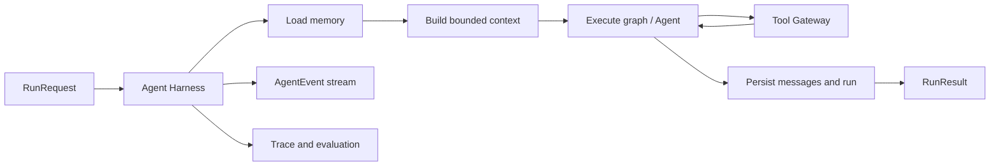

# Agent Runtime Design

Status: V4 and V5 complete; V6 Slices 1-4 complete (global Slices 37-40);
Slice 4 identity, PII-safe audit/persistence/retention/emission, authenticated
owner-data lifecycle, signed ingress, monitoring and accepted governance
evaluation are implemented; V6 Slice 5 static production preflight is
implemented and production operations remain

## Goal

The Agent Runtime turns the current API handlers, LangGraph invocations, tool
guards, persistence helpers, traces, and evaluators into one coherent execution
system. Single- and multi-agent flows should obey the same lifecycle rules
without moving domain reasoning into infrastructure code.

Project completion requires all V6 evaluation, resilience, operations,
governance, observability, deployment,
and reference-client exit criteria in `PLAN.md`. The current validated worktree
is not the final endpoint.



## Core Contracts

V4 should define versioned structured models for:

- `RunRequest`: user, thread, input, mode, request ID, idempotency key, deadline,
  policy, budget, and client metadata.
- `RunContext`: identity, policy, budgets, memory references, trace ID, and
  cancellation signal.
- `RunResult`: answer, status, run/thread IDs, tools, usage, pending action,
  errors, and stable debug metadata.
- `AgentEvent`: sequence, type, timestamp, Agent, payload, trace ID, and
  client-visibility classification.
- `AgentTask`: sender/recipient, intent, input, context references, output schema,
  deadline, task ID, and budget.
- `AgentResult`: task/status, structured output, evidence references, usage,
  error, and child traces.
- `ToolCallRecord`: caller, capability, argument hash, status, duration, result
  metadata, side-effect class, and audit reference.

Map external API models to internal contracts explicitly. FastAPI response
schemas must not become the persistence model by accident.

## Agent Harness

The Harness owns this lifecycle:

1. Validate request and establish user/thread/run identity.
2. Resolve policy, deadline, concurrency, cost, step, and token budgets.
3. Load relevant memory.
4. Build a bounded per-Agent context.
5. Execute an Agent/graph through an adapter.
6. Route tools through the Tool Gateway.
7. Emit ordered events and tracing spans.
8. Handle retryable failures, cancellation, and timeout.
9. Persist messages, summaries, state, usage, and pending actions.
10. Return or stream a normalized result.

The current V4.2/V4.4 implementation covers the compatibility slice:
policy and budget propagation, retryable executor failures, deadline and
cancellation checks, step/tool-call limits, ordered control events, and one
finalization path. `/api/chat/stream` serializes the ordered event sequence as
SSE and propagates disconnect cancellation signals. The first V4.5 slice adds
centralized capability, argument, ownership, sensitive-policy, output-limit,
and budget enforcement through `ToolGateway`; token-level streaming, hard
interruption, context compaction, and generic action registration remain
subsequent milestones.

The Harness also treats an idempotency key as an owner-and-operation scoped
execution key. A matching completed request replays its stored result without
re-running tools or appending messages; a key reused with different input is
rejected before execution, and an in-progress key is not executed twice.

The same event sequence supports two modes:

- `run`: collect events and return complete JSON for existing clients.
- `stream`: yield events to SSE clients.

This prevents streaming and non-streaming from becoming separate runtimes.

### Testability

Provide deterministic seams for fake models/tools, fixed clocks and IDs,
record/replay, timeout/failure/disconnect injection, resource-budget assertions,
and trajectory comparison across single, multi, and remote Agent adapters.

## Memory Management

Memory is persisted information that may be available to future runs.

| Layer | Examples | Lifetime |
| --- | --- | --- |
| Working | Graph state, routes, intermediate summaries | One run; optional checkpoint |
| Episodic | Messages, run outcomes, conversation summaries | PostgreSQL with retention |
| Long-term user | Budget, brand, usage, avoid/style preferences | PostgreSQL, user-managed |
| Operational | Pending actions, candidates, idempotency | PostgreSQL with strict TTL/state |

Records need owner, thread scope where relevant, provenance, confidence,
timestamps, expiry, and deletion semantics.

Rules:

- Never mix users or tenants.
- Do not promote one-turn requests into long-term memory automatically.
- Mark user statements, tool facts, and model inferences differently.
- Resolve conflict with explicit correction, recency, and confidence.
- Support inspection, correction, retention, and deletion before calling memory
  production-ready.

## Context Management

Context is what one model sees for one invocation. It is selected from memory
and current evidence, then discarded as an input bundle.

The Context Manager should:

- accept Agent role, task, policy, and token budget;
- prioritize safety rules, current turn, active action, recent messages,
  summaries, preferences, and retrieved evidence;
- create a minimal slice for each specialist;
- deduplicate documents and Agent outputs;
- preserve source IDs/citations;
- summarize or omit low-priority material when over budget;
- record a manifest of included, summarized, and omitted content.

Product Agent should not receive full policy documents; RAG Agent does not need
raw cart rows; Decision Agent should receive structured specialist evidence
rather than every raw tool payload.

## Sandbox And Tool Gateway

V3 capability allowlists and confirmed writes are a logical sandbox, not an
operating-system sandbox.

The Tool Gateway should enforce:

- per-Agent capability allowlists;
- Pydantic/JSON Schema input validation;
- user/thread/resource ownership policy;
- timeouts, retries, output limits, and redaction;
- read/write side-effect classification;
- database roles or transaction boundaries where practical;
- host/URL allowlists for future network tools;
- per-run tool, cost, and time budgets;
- audit records and stable events;
- action-registry/HITL handoff before sensitive effects.

A process/container sandbox is required only if a future Agent runs arbitrary
code, shell commands, or untrusted plugins. It must then add filesystem,
network, CPU, memory, process, and wall-time isolation. Do not claim it early.

The current gateway is an application-level policy boundary. It derives
capabilities from the V3 allowlist, validates tool arguments before delegation,
checks the active user/thread, gates sensitive side effects, enforces output and
per-run call limits, and returns `ToolCallRecord` audit data. It does not claim
OS, database-role, or network isolation yet.

Each registered capability now carries a typed `ToolResourcePolicy`. Current V3
catalog, document, and preference capabilities declare database read access;
prepare, confirm, and cancel cart capabilities declare database write access.
The policy is included in tool audit records and events. A future network
capability must explicitly set `network_access` and provide bare lowercase
`allowed_https_hosts`; the policy alone does not perform HTTP requests, follow
redirects, or provide DNS/private-address isolation.

The production V3 allowlist is checked against an explicit capability policy
manifest at Gateway construction. This avoids treating a name prefix as a
security declaration: adding an allowed tool without side-effect, confirmation,
and resource metadata fails closed. Generic Gateway instances may still opt out
for isolated tests or future adapters that supply their own capability set.
The same manifest declares the permitted Agent set, so strict production
construction also rejects role-assignment drift rather than treating the
allowlist and capability registry as independent sources of truth.
The manifest itself is read-only, and its coverage test consumes the production
allowlist rather than a copied fixture, keeping policy integrity checks close to
the configuration actually used by V3 execution.
Nested `ToolResourcePolicy` contracts are frozen too, so a read-only manifest
cannot be bypassed by mutating a declared database or network boundary in place.
Capability registration also validates confirmation semantics: sensitive writes
must require confirmation, and non-write capabilities cannot claim it.
The resulting confirmation requirement is copied into each `ToolCallRecord` and
tool audit event, so persisted or streamed execution data stays self-describing
even if the manifest later evolves.

Gateway execution controls are cooperative. If the run is already cancelled,
past its deadline, or past its duration budget before a tool starts, the gateway
skips invocation and records a structured `ToolCallRecord` with a stable error
code. Capability-level duration limits are measured after the provider returns;
overruns are audit metadata, not automatic failures, because a synchronous
write may already have committed its side effect by then.

The first action-registry slice is also live for `add_to_cart`: typed action
definitions select confirmation/cancellation tools, while PostgreSQL pending
actions retain risk class, preview, metadata, expiry, and owner/thread transition
checks. Additional action types can register through the same boundary without
changing the public confirmation endpoint.

The confirmation endpoint executes through the registered
`confirmation_boundary` capability with an explicitly approved sensitive-tool
policy. The normal chat path does not inherit that policy, and gateway records
are normalized into the Harness `RunResult` before persistence.

Pending-action transitions use the typed `ActionTransitionRequest` contract.
The registry validates the action type, pending-action ID, user identity, and
confirmation direction before selecting the registered confirm or cancel tool.
Duplicate action definitions are rejected rather than silently replacing an
existing safety policy. This remains an in-process boundary; it does not claim
generic action execution or remote workflow isolation.

The V3 write handoff validates its `ActionRequest` through the same registry
before calling the prepare tool. A registry failure stops action creation with a
safe runtime result, while the legacy confirmation-required response remains
unchanged for valid add-to-cart requests.

The prepare tool now executes through a dedicated `write_handoff` gateway
capability classified as `WRITE`, because it creates a pending action but does
not mutate the cart. Confirm and cancel remain `SENSITIVE_WRITE` capabilities;
the prepare gateway record is carried into the Harness audit result.

Read-only V3 Agents use the same `ToolGateway.invoke` delegation path. Their
legacy `PermissionedTool` wrapper remains the compatibility surface, but it no
longer validates through one object and executes through another.

The Harness now passes its per-run context into freshly bound read-tool wrappers.
This keeps ownership and budget checks active during graph execution while
avoiding mutable context shared across concurrent requests.

Read-tool records are copied from that context into `RunResult.tool_call_records`
and emitted as `tool.call.completed` audit events before the terminal run event.
If a delegated tool raises, the gateway completes a failed record with a stable
error code and exception type, the Harness persists it, and `tool.call.failed`
precedes `run.failed`; the underlying exception text remains internal.

## Human-In-The-Loop

Generalize `pending_actions` into a typed action registry with:

- action schema, risk class, owner, thread, arguments, and preview;
- created, expired, confirmed, cancelled, rejected, failed, completed states;
- approve, edit, reject, resume, and expire commands;
- idempotency and audit trail;
- execution adapters hidden from reasoning Agents.

V3 add-to-cart becomes the first adapter without breaking its current API.

## Streaming And Cancellation

SSE is the preferred first transport because execution mainly streams
server-to-client while existing HTTP/HITL endpoints remain useful.

Suggested events:

- `run.started`
- `agent.started`, `agent.completed`
- `message.delta`
- `tool.started`, `tool.completed`, `tool.failed`
- `memory.loaded`, `context.built`
- `action.required`
- `run.completed`, `run.failed`, `run.cancelled`
- heartbeat for long operations

Requirements include monotonic sequence numbers, bounded buffers/backpressure,
client-safe filtering, disconnect propagation, exactly-once final persistence,
and no partial sensitive write during cancellation races.

The local thread bridge tracks each non-blocking event delivery and flushes all
accepted deliveries before enqueueing the final result/error and stream
terminator. A fast synchronous worker therefore cannot overtake its lifecycle
events, while queue overflow still requests cooperative cancellation.

## A2A-Ready Design

V3 Agents are LangGraph nodes in one process. This is currently simpler and
more reliable than remote calls.

Introduce one adapter boundary:

- `InProcessAgentAdapter` invokes the existing graph/node.
- `HttpAgentAdapter` or `A2AAgentAdapter` exchanges typed tasks/results.

The first V5 slice provides the typed `AgentTask`/`AgentResult` envelope and a
synchronous `InProcessAgentAdapter`. It validates recipient and task-result ID
alignment before invoking a local handler. The product and RAG specialists are
now routed through typed input/output bridges; RAG carries retrieved document
IDs as evidence references. The preference specialist also uses the bridge and
preserves its task user scope for the existing read tool. No remote transport is
active.

The graph-facing boundary now uses a runtime-checkable `AgentAdapter` protocol
with only `agent_name` and typed `invoke(AgentTask) -> AgentResult` behavior.
`invoke_agent_adapter` applies recipient validation before transport invocation
and result-type/task-ID validation after it returns. Product, RAG, and
preference bridges consume the protocol, while their factories still create
an `InProcessAgentAdapter` transport. Structural conformance tests allow a
future transport to prove the same envelope semantics without inheritance.
This is an extension boundary only: there is no HTTP/A2A implementation,
endpoint trust policy, remote retry loop, or distributed task ledger.

Delegation policy is layered outside that transport.
`PolicyEnforcedAgentAdapter` wraps any `AgentAdapter`, admits the task through a
shared `DelegationBudgetGuard`, reconciles time after transport exceptions, and
validates/reconciles typed results, usage, and time when control returns. The
three specialist factories always return this wrapper around their local
transport. A future transport therefore does not reimplement budget logic; it
must enter production through the same policy layer.

`AgentAdapterRegistry` is the server-owned lookup boundary above that protocol.
It snapshots an immutable insertion-ordered mapping, requires exact normalized
recipient names, and rejects duplicate/non-conforming entries at construction;
resolution of an unknown recipient fails closed. Its optional policy-required
construction mode also rejects every entry that is not a
`PolicyEnforcedAgentAdapter`; the transport-neutral default remains available
for isolated conformance tests. The multi-agent graph creates the registry
through a domain factory containing exactly the three current policy-wrapped
in-process specialists and always enables the required mode. All wrappers
receive the same trusted `DelegationBudgetGuard`, so parallel recipient
resolution does not fragment run counters. Neither API payloads nor environment
settings can supply a registry, transport, or endpoint.

Failure handling is also transport-independent. The bounded plan executor maps
unknown transport and malformed-result failures to a stable `plan.step_failed`
error and retains successful independent results. The Harness uses stable safe
messages for unknown executor exceptions and explicit typed mappings for
adapter contract, delegation time, usage, and general budget failures; it does
not persist `str(exc)`. Tool Gateway failures retain their existing dedicated
audit mapping. Exception-time policy reconciliation runs before an underlying
transport error can escape, so a crossed trusted deadline or duration remains
the authoritative failure.

Transport implementations can raise `AgentTransportError` using only the
server-defined unavailable, timeout, or protocol-error classes. Construction
requires an explicit boolean retriable decision; message and source are derived
by the runtime, with no arbitrary details field. The Harness can use that signal
in its existing bounded executor-level retry loop. A plan step records the same
classification in `RunError`; an explicitly enabled plan-owned policy may also
replay the same specialist step under its stable task identity.

`AgentTaskRetryPolicy` now makes those prerequisites explicit. It is frozen,
defaults to `disabled` with one attempt, and allows at most three attempts only
when ownership is `plan_executor` and a closed set of typed transport failures
is configured. Identity preservation and per-attempt accounting cannot be
disabled. An enabled task must use the SHA-256 key derived by the runtime from
its exact run/task identity. All specialist bridges generate this key and carry
the canonical plan-step policy into the task.

Failed-attempt accounting is now typed. Every `AgentTransportError` carries a
`RunUsage` sample with at least one step. The policy decorator sends that sample
through the same shared guard used by successful results before re-raising the
transport signal. Cumulative ceilings and unavailable configured metrics can
therefore stop retry eligibility. Plan step results retain failed usage, and
Harness-level retries merge all failed/successful attempts before final budget
checks and persistence.

Specialist replay is now server-owned and disabled by default. The typed
`RuntimePolicy` supplies the canonical planner with one frozen task policy;
validated provider proposals cannot alter it. `SHOPMIND_AGENT_TASK_MAX_ATTEMPTS`
defaults to one and is capped at three. Values above one allow only unavailable
and timeout failures, never protocol errors. The Plan Executor preserves the
same step/task identity, checks cooperative cancellation before replay, and
aggregates every attempt. Explicit retry opt-in routes sequential read plans
through that executor as well; without opt-in, the V3 sequential dispatcher is
unchanged.

Attempt observability uses `AgentPlanAttemptEvent`, a frozen payload carried by
the existing `AgentEvent` contract. The executor emits attempt start and
terminal events plus retry scheduled/started/succeeded, exhausted,
non-retriable, budget-blocked, and cancelled-before-retry decisions. Per-step
order is preserved, while the Harness atomically assigns one run-wide sequence
under parallel execution. Persistence and SSE therefore consume the same event
objects and do not reconstruct retry state from final counters.

`AgentTask` validates its parent/depth relationship. A per-graph,
thread-safe `DelegationBudgetGuard` admits each local child task once and
enforces `RunBudget.max_delegation_depth` and `RunBudget.max_child_tasks` before
the handler runs. This is a local admission boundary, not a distributed task
ledger; V3 has no child-task fan-out yet.

`AgentPlanStep` and `AgentExecutionPlan` now describe deterministic specialist
work before execution. Plans reject duplicate IDs, unknown dependencies,
dependency cycles, and invalid sequential parallelism. Current read routes map
to independent, parallel-eligible steps. Plans remain sequential by default;
the server-owned feature gate may select bounded parallel mode only for
multi-route reads.

`AgentPlanStepResult` and `AgentPlanResult` provide deterministic fan-in. The
local `BoundedPlanExecutor` is parallel-disabled by default; explicit parallel
use accepts only independent steps, respects `max_parallelism`, returns results
in plan order, deduplicates evidence, aggregates usage, and converts exceptions
to sanitized `RunError` records. Server-owned settings default parallel reads
off and cap workers at three. The graph now uses the executor only for an
explicitly enabled multi-route plan. Each planned step receives a deep-copied
current-turn/identity state without prior specialist summaries or mutable
traces; fan-in maps successful summaries, tools, safety flags, evidence, and
reindexed steps back in plan order. Failed or cancelled steps do not discard
successful sibling results.

Typed specialist usage now follows the same state boundary. `RunUsage` carries
non-negative input/output/total tokens and USD cost from `AgentResult` through
sequential state or plan-ordered parallel fan-in into the Harness aggregate.
The per-graph `DelegationBudgetGuard` records every actual invocation under its
run ID and compares cumulative usage with the stricter task/server prompt,
completion, total-token, and cost ceiling. Reusing a task ID avoids a duplicate
step admission but does not make a real repeated handler invocation free.
Configured metrics fail closed when any invocation cannot report them, so a
partial sum never masquerades as complete usage. These are post-execution
reconciliation controls; unlike step/tool reservation, they cannot prevent the
first over-limit synchronous provider call. Provider usage is measurement only
and cannot set or raise the trusted policy ceiling.

Delegation time controls live at the same guard boundary. The effective
deadline is the earliest of the typed task, task budget, server budget, and
trusted request deadline; maximum duration is the stricter task/server value
and is measured from the Harness-owned run start. Admission rejects elapsed
budgets before a specialist can run. Reconciliation checks again after the
synchronous handler returns or raises, producing sanitized timeout-sourced
`plan.deadline_exceeded` or `plan.duration_budget_exceeded` errors with only the
budget field and phase. This is cooperative wall-clock enforcement: it does not
interrupt an already running Python/provider call, and its real completed tool
records remain auditable.

Planning now uses an `AgentPlanner` protocol. `DeterministicAgentPlanner`
remains the default. `ValidatedProviderPlanner` sends an optional provider the
message, routed routes/reasons, and a canonical baseline plan, then parses the
proposal through `AgentExecutionPlan`. It rejects any run identity, route order,
step ID, intent, dependency, execution mode, or parallelism difference. A valid
proposal is still recompiled from the baseline, so untrusted plan identity,
planner type, step metadata, and arbitrary metadata are discarded. Provider
exceptions and invalid contracts produce sanitized deterministic fallback.

`create_langchain_plan_provider` is lazy and uses
`with_structured_output(AgentExecutionPlan)`. `create_agent_planner` selects it
only for explicit `llm` mode; default and unknown modes remain deterministic.
The structured prompt includes the Supervisor routes and canonical baseline,
but the returned model is still untrusted. Empty plans bypass the provider, so
write-handoff classification cannot trigger a planner model call.

`evaluation/shopmind_planner_eval.py` evaluates the validator rather than model
quality. Every case checks planner/fallback type, sanitized reason, provider
call count, canonical step contract, execution mode, parallelism, and provider
skip semantics. This separates policy regressions from future prompt/model
experiments and provides a stable CI gate before any non-deterministic baseline.
The default CI job explicitly selects deterministic planner mode, records the
human-readable result in its summary, and uploads the full JSON result as
`v5-planner-policy-eval`. Artifact generation does not initialize the structured
planner provider, and failed policy cases remain available in the uploaded JSON.

`evaluation/shopmind_plan_trajectory_eval.py` replays fixed execution scenarios
through the production compiled graph rather than a copied evaluator model. It
uses fake specialist tools at the capability boundary, then checks normalized
plan status, step status counts, plan-order fan-in, shared Gateway accounting,
Decision inputs, cancellation, and lifecycle events. Generated IDs, elapsed
times, and concurrent completion order are deliberately excluded from the
`shopmind.plan-trajectory-eval.v2` artifact schema. The suite now includes five
typed retry fault trajectories in addition to the original eight execution
cases, for `13/13` cases and `195/195` checks. Retry scenarios normalize the
exact per-specialist attempt sequence, attempt count, terminal classification,
tool execution, and budget/cancellation boundary. Replay graph invocation also
uses a local `tracing_context(enabled=False)` boundary, preventing an application
or shell tracing setting from creating network traffic during offline checks.
`BoundedPlanExecutor` creates a distinct `contextvars.Context` copy for every
submitted step, preserving parent request-local values without concurrently
entering one mutable context from multiple threads.

Default CI treats this replay as an execution-lifecycle gate separate from the
planner-policy gate. Its readable summary is added to the workflow report and
the versioned result is uploaded as `v5-plan-trajectory-eval`; both gates remain
model-independent and run even when an earlier CI step has failed.

Shared accounting now uses a private, non-serialized lock on `RunContext`.
Tool-call budget slots are reserved atomically before execution, and persisted
records carry an `audit_sequence` and are retained in reservation order even
when tools complete out of order. Graph and persistence consumers read deep
metadata snapshots rather than mutable shared lists.

Cancellation is cooperative. Harness binds a non-serialized probe and sequenced
event emitter to `RunContext`. Every queued plan step checks the latest signal
when a worker begins; cancelled steps return `plan.step_cancelled` without
invoking tools. `plan.execution.*` and `plan.step.*` events use the Harness event
sequence even when workers emit concurrently. Already-running synchronous calls
are not force-terminated, and their true completed or failed tool records remain
in cancelled-run audit and persistence output.

Local task admission also uses a shared `DelegationBudgetGuard` with a deep copy
of the server-owned `RunBudget`. Each plan step becomes the typed task ID, and
the guard scopes reservations by run/task identity while applying the stricter
trusted or task-level depth, child, and step limit. Parallel workers therefore
cannot race past `max_steps`; a denied handler receives no tool capability and
the plan records `plan.step_budget_exceeded`. Harness retains its whole-run
postcondition check because orchestration steps are not delegated tasks.

RAG adapters return typed document evidence to the graph. The Decision Agent
can currently flag only a conservative product-document scope mismatch when
both sides identify products but have no overlap. `EvidenceConflict` preserves
the candidate, evidence, and reference IDs; `EvidenceResolution` excludes the
mismatched RAG summary and requests clarification. Non-conflicting summaries
remain usable, matching evidence follows the normal combined-read path, and no
tool or write policy is relaxed.

Suggested envelope:

```text
task_id
thread_id
run_id
sender
recipient
intent
input
context_refs
expected_output_schema
trace_id
deadline
idempotency_key
budget
```

Remote A2A also needs authentication, authorization, capability discovery,
protocol/version negotiation, cancellation, retry, duplicate suppression,
trace propagation, and data minimization.

Use remote A2A only for independent ownership, scaling, deployment, runtime, or
security needs. Do not distribute every Agent merely to demonstrate a protocol.

### HTTP Adapter And Registry Selection (Implemented)

Slice 33 adds a synchronous `HttpAgentAdapter` as a real transport
implementation while leaving orchestration policy outside the transport. Its
server-owned configuration must include an HTTPS endpoint, bounded timeout and
response size, optional secret authorization material, and an injectable HTTP
client seam for offline tests. Requests serialize the existing `AgentTask`
schema and propagate trace/run/task/idempotency identity. Responses must parse
as the existing `AgentResult` and preserve task identity.

Connection/availability failures map to typed retriable unavailable errors;
transport timeouts map to typed retriable timeout errors; invalid status,
oversized/malformed payloads and contract mismatches map to non-retriable
protocol errors. No endpoint text, token, response body or provider exception
detail enters persisted failures. The adapter does not own retries, budgets or
registry selection: `PolicyEnforcedAgentAdapter`, `DelegationBudgetGuard` and
the Plan Executor remain authoritative.

Slice 34 wires that transport into the server-owned Registry for `rag_agent`
only. Selection is explicit environment configuration and defaults to
`in_process`; missing endpoint/allowlist configuration fails closed. Remote RAG
uses the same policy decorator and delegation guard as local specialists, while
the Supervisor, planner, graph state, fan-in and public API remain unchanged.
Slice 35 generalizes action preparation and resume beyond the single add-to-cart
handler. The pending record selects a registered handler under owner/thread
scope; `save_preference` demonstrates a second action without giving write
capability to the Preference Agent. Harness-sequenced `action.*` events cover
prepare and terminal transitions. Slice 36 adds definition-owned editable
schemas and applies validated edits with confirmation under one row lock and
transaction. Persisted IDs resume across fresh sessions; ordered
`action.resumed`, optional `action.edited`, and terminal events are persisted
and streamed. PostgreSQL restart/reject/expiry/idempotency trajectories and
`shopmind.action-lifecycle-eval.v2` close the V5 HITL and adapter exit
condition. V6 Slice 1 composes these surfaces through a closed catalog and an
accepted-baseline regression comparison. Slice 2 adds normalized persisted
trajectory record/replay and deterministic fault/restart recovery scenarios.

## Observability And Evaluation

Every layer shares run, task, thread, and trace IDs. Evaluation covers routing,
specialist completion, answer correctness/grounding, tool efficiency, context
relevance, memory correctness, unauthorized tools, sensitive actions,
multi-turn consistency, failure behavior, and adapter equivalence.

LangSmith remains the trace/experiment integration. Deterministic local
evaluators remain the default CI gate.

### V6 Evaluation Catalog Contract

`evaluation/catalog/v6_evaluation_catalog.json` is validated as
`shopmind.evaluation-catalog.v1`. It cannot name import paths: runner names are
a closed literal set mapped to code-owned deterministic factories. Suite IDs,
runners and artifact paths are unique; paths must remain repository-relative;
and all ten required dimensions must be covered by required suites. Unknown
fields, runners, categories, absolute paths and incomplete coverage fail before
execution.

`evaluation/baselines/v6_slice4_accepted.json` is a separate frozen
`shopmind.evaluation-baseline.v1` policy artifact. It binds the catalog ID and
schema, suite artifact schemas and minimum case/check counts. Its metric
contract fixes minimum quality/safety scores and maximum latency, token and cost
regression counts with zero implicit tolerance. Runtime evaluation reads but
never updates this file; accepting a baseline requires an explicit reviewed
change.

`evaluation/run_catalog_eval.py` runs the eight registered suites or reuses their
existing versioned JSON under a caller-supplied artifact root. Reused artifacts
are schema/count validated exactly like freshly executed results. The normalized
candidate and 48-check comparison are emitted as
`shopmind.evaluation-catalog-run.v1`; suite execution errors and invalid
manifests are sanitized and return non-zero. The Slice 4 accepted run is `8/8`
suites, `61/61` cases, `488/488` suite checks and `48/48` baseline checks.
Wall-clock timing is deliberately not a cross-machine baseline: the current
latency dimension covers deterministic deadline/duration policy trajectories.
Provider timing distributions belong in later calibrated V6 datasets.

### V6 Resilience And Restart Replay Contract

`shopmind.runtime-trajectory.v1` is a normalized, terminal-only projection over
the existing `agent_runs` and ordered `agent_run_events` facts; Slice 2 adds no
parallel persistence table or migration. Recording requires exact owner and
runtime-thread scope, contiguous event sequences, a common trace, and a terminal
event consistent with the run status. Run/task/action identities, safe error
classification and aggregate usage remain structured. Raw request, response,
debug, tool and full event payloads are reduced to canonical fingerprints, so
provider or user detail is not copied into evaluation artifacts.

`evaluation/run_resilience_replay_eval.py` emits the versioned
`shopmind.resilience-replay-eval.v1` artifact and owns a closed six-scenario contract:
provider fallback, Tool Gateway failure, transport retry success, cancellation
before retry, idempotent replay after restart, and pending-action resume after
restart. Local fakes inject faults but execution uses the production planner,
Tool Gateway, Plan Executor, Harness and repositories. Each case serializes the
snapshot and reloads it through a distinct engine/session factory, then checks
status, event subsequence/order, identities, sanitization, invocation count and
scenario-specific recovery. The versioned result passes `6/6` cases and
`72/72` checks and is a required catalog/CI suite. Real PostgreSQL integration
uses the same fresh-store boundary; it is explicitly gated and never seeds or
indexes data.

### V6 Runtime Coordination Contract

`RuntimeCoordinationBackend` separates coordination semantics from transport.
The closed operations are admission acquire/renew/release, fixed-window rate
checks, duplicate claim/forget, and bounded cache get/put/invalidate. Requests
carry a validated resource namespace and SHA-256 subject/key fingerprint, never
raw user IDs, messages, idempotency keys or endpoint configuration. Decisions
are typed and include backend, accepted/hit/released state, closed reason and
bounded retry timing where applicable.

The initial `LocalRuntimeCoordinationBackend` is the explicit development
fallback. A single lock makes each mutation atomic within one process;
monotonic-clock injection makes lease, window, claim and cache expiry
deterministic. Active leases, rate buckets, duplicate claims, cache entries and
cache value bytes all have server-owned bounds. Admission and duplicate state
expire, leases can be renewed, cache values must be JSON-serializable, and
cache storage uses TTL plus LRU eviction and defensive copies.

The server-owned factory preserves `local` as the default and recognizes an
explicit `redis` selection. Missing Redis configuration, client import,
connection or operation failure raises a sanitized error and never silently
falls back. The Redis URL is a `SecretStr` and is not copied into errors.
`RedisRuntimeCoordinationBackend` uses versioned same-slot keys and one atomic
Lua script per admission, fixed-window rate-limit, duplicate-claim or TTL/LRU
cache transition. Cardinality/value limits remain server-owned.

SSE admission now uses `StreamAdmissionController` over this backend. Each
accepted request owns one opaque lease ID, renews it on a server-controlled
interval shorter than the TTL, and releases the same token when streaming
ends. Exhaustion keeps the existing HTTP 429 contract. The former local counter
remains only as a compatibility helper and no longer owns API admission.

Local mode remains single-process. Redis mode is the explicit cross-process
implementation. Its deterministic wire-reference evaluation passes `5/5`
cases and `18/18` checks, including sanitized transport failure, and the suite
is part of the accepted V6 catalog baseline. The default-skipped isolated
two-client integration test now passes against real Redis, including atomic
concurrent admission, server TTL expiry, shared rate/dedup/cache state and exact
random-scope cleanup. PostgreSQL
idempotency remains the durable result-replay contract; coordination duplicate
claims are transient execution suppression and must not replace it.

### V6 Authenticated Principal And Owner Binding

`IdentityBoundary` separates authentication source from the V3 `user_id`
ownership contract. `SHOPMIND_IDENTITY_PROVIDER` is server-owned and closed to
`development_payload`, `trusted_header`, or `signed_header`; unknown values
preserve the explicit development default. No request schema accepts provider,
role, scope or policy claims.

The development adapter turns an existing optional body `user_id` into a
principal and therefore preserves released API behavior. Trusted-header mode
requires the fixed `X-ShopMind-Authenticated-User` value supplied by a trusted
ingress, uses that subject when the body owner is omitted, and compares exact
normalized ownership when it is present. Authentication failure is 401 and
cross-owner impersonation is 403. Binding happens before Agent execution,
action confirmation and SSE admission. Operators must strip this header from
untrusted traffic before adding it at the trusted proxy.

`AuthenticatedPrincipal` retains the subject only for owner propagation,
excludes it from repr and exposes a namespaced SHA-256 fingerprint. This
boundary is not a generic RBAC implementation.

The production-facing `signed_header` adapter uses the same subject header plus
`X-ShopMind-Identity-Timestamp`, `X-ShopMind-Identity-Nonce`, and
`X-ShopMind-Identity-Signature`. The signature is lowercase HMAC-SHA256 over
the NUL-separated
`shopmind.identity-signature.v1`, normalized subject, canonical epoch timestamp
and nonce fields. Configuration requires a masked signing secret of at least
32 characters, bounds max age to 300 seconds and keeps a separately bounded
future-clock skew. Missing, partial, malformed, expired, invalid, replayed and
backend-unavailable assertions all fail closed through the existing stable 401
boundary; owner mismatch remains 403.

After signature validation, the runtime hashes the subject/timestamp/nonce/
signature tuple into a domain-separated coordination key and claims it once.
The bounded local backend is sufficient only for one process. Explicit Redis
coordination provides atomic replay rejection across API processes and retains
neither raw subject nor raw credentials in its keys. The adapter is
intentionally offline: it adds no remote IdP/JWKS HTTP, token role/scope parsing
or caller-selected authentication policy.

### V6 PII-Safe Governance Audit Contract

`GovernanceAuditRecord` is frozen and versioned as
`shopmind.governance-audit.v1`. Its closed categories are authentication, tool,
action, memory and deletion; each operation admits only an explicit decision
set. Reasons, request operations, deletion targets and actor kinds are closed
enums. Operation/category drift, invalid decisions, anonymous actors carrying
identities and principal actors missing identities fail validation.

`governance_fingerprint` uses a schema/version namespace plus a closed
actor/owner/thread/run/action/memory/deletion/tool-call namespace before
SHA-256. Raw values exist only during conversion and are never fields on the
record. Actor fingerprints use a different domain from the identity boundary,
preventing direct cross-purpose correlation.

`GovernanceAuditMetadata` is an extra-forbidden typed allowlist. Authentication
may retain only the server-selected provider and API operation. Tool decisions
may retain capability, side-effect/confirmation posture, bounded sequence and
duration facts, and a validated pre-existing input fingerprint. Action records
retain action type/risk, memory records retain kind/scope/count, and deletion
records retain target/count. There are no raw message, argument, output,
preview, subject, thread, credential, header, endpoint or connection-URL fields.
The Tool Gateway converter deliberately ignores arbitrary `result_metadata` and
raw `audit_reference` values.

`GovernanceAuditFactory` converts the current typed authentication,
`ToolCallRecord`, action, memory and deletion boundaries and supports injected
clock/ID factories for deterministic tests.

`governance_audit_records` persists the exact record at migration
`0007_governance_audit`. Its identity columns are 64-character fingerprints;
there are no raw owner/thread/run/resource IDs, payload copies or foreign keys.
An audit may therefore outlive the runtime row it describes without retaining
that row's direct identifier. Database constraints close classification values,
fingerprint lengths and positive retention windows.

The repository assigns a 90-day default expiry, rejects duplicate immutable
audit IDs, and returns a typed persistence envelope. Single-record and list
inspection both require an exact validated owner fingerprint; list inspection
is newest-first, supports closed category/operation and time filters, and is
capped at 200. Expired rows are never returned. The existing runtime cleanup
command calls the audit-specific prune function, which hard-deletes only rows
whose explicit expiry has passed.

This is an internal persistence/inspection boundary, not a new public endpoint.
`SHOPMIND_GOVERNANCE_AUDIT_ENABLED` is server-owned and defaults to false.
When explicitly enabled, authentication allow/deny decisions emit immediately
after identity classification. The Harness projects typed tool-call records,
closed prepare/resume/confirm/cancel/expire/failure action events, and persisted
memory items actually selected into context. It skips the current request item
and never copies memory content, arbitrary event dictionaries or tool results.

Tool/action/memory source identity plus run/event identity produces a
deterministic audit UUID. Re-emission is treated as an immutable duplicate.
Runtime persistence commits first; the governance batch uses a separate
transaction. A storage exception rolls back only that batch and is reduced to
the closed `storage_unavailable` result/log message. It cannot change an HTTP
401/403, Agent result, pending-action transition or V3 response.

Every default emitter shares a process-local
`GovernanceAuditEmissionMonitor`. Its frozen
`shopmind.governance-audit-monitor.v1` snapshot contains only monotonic counts,
closed last status/reason values, UTC timestamps, consecutive failures and
alert/recovery transitions. A lock makes updates deterministic under concurrent
identity, Harness and owner-data emissions. It has no schema field for an audit
record, fingerprint, subject, request, action, memory, credential, exception or
connection detail.

`SHOPMIND_GOVERNANCE_AUDIT_ALERT_FAILURE_THRESHOLD` defaults to three and is
bounded to 100. The crossing failure emits a sanitized active alert; the first
later persisted or duplicate transaction emits recovery and resets the streak.
Skips do not pretend that storage recovered.
`GET /api/health/governance-audit` returns the process snapshot plus the server-owned
enabled flag. Alert state maps to `degraded` but the route remains HTTP 200:
best-effort audit availability cannot become API liveness. Multi-process
deployments scrape and aggregate every replica; the monitor is not a distributed
counter or an audit-record inspection endpoint.

### V6 Authenticated Owner-Data Lifecycle

`OwnerDataService` sits behind `IdentityBoundary`; all four additive API
operations require a principal whose effective owner exactly matches the body
`user_id`. The request cannot select an identity provider, roles, scopes,
storage target, deletion category, or audit policy.

Inspection returns fixed counts for preferences, cart items, pending actions,
candidate contexts, threads/messages, runs/events, summaries, idempotency and
memory plus at most 100 owner memory records. It never includes another owner
or operational/global memory. Memory correction accepts only bounded
replacement text, requires an active/unexpired exact-owner row, clears stale
structured content, records `owner_correction` provenance and raises confidence
to one. Single-memory deletion is an immediate hard delete.

Full deletion requires a UUID `deletion_request_id` and literal
`confirmed=true`. One database transaction hard-deletes the exact owner's
ShopMind preferences, cart/pending/candidate state and runtime conversations,
messages, runs/events, summaries, idempotency and memory. It excludes products,
documents, customers/orders, and fingerprint-only governance audit rows. A
repeated request after the rows are gone returns `already_deleted` with zero
affected records instead of crossing scope or failing.

When governance emission is enabled, inspect/correct/delete facts use the
closed memory operations and full deletion emits `deletion.request` followed by
`deletion.execute`. Deterministic request-phase IDs collapse the repeated
request fact, while distinct succeeded/failed/skipped execution outcomes remain
representable. Audit transactions and their 90-day default retention are
independent from owner-row deletion. Storage failures are sanitized to
`OwnerDataStorageError`/HTTP 503; audit storage failure remains best-effort and
cannot rewrite a committed deletion.

### V6 Governance Lifecycle Evaluation

`evaluation/run_governance_lifecycle_eval.py` owns the closed
`shopmind.governance-lifecycle-eval.v1` contract. Its five offline scenarios
exercise the production identity, owner-data, audit emitter and monitor
implementations with fixed clocks/IDs and isolated in-memory repositories:
signed assertion acceptance plus replay/owner denial, exact-owner memory
inspection/correction/deletion, full deletion plus duplicate-by-effect
execution, alert activation/recovery, and immutable audit append/duplicate
classification.

Every outcome contains only closed statuses, counts, trajectories and
fingerprint lengths. Test subjects, memory content, action IDs, nonces,
signatures and signing secrets are asserted absent from the artifact. The gate
uses no model, remote HTTP/A2A, Redis, PostgreSQL, credential or LangSmith
service and passes `5/5` cases with `42/42` checks. It is registered as the
eighth code-owned catalog runner and locked by the explicit
`evaluation/baselines/v6_slice4_accepted.json`; baseline acceptance never
occurs inside runtime or CI execution.

### V6 Production Configuration Preflight

`SHOPMIND_DEPLOYMENT_PROFILE` is a server-owned
`development|production` selector and defaults to `development`. The frozen
`shopmind.production-preflight.v1` report has exactly six code-owned checks:
`identity.boundary`, `coordination.topology`, `governance.audit`,
`transport.rag`, `retention.cleanup`, and `runtime.limits`. Each result contains
only a closed category, status and reason; configuration values and arbitrary
messages have no schema field.

Production permits `signed_header`, or `trusted_header` only when the deployer
explicitly declares protected proxy authentication. Local coordination is
valid for one declared replica; multiple replicas require Redis with a
server-owned URL. Audit emission and external execution of
`cleanup_runtime_persistence.py` must be declared. In-process RAG remains the
safe default; HTTP selection requires query-free HTTPS and an exact allowlisted
host. Duration, step, tool-call, total-token and cost budgets must all be
positive.

`create_app` evaluates the report before exposing routes and raises only
`ShopMind production preflight failed.` for an explicitly selected blocked
production profile. Development yields `not_applicable` and starts unchanged.
The standalone CLI, CI artifact and `GET /api/health/preflight` serialize the
same report. This is deliberately static: it makes unsafe combinations
non-deployable without leaking secrets, but does not claim proxy, scheduler,
Redis, PostgreSQL, certificate or migration reachability.

### V6 Deployment Readiness

The frozen `shopmind.deployment-readiness.v1` report has exactly five checks:
`configuration.preflight`, `postgres.connectivity`, `postgres.migration`,
`coordination.backend`, and `retention.cleanup`. Checks contain only a closed
category, status and reason. Aggregate readiness maps to HTTP 200 or 503 at
`GET /api/health/readiness`; database identities, current/expected migration
values, Redis details, evidence paths and raw exceptions are intentionally
absent.

PostgreSQL connectivity and exact `MIGRATION_HEAD` are always required.
Selected Redis mode performs its bounded connect/ping and closes the probe
client; local mode remains a single-process construction check whose topology
was already constrained by static preflight. Development marks configuration
and retention checks `not_applicable`, preserving local defaults without
pretending the database is optional.

Production retention readiness requires both the scheduling declaration and a
recent `shopmind.runtime-cleanup-evidence.v1` marker.
`cleanup_runtime_persistence.py` atomically writes only schema, `succeeded` and
an aware UTC completion timestamp after its database commit. Marker location is
server-owned and omitted from output. Missing, unreadable, extra-field,
timezone-naive, future or older-than-policy evidence blocks readiness. The
standalone CLI and PostgreSQL integration CI emit the same closed report.

### V6 Service Metrics And SLO

`RuntimeServiceMonitor` wraps the public Harness execution boundary, so JSON
chat, confirmation and SSE-backed runs share one observation path. Each returned
terminal result is recorded once; an exception re-raised after Harness
persistence is recorded once through the closed failure path. Monitoring errors
are swallowed and cannot rewrite the result. Idempotent persisted replay
increments the same status counter plus `replayed_total`.

The frozen `shopmind.service-metrics.v1` snapshot is process-local. It contains
only cumulative operation/status counts, replay count, measured token/cost
coverage and totals, tool/step totals, latency observation count, and the
latest status/timestamp. A locked deque retains at most 1000 numeric durations
and closed statuses for p50/p95/max plus rolling SLO inputs. It has no schema
fields for owner/user, request, thread, run, trace, action, Agent/tool name,
error, provider, text or arbitrary labels.

The frozen `shopmind.service-slo.v1` has exactly three checks:
`telemetry.sample_size`, `availability.success_rate`, and `latency.p95`.
Successful availability outcomes are `completed` and
`confirmation_required`; `failed` is unsuccessful, and cooperative/client
`cancelled` is excluded from the denominator. Minimum runs is bounded to the
same 1000-entry window. Before enough eligible results, all three checks are
`insufficient_data`; afterward the availability and p95 checks are `met` or
`breached` against server-owned thresholds.

`shopmind.service-health.v1` combines both contracts at
`GET /api/health/service-metrics`. It always returns HTTP 200: an SLO breach is
an operations signal and cannot become business liveness or readiness. Every
replica must be scraped and aggregated externally, and restart resets the
process window. Deployment/rollback/incident automation consumes this contract
through the release-operation boundary below.

### V6 Release Operations Checks

`shopmind.release-operation-input.v1` is a frozen release-controller envelope.
It contains only a closed operation, normalized liveness state, and the typed
deployment-readiness, service-health and governance-audit-health snapshots.
Rollback additionally requires closed target-verification and migration-
compatibility states. Extra fields are forbidden, nested schema/status
relationships are revalidated, and the service SLO is recomputed from its
bounded metrics and declared thresholds before use.

`shopmind.release-operation-check.v1` always emits the same ordered checks:

1. `health.liveness`
2. `readiness.deployment`
3. `coordination.backend`
4. `service.slo`
5. `governance.audit`
6. `rollback.target`
7. `rollback.migration`

The last two are not applicable outside rollback. `insufficient_data` and
audit `warning` map to waiting/observation, while SLO breach, audit degradation
or unavailable liveness/readiness/coordination fails the relevant operation.
Deployment decisions are `continue_rollout|hold_rollout|stop_rollout`;
rollback decisions are `execute_rollback|hold_rollback|block_rollback`;
incident decisions are `no_action|observe|mitigate`.

Evaluation is a pure projection. It does not fetch health endpoints, mutate a
deployment, connect to PostgreSQL/Redis, or execute schema downgrade.
`rollback_target_status=verified` and
`rollback_migration_status=compatible` are explicit release-controller
attestations; absent or incompatible proof blocks rollback. This prevents a
destructive downgrade from being inferred merely because an incident exists.
The standalone `shopmind.release-operations-eval.v1` covers seven deterministic
trajectories and remains outside the accepted evaluation catalog until a
separate baseline review.

### V6 Reference Client And Owner Run Inspection

The compact reference client exercises policy at the HTTP boundary rather than
importing the Harness, repositories or tools. Its commands cover JSON chat,
SSE chat, confirm/cancel with optional registered edits, owner memory
inspection and owner run/trace inspection. The transport is dependency-
injectable for model/network-free tests and bounded by a 30-second maximum
timeout, 2 MiB JSON response, 256 KiB SSE frame and 1000 ordered SSE events.
Redirects and malformed/untyped frames fail closed. Remote plain HTTP,
credential-bearing URLs and query/fragment base URLs are rejected.

The existing public result remains backward compatible. Normal responses are
unchanged; an explicit `include_debug=true` adds opaque `run_id` and `trace_id`
to JSON chat/confirm and the SSE terminal payload. Those values are correlation
selectors, not authorization.

`POST /api/owner-data/runs/inspect` binds the authenticated principal before
storage access and accepts exactly one run or trace selector plus an event
limit of 1-100. `shopmind.owner-run-inspection.v1` contains:

- run, trace and runtime-thread identifiers;
- closed operation/mode/status and optional pending-action correlation;
- typed token/cost/tool/step usage and start/completion timestamps;
- the total client-visible event count and a bounded ordered event summary.

Each event summary contains only sequence, type, optional Agent name,
`visibility=client` and timestamp. The projection has no fields for input or
output content, request/result JSON, error/debug/metadata, tool records,
idempotency keys, or event payload. Internal and audit events are filtered in
the query, and wrong-owner lookup uses the same not-found result as a missing
run. Production authentication remains server-owned; the CLI cannot synthesize
trusted or signed headers.

## Persistence Additions

V4.1 should design tables for conversation threads, messages, Agent runs, run
events or an archive strategy, conversation summaries and covered ranges, plus
idempotency records not already represented by an action. Include user/thread
indexes, timestamps, retention fields, and referential cleanup behavior.

## Migration Order

1. Add contracts and persistence without changing V3 API behavior.
2. Add explicit scoped memory records and deterministic bounded context slices.
3. Wrap current V3 invocation in the Harness and record runs.
4. Build non-streaming results from the Harness event sequence.
4. Add SSE on the same event sequence.
5. Add memory/context selection and compaction.
6. Move tools behind the Tool Gateway.
7. Generalize HITL actions.
8. Add advanced planning and one optional remote Agent adapter.

This keeps each step observable and reversible.
