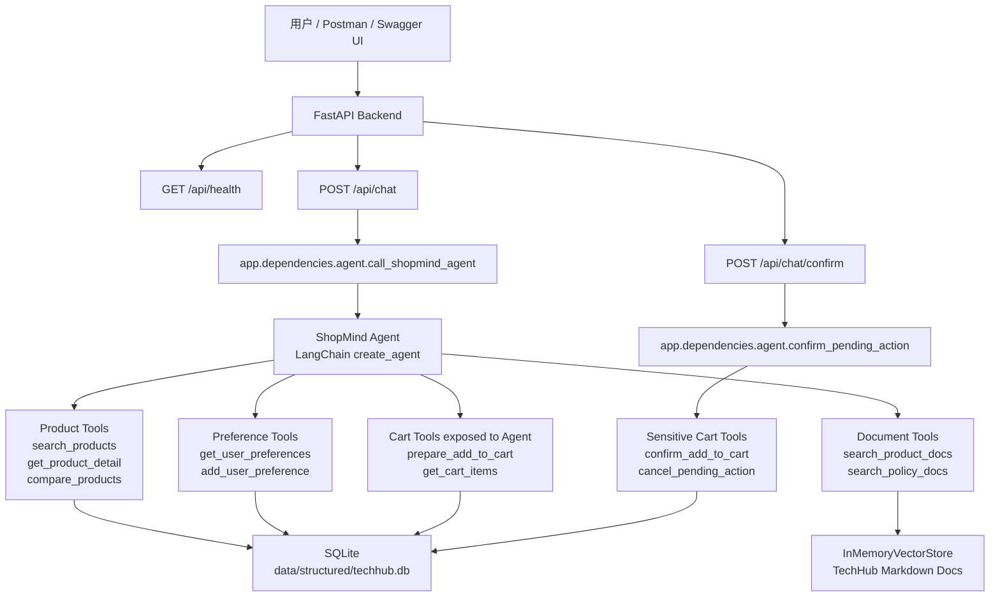

# ShopMind V1 架构设计

## 项目背景

ShopMind V1 是在原 TechHub 电商 Agent Workshop 基础上改造出来的购物决策 Agent 后端项目。原项目主要用于教学 LangChain、LangGraph、LangSmith 的 Agent 生命周期，核心场景偏“电商客服”；ShopMind V1 则把它收敛成一个更适合展示和写进简历的后端项目：

- 用 FastAPI 提供 HTTP API；
- 用单个 LangChain Agent 承载购物决策逻辑；
- 用多个 LangChain Tools 访问商品、文档、用户偏好、购物车和待确认动作；
- 继续复用原项目 TechHub SQLite 数据和 Markdown 文档 RAG。

V1 的重点不是做完整电商系统，而是完成一个可运行、可测试、可解释的 Agent 后端闭环。

## V1 架构图



## 请求链路

### 普通购物咨询

```text
POST /api/chat
  → app/api/routes/chat.py
  → app/dependencies/agent.py
  → agents/shopmind_agent.invoke_shopmind_agent
  → ShopMind Agent
  → Tools
  → SQLite / InMemoryVectorStore
  → ChatResponse(status="completed")
```

### 加购确认

```text
POST /api/chat
  → ShopMind Agent 调用 prepare_add_to_cart
  → 写入 pending_actions
  → 返回 confirmation_required + pending_action_id

POST /api/chat/confirm
  → confirm_pending_action
  → confirmed=true 调用 confirm_add_to_cart
  → confirmed=false 调用 cancel_pending_action
  → 更新 pending_actions / cart_items
  → 返回 completed 或 cancelled
```

## 为什么 V1 采用单 Agent + 多 Tool

原 workshop 中已经有 Supervisor Multi-Agent 示例，但 ShopMind V1 暂时采用单 Agent + 多 Tool，原因是：

1. V1 的目标是做出可展示的购物决策闭环，而不是证明多 Agent 编排复杂度。
2. 当前业务边界还比较清晰：商品检索、文档检索、偏好记忆、购物车确认都可以通过 Tool 表达。
3. 单 Agent 更容易调试、测试和接入 FastAPI。
4. 对简历项目来说，“Agent 能根据用户意图动态选择工具，并完成安全加购确认”已经足够体现 Agentic 后端能力。

后续如果业务扩展到更复杂的角色分工，例如导购 Agent、售后 Agent、订单 Agent、风控 Agent，再拆 Multi-Agent 更合理。

## 为什么 V1 不使用 A2A

V1 没有采用标准 A2A 协议或分布式 Agent-to-Agent 通信。当前项目中的 Agent 和 Tools 都运行在同一个 Python 后端进程中，不涉及 Agent Card、Agent Discovery、跨服务任务生命周期或独立 Agent Server。

不使用 A2A 的原因：

- V1 没有多个独立部署的 Agent 服务；
- 业务流程主要是单用户请求内的工具调用；
- 引入 A2A 会增加部署、协议、鉴权、任务状态同步等复杂度；
- 对第一版简历项目来说，A2A 的收益低于成本。

如果后续将商品 Agent、订单 Agent、客服 Agent 独立部署为多个服务，再考虑 A2A 会更自然。

## 为什么 V1 使用 SQLite 和 InMemoryVectorStore

V1 继续使用原项目的 SQLite 和 InMemoryVectorStore：

- SQLite 已包含 TechHub 商品、订单、客户等结构化数据，足够支撑 V1 演示；
- InMemoryVectorStore 已能完成商品文档和政策文档检索；
- 避免第一阶段陷入数据库迁移、pgvector 安装、数据导入和 Docker 编排；
- 降低学习成本，让重点放在 Agent、Tool、FastAPI 和安全确认链路上。

这不是说 SQLite 适合生产大规模电商，而是它很适合作为 V1 的可运行 MVP 数据层。

## V2 演进方向

V2 可以沿以下方向增强：

- PostgreSQL + pgvector：替代 SQLite 和 InMemoryVectorStore，统一结构化数据和向量检索存储；
- LangGraph interrupt/resume：把当前 pending_actions API 确认机制升级为图状态级 HITL；
- Docker Compose：一键启动 FastAPI、PostgreSQL、pgvector 和测试环境；
- 更完整的评测体系：加入 LangSmith dataset、offline evaluation、工具调用准确率和加购安全性评测；
- 更严格的会话状态：使用 thread_id 管理多轮上下文和 pending action 生命周期。
