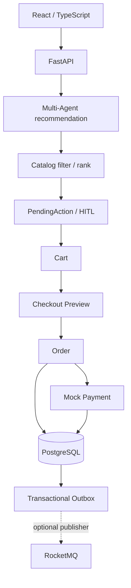
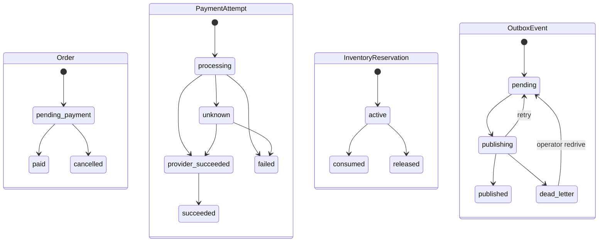
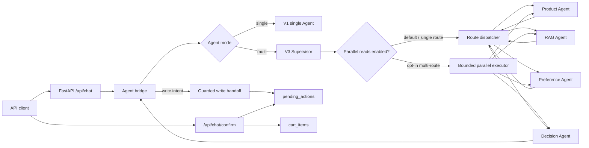
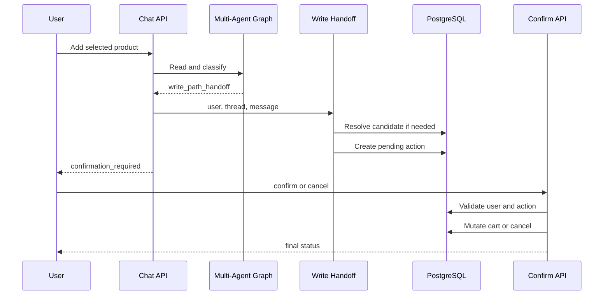
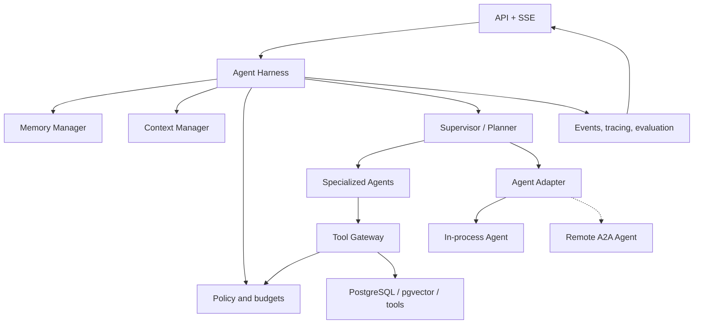

# ShopMind Architecture

Updated: 2026-08-11

## Purpose

ShopMind is the current Release Candidate architecture for a complete,
SKU-level commerce workflow: Multi-Agent recommendation -> Catalog / SKU ->
PendingAction / HITL -> Cart -> Checkout Preview -> Order and Inventory
Reservation -> Mock Payment -> Transactional Outbox -> optional RocketMQ FIFO
publisher. PostgreSQL is the source of truth for commerce state.

The current Alembic head is `0014_shopmind_outbox_events`.
`0007_governance_audit` is the pre-commerce / pre-ShopMind-commerce baseline,
not the current migration head.

## Current Commerce Architecture

```mermaid
flowchart TB
    Browser["React / TypeScript"] --> API["FastAPI"]
    API --> Agents["Multi-Agent recommendation"]
    Agents --> Catalog["Catalog filter / rank"]
    Catalog --> Pending["PendingAction / HITL"]
    Pending --> Cart
    Cart --> Checkout["Checkout Preview"]
    Checkout --> Order
    Order --> Payment["Mock Payment"]
    Order --> PG[(PostgreSQL)]
    Payment --> PG
    PG --> Outbox["Transactional Outbox"]
    Outbox -. "optional publisher" .-> MQ["RocketMQ"]
```

Agents and Catalog reads can propose a SKU, but only an explicitly confirmed
PendingAction can mutate the owner-scoped Cart. PostgreSQL owns every commerce
fact; RocketMQ is not on the synchronous request path.

### Checkout, Payment, and Outbox transaction sequence

```mermaid
sequenceDiagram
    participant UI as React
    participant API as FastAPI
    participant DB as PostgreSQL
    participant Provider as Mock Provider
    participant Worker as Outbox Worker
    participant MQ as RocketMQ

    UI->>API: Checkout Preview
    API->>DB: read stable Cart/Catalog snapshot
    API-->>UI: signed checkout token
    UI->>API: Create Order + Idempotency-Key
    API->>DB: lock SKUs, reserve inventory, create pending_payment Order + Outbox
    DB-->>API: commit
    API-->>UI: Order

    UI->>API: Pay + Idempotency-Key
    API->>DB: claim PaymentAttempt
    DB-->>API: commit claim
    API->>Provider: provider call outside DB transaction
    Provider-->>API: success / failure / unknown
    API->>DB: persist provider outcome
    DB-->>API: commit outcome
    API->>DB: lock Order/Attempt/Reservations/Inventory; consume stock; mark paid/succeeded; enqueue Outbox
    DB-->>API: atomic finalization commit

    Worker->>DB: claim lease and commit
    Worker->>MQ: publish outside business transaction
    MQ-->>Worker: acknowledgement
    Worker->>DB: CAS mark published
```

Provider I/O never holds a PostgreSQL transaction. MQ publish is also outside
the business transaction: the committed Outbox row is the durable handoff, so
delivery is at-least-once rather than exactly-once.

### Commerce state and data relationships

```mermaid
stateDiagram-v2
    state Order {
        [*] --> pending_payment
        pending_payment --> paid
        pending_payment --> cancelled
    }
    state PaymentAttempt {
        [*] --> processing
        processing --> unknown
        processing --> provider_succeeded
        processing --> failed
        unknown --> provider_succeeded
        unknown --> failed
        provider_succeeded --> succeeded
    }
    state InventoryReservation {
        [*] --> active
        active --> consumed
        active --> released
    }
    state OutboxEvent {
        [*] --> pending
        pending --> publishing
        publishing --> published
        publishing --> pending: retry
        publishing --> dead_letter
        dead_letter --> pending: operator redrive
    }
```

`OrderItem` snapshots price, currency, product, and SKU names/codes. Active
Reservations point to OrderItems and SKU Inventory. Payment success atomically
decrements on-hand and reserved quantities, consumes Reservations, marks the
Order and PaymentAttempt successful, increments inventory versions, and writes
the versioned Outbox event.

## Current API Boundary

The running FastAPI application and its versioned OpenAPI artifacts expose:

- `GET /api/health`
- `GET /api/health/governance-audit`
- `GET /api/health/outbox`
- `GET /api/health/postgres`
- `GET /api/health/preflight`
- `GET /api/health/readiness`
- `GET /api/health/service-metrics`
- `POST /api/chat`
- `POST /api/chat/confirm`
- `POST /api/chat/stream`
- `GET /api/cart`
- `DELETE /api/cart`
- `PATCH /api/cart/items/{cart_item_id}`
- `DELETE /api/cart/items/{cart_item_id}`
- `POST /api/checkout/preview`
- `POST /api/orders`
- `GET /api/orders`
- `GET /api/orders/{order_id}`
- `POST /api/orders/{order_id}/cancel`
- `POST /api/orders/{order_id}/payments`
- `GET /api/orders/{order_id}/payments`
- `POST /api/pending-actions/add-to-cart`
- `GET /api/pending-actions/{pending_action_id}`
- `POST /api/pending-actions/{pending_action_id}/confirm`
- `POST /api/pending-actions/{pending_action_id}/cancel`
- `POST /api/owner-data/inspect`
- `POST /api/owner-data/memory/correct`
- `POST /api/owner-data/memory/delete`
- `POST /api/owner-data/delete`
- `POST /api/owner-data/runs/inspect`

Identity and anti-enumeration behavior remain server-owned. Generated OpenAPI
is the machine-readable contract; this list is the human-readable entry point.

## Retained Agent Runtime / Historical Architecture Context

The following V3-V6 sections document retained runtime compatibility and the
design lineage still present in the RC. Their historical roadmap language does
not override the current commerce architecture, API boundary, or migration
head above.

### V3 System

```mermaid
flowchart LR
    Client["API client"] --> API["FastAPI /api/chat"]
    API --> Bridge["Agent bridge"]
    Bridge --> Mode{"Agent mode"}
    Mode -->|single| Single["V1 single Agent"]
    Mode -->|multi| Supervisor["V3 Supervisor"]
    Supervisor --> Gate{"Parallel reads enabled?"}
    Gate -->|default / single route| Dispatcher["Route dispatcher"]
    Gate -->|opt-in multi-route| Parallel["Bounded parallel executor"]
    Dispatcher --> Product["Product Agent"]
    Dispatcher --> RAG["RAG Agent"]
    Dispatcher --> Preference["Preference Agent"]
    Parallel --> Product
    Parallel --> RAG
    Parallel --> Preference
    Parallel --> Decision["Decision Agent"]
    Product --> Dispatcher
    RAG --> Dispatcher
    Preference --> Dispatcher
    Dispatcher --> Decision["Decision Agent"]
    Decision --> Bridge
    Bridge -->|write intent| Handoff["Guarded write handoff"]
    Handoff --> Pending["pending_actions"]
    Client --> Confirm["/api/chat/confirm"]
    Confirm --> Pending
    Confirm --> Cart["cart_items"]
```

Selected read routes execute sequentially by default, then the Decision Agent
synthesizes their structured output. A server-owned, default-off V5 feature gate
can run multiple independent read routes with bounded parallelism; single-route
and write flows retain the V3 path.

### Responsibilities

| Component | Responsibility | Tool capability |
| --- | --- | --- |
| Supervisor | Classify intent and choose ordered routes | None |
| Product Agent | Search, inspect, compare products | Product reads only |
| RAG Agent | Retrieve specifications and policies | Document reads only |
| Preference Agent | Read long-term preferences | Preference read only |
| Decision Agent | Combine evidence; answer or request handoff | None |
| Write handoff | Resolve product/quantity; prepare action | Guarded prepare action |
| Confirmation boundary | Confirm/cancel pending action | Internal cart mutation |

Deterministic routing is the V3 baseline. The optional LLM router uses structured
output and falls back to deterministic routing on provider/model failure.

### Read Flow

1. FastAPI validates `ChatRequest`.
2. `app.dependencies.agent.call_shopmind_agent` selects single or multi mode.
3. Supervisor emits a structured route decision.
4. Dispatcher runs Product, RAG, and/or Preference Agents in order.
5. Specialists write bounded summaries to shared graph state.
6. Decision Agent creates the final response.
7. FastAPI returns complete JSON and optional debug metadata.

The route is declared `async`, but V3 Agent execution is synchronous. SSE,
disconnect cancellation, and centralized deadlines are V4 work.

### Write Flow

```mermaid
sequenceDiagram
    participant U as User
    participant C as Chat API
    participant M as Multi-Agent Graph
    participant W as Write Handoff
    participant P as PostgreSQL
    participant H as Confirm API

    U->>C: Add selected product
    C->>M: Read and classify
    M-->>C: write_path_handoff
    C->>W: user, thread, message
    W->>P: Resolve candidate if needed
    W->>P: Create pending action
    C-->>U: confirmation_required
    U->>H: confirm or cancel
    H->>P: Validate user and action
    H->>P: Mutate cart or cancel
    H-->>U: final status
```

Invariants:

- Read Agents never receive cart mutation tools.
- Product selection is explicit or comes from an unexpired candidate context
  owned by the same user/thread.
- Preparing an action never mutates the cart.
- Confirmation checks user ownership and action state.
- Smoke/evaluation users are cleaned before and after execution.

### State And Persistence

#### Working State

`ShopMindMultiAgentState` carries request identity, routing fields, specialist
summaries, final decision, safety flags, tool names, and Agent-step events. It is
working memory for one invocation, not durable conversation memory.

#### PostgreSQL And pgvector

PostgreSQL is the ShopMind persistence path:

- customers, products, orders, and order items;
- preferences, cart items, pending actions, and candidate contexts;
- V4.1 runtime persistence tables for `conversation_threads`,
  `conversation_messages`, `agent_runs`, `agent_run_events`,
  `conversation_summaries`, and `idempotency_records`;
- V6 governance audit records containing only domain-separated actor, owner,
  thread, run and resource fingerprints plus closed allowlisted metadata;
- product and policy document chunks with pgvector embeddings;
- Alembic migrations through the historical `0007_governance_audit` baseline;
  current commerce migrations continue through `0014_shopmind_outbox_events`.

Inherited SQLite/vectorstore paths remain for workshop/legacy compatibility.
New ShopMind runtime persistence should use PostgreSQL.

### Observability And Evaluation

V3 emits stable metadata rather than raw LangChain objects: Supervisor decisions,
routes, Agent steps, tool names, Decision output, safety flags, candidate-context
events, and pending-action events. These feed metrics, CI artifacts, PR summaries,
API smoke, and LangSmith experiments.

V6 adds a closed evaluation composition layer rather than dynamically importing
manifest callables. `shopmind.evaluation-catalog.v1` maps seven
server-registered deterministic runners to ten required quality, safety,
trajectory, memory and resource dimensions. The accepted baseline is a tracked,
versioned policy artifact; candidate execution cannot rewrite it. CI reuses the
separate V5 JSON artifacts when present, runs missing deterministic suites, and
publishes a catalog-run JSON plus a readable 43-check regression summary.

### V4 Runtime Compatibility Layer

V4.1 keeps the public V3 API contract intact while inserting a thin internal
runtime layer:

- `app.runtime.contracts` defines structured request, context, result, event,
  tool-call, usage, and error models.
- `app.runtime.harness` wraps legacy single-agent, multi-agent, and confirmation
  paths so the same request can emit runtime IDs, ordered events, and durable
  run/message records.
- The first V4.2 slice also applies request policy and budgets, retryable
  failures, synchronous deadline/cancellation checks, and unified finalization
  while preserving the V3 response adapter.
- Server-owned runtime settings now resolve retry, duration, step, tool,
  prompt/completion/total-token, cost, and context budgets into each
  `RunRequest`; sensitive-tool permission remains deny-first and is granted only
  to the confirmation operation.
- `/api/chat/stream` now exposes ordered Harness events through SSE while the
  worker-thread compatibility bridge is used for synchronous V3 execution.
- SSE uses bounded in-process event queues and a local concurrency admission
  limit. Queue pressure requests Harness cancellation; it does not attempt to
  interrupt a synchronous provider or claim distributed rate limiting. Accepted
  worker event deliveries are flushed before the final result/error and stream
  terminator, preserving lifecycle order across the thread/event-loop boundary.
- The first V4.5 Tool Gateway slice centralizes capability lookup, structured
  argument validation, ownership checks, sensitive-tool policy, output limits,
  per-run budgets, and tool-call audit records.
- The confirmation boundary is now a separate registered capability; only the
  explicit confirm operation enables sensitive tools, while ordinary chat keeps
  the default deny policy.
- V3 read Agents also delegate actual tool execution through the same gateway,
  keeping capability validation and result-limit enforcement on one path.
- Each runtime invocation binds its own `RunContext` to read-tool wrappers, so
  user/thread and budget policy is scoped to one run rather than a process-wide
  singleton.
- Gateway records from those wrappers are normalized by the Harness into
  persisted tool-call records and ordered audit events.
- Failed tool attempts receive the same durable record treatment, with safe
  error metadata and a `tool.call.failed` audit event before `run.failed`.
- Gateway execution controls now skip tool invocation when the run has already
  been cancelled or timed out, and capability duration overruns are captured as
  audit metadata after a provider returns.
- Gateway capabilities now declare typed database read/write resource policy;
  the policy is retained in tool audit records. Network access remains disabled
  unless a future capability explicitly supplies an HTTPS host allowlist.
- Production V3 Gateway construction validates the allowlist against an
  explicit capability policy manifest, so an unclassified tool fails closed at
  startup rather than inheriting a name-based default.
- The same manifest declares each tool's permitted Agent ownership; strict
  startup validation rejects an allowlist assignment that drifts from it.
- Capability policy entries are exposed through a read-only manifest whose
  coverage test uses the production V3 allowlist directly.
- Nested resource policies are immutable, preventing in-place changes to a
  manifest entry's database or network declaration.
- Gateway registration rejects inconsistent confirmation declarations, including
  sensitive writes without confirmation and read tools that claim it.
- Tool-call audit records and events include each capability's confirmation
  requirement, keeping persisted and streamed execution data self-describing.
- Pending-action transitions use a typed action contract and registry; generic
  action types, token-level provider streaming, context compaction, resource
  isolation, and remote A2A remain later V4 milestones.
- The V3 write handoff validates action creation through that same registry
  before invoking the prepare tool, so creation and confirmation share the
  same action-type boundary.
- Prepare action execution uses a `WRITE` gateway capability and is audited in
  the Harness; confirm and cancel remain `SENSITIVE_WRITE` operations requiring
  the explicit confirmation policy.

### Historical Runtime Limits and Boundaries

- No hard async execution interruption or token-level provider streaming.
- No context compaction or automatic memory extraction.
- SSE concurrency control is local by default. Explicit Redis mode provides
  cross-process admission and the closed coordination operations; real
  two-client concurrency and TTL behavior are integration-tested.
- The generic Action Registry currently implements add-to-cart and
  save-preference. New sensitive action types still require an exact definition,
  edit schema, handler, persistence path, and lifecycle/evaluation coverage.
- No OS sandbox or network/database resource isolation; gateway policy is
  application-level only.
- Production/default Agent communication is in-process. A server-owned,
  default-off HTTP transport exists only for RAG; there is no caller-selected
  endpoint or general remote A2A mesh.
- The runtime now exposes typed task/result envelopes and a synchronous local
  adapter. All V3 read specialists now use it: product, RAG, and preference.
  RAG maps retrieved document IDs to typed evidence references, and preference
  preserves the typed task's user scope for its existing read tool.
- Local adapters share a delegation budget guard for each compiled graph. It
  rejects tasks over trusted depth, per-parent child-task, or run step limits
  before a handler runs. Reservations are run/task scoped and atomic across
  parallel adapters; V3 continues to submit root specialist tasks.
- Supervisor now emits a typed deterministic execution plan alongside its
  routes. Default and single-route plans remain sequential with
  `max_parallelism=1`; explicitly enabled multi-route read plans can select
  bounded parallel execution while the dispatcher remains the default path.
- Supervisor accepts an injectable planner boundary. The default planner is
  deterministic. An optional provider proposal must exactly match the
  server-compiled route, intent, step, dependency, identity, and parallelism
  policy; accepted proposals are recompiled and invalid proposals fall back
  without exposing provider errors.
- A lazy LangChain structured-output planner can be explicitly selected by
  server configuration. It uses the configured workshop model only after a
  non-empty read plan exists. Router selection is independent, write handoff
  never invokes the planner model, and every proposal retains the same
  validator/fallback boundary.
- Planner policy has a deterministic offline evaluation boundary. Fixed
  trajectories exercise accepted sequential/parallel plans and adversarial
  route, dependency, identity, mode, parallelism, malformed-provider, and
  write-guard cases without invoking a model or database. Default CI pins the
  deterministic planner, gates on this suite, and publishes its JSON artifact.
- A separate compiled-graph replay boundary exercises complete and partial
  fan-out/fan-in, shared tool budgets, and cancellation with fake tools. Its
  versioned output normalizes concurrency into stable counts and plan-order
  invariants instead of treating thread completion order as a contract. Default
  CI gates on this replay and uploads it separately from planner-policy results.
- A local bounded executor can run explicitly enabled, independent plan steps
  and deterministically fan in typed results, evidence, usage, and sanitized
  errors. The server-owned feature gate is connected to the graph, each step
  receives isolated state, and shared runtime/tool accounting is
  concurrency-safe. Fan-in preserves plan order, and partial failures retain
  successful summaries for Decision Agent synthesis. Each worker also receives
  its own copy of the parent execution context so request-local context variables
  survive thread fan-out without sharing one mutable context.
- Typed token/cost measurements flow from specialist `AgentResult` values
  through sequential state or plan-ordered parallel fan-in into persisted
  `RunResult.usage`. A shared run guard atomically reconciles cumulative usage
  against the stricter server/task ceiling. Configured but unavailable metrics
  fail closed; provider output cannot supply or increase policy limits. This is
  post-execution reconciliation, not a claim that a synchronous provider call
  can be interrupted after crossing a token or cost boundary.
- Delegation deadlines and maximum run duration are also enforced at adapter
  admission and reconciliation. The earliest deadline and stricter duration
  win, using the trusted Harness run start. Expired work maps to sanitized
  timeout-sourced plan errors before tools where possible; a synchronous call
  already in progress may finish and is classified only when control returns.
- Specialist graph bridges depend on the transport-neutral `AgentAdapter`
  protocol and call a shared validation wrapper around typed task/result
  envelopes. Product and preference remain in-process; RAG may select the
  bounded server-owned HTTP adapter only through trusted Registry construction.
- `PolicyEnforcedAgentAdapter` decorates those transports with the shared
  delegation admission, timeout, usage, and result-reconciliation lifecycle.
  Transport implementations do not own or redefine these server controls.
- The production graph resolves those adapters through an immutable,
  exact-recipient `AgentAdapterRegistry` built by server code. Its default
  factory registers product, RAG, and preference policy-wrapped in-process
  adapters with one shared delegation guard and enables the registry's
  policy-required mode, so a bare transport fails during construction.
  Duplicate, malformed, or unknown recipients also fail closed. The generic
  registry remains transport-neutral for conformance tests; clients cannot
  select adapters or inject endpoint configuration.
- Adapter failures are normalized at execution boundaries. Parallel plan
  failures expose stable error codes while retaining successful specialist
  summaries, and the Harness persists sanitized messages for unknown executor,
  adapter-contract, and delegation-budget failures rather than raw exception
  text. Tool Gateway failures keep their capability-specific audit mapping.
- Transports share a typed `AgentTransportError` boundary with a closed
  failure-code set and explicit retriability. Executor-owned retries consume
  the signal; plan steps preserve it for orchestration and can replay only
  under an explicit server-owned policy.
- Task retry policy is now a frozen contract owned only by the Plan Executor.
  Runtime-derived task idempotency keys bind run/task identity, attempts are
  capped, and identity/accounting requirements cannot be relaxed.
- Typed transport failures now include measured attempt usage. The shared guard
  reconciles failed usage before propagation, plan fan-in retains it, and the
  Harness combines failed and successful attempts before checking budgets or
  persisting a run. Unknown configured metrics and cumulative overruns fail
  closed.
- Specialist replay is disabled at one attempt by default. Server configuration
  may opt into at most three attempts for typed unavailable/timeout failures;
  protocol errors are excluded. The canonical plan policy flows into each task,
  provider planners cannot widen it, and the Plan Executor preserves identity,
  checks cancellation between attempts, and aggregates all attempt usage.
  Retry-enabled sequential reads use the same executor while the default V3
  dispatcher remains unchanged.
- Every executor-owned specialist attempt emits a frozen structured lifecycle
  payload. Attempt start/completion/failure and retry scheduling, start,
  success, exhaustion, non-retriable, budget-blocked, and cancellation
  decisions use the Harness-owned monotonic `AgentEvent` sequence. Those same
  events are retained in `agent_run_events` and mirrored to SSE without a
  second observability path.
- `RuntimeTrajectoryRecorder` projects a terminal persisted run into an
  owner/thread-scoped `shopmind.runtime-trajectory.v1` snapshot. It requires a
  contiguous Harness event sequence, matching run/thread/user/trace identity,
  and a status-compatible terminal event. Raw request, result, output, debug,
  tool-record and event payloads are represented only by canonical SHA-256
  fingerprints; only a closed safe scalar classification is replay-visible.
- `RuntimeTrajectoryReplayer` reloads that snapshot through a fresh session
  factory and compares every normalized identity, status, usage, event and
  fingerprint field. The offline resilience suite uses separate SQLite engines
  to cover provider, tool, transport, cancellation, idempotency and action
  restart paths without models or network calls. PostgreSQL tests apply the
  same boundary through a newly constructed engine.
- `RuntimeCoordinationBackend` is the V6 boundary for admission leases, fixed
  rate windows, duplicate claims and bounded cache entries. Every subject/key
  crossing it is a SHA-256 fingerprint rather than a user identifier or raw
  idempotency key. Decisions are frozen structured models with explicit
  backend/reason fields.
- `LocalRuntimeCoordinationBackend` is a single-process fallback with injectable
  monotonic time, renewable expiring leases, TTL cleanup, atomic locking, LRU
  eviction and bounded state/value sizes. It establishes semantics for later
  backend equivalence but is not a distributed coordination claim.
- A server-owned factory selects the backend. Local is the default and unknown
  legacy values normalize to it. Explicit Redis requires a secret URL, an
  installed client and a reachable service; failure raises a sanitized startup
  error rather than silently degrading. Versioned keys share one Redis cluster
  hash slot and atomic Lua scripts own every multi-key transition.
- `/api/chat/stream` now acquires an opaque admission lease, renews it before
  TTL expiry while the generator is active, and releases that exact lease token
  on every generator exit. Capacity exhaustion retains the existing HTTP 429
  response, and SSE payload/order behavior is unchanged.
- `IdentityBoundary` is the V6 HTTP owner-binding seam. Server configuration
  selects `development_payload` (the compatibility default) or
  `trusted_header`, or the production-facing `signed_header`; request JSON
  cannot select a provider, role or scope.
  Trusted-header mode uses the fixed `X-ShopMind-Authenticated-User` ingress
  header, rejects missing identity with 401 and rejects a mismatched body
  `user_id` with 403 before Agent execution or stream admission. Raw subjects
  are excluded from structured repr and have a namespaced SHA-256 fingerprint
  for later audit use.
- `signed_header` keeps the same owner binding and adds
  `X-ShopMind-Identity-Timestamp`, `X-ShopMind-Identity-Nonce`, and
  `X-ShopMind-Identity-Signature`. A server-owned HMAC-SHA256 secret verifies a
  versioned, short-lived assertion; a fingerprint-only duplicate claim makes
  each assertion one-time. The local coordination backend is process-scoped,
  while explicit Redis mode provides atomic replay rejection across instances.
  Credential, expiry, replay and coordination failures all use the same public
  401 response and never reach Agent, action or stream execution.
- `GovernanceAuditRecord` is a separate frozen
  `shopmind.governance-audit.v1` fact, not a copy of an arbitrary
  `AgentEvent.payload`. A closed factory converts authentication,
  `ToolCallRecord`, action, memory and deletion decisions into category-specific
  allowlisted metadata. Actor/owner/thread/run/resource references are
  domain-separated fingerprints; raw messages, tool arguments, action previews,
  credentials, headers, URLs and provider result metadata have no schema field.
  `governance_audit_records` persists that exact contract without raw identity
  columns or foreign keys. Append is immutable; inspection requires an exact
  owner fingerprint, excludes expired rows and has a fixed result bound.
  Explicit `expires_at` retention is enforced by the existing runtime cleanup
  command, independently from ordinary run deletion.
- `GovernanceAuditEmitter` is a separate post-runtime transaction. A
  server-owned default-off switch enables authentication allow/deny emission
  and Harness projection of typed tool records, closed action lifecycle events,
  and selected persisted memory items. Deterministic audit IDs make replay
  idempotent. Storage failure is sanitized and best-effort: it cannot rewrite
  an HTTP identity decision, Agent result or completed action transition.
- `GovernanceAuditEmissionMonitor` is the process-local operations seam for
  every default emitter. A lock protects monotonic closed counters and
  consecutive-failure alert state; no audit record or source identifier enters
  the snapshot. Three consecutive failures activate a structured alert by
  default, while a persisted or duplicate commit emits recovery. The additive
  health endpoint stays HTTP 200 and reports `disabled`, `ok`, `warning`, or
  `degraded` plus the versioned metrics snapshot. It is not an audit-record
  query and must be scraped per replica.
- `OwnerDataService` owns the authenticated privacy lifecycle. Inspection
  returns fixed category counts and at most 100 memory records. Correction
  replaces only an active, unexpired exact-owner memory and clears stale
  derived JSON/provenance. Single-memory and full-owner deletion are hard
  deletes; full deletion uses one transaction across preferences, cart,
  pending/candidate state and owner runtime persistence.
- Full deletion deliberately excludes product/document catalogs, inherited
  customer/order seed data, and `governance_audit_records`. When emission is
  enabled, memory inspect/correct/delete and deletion request/execute facts are
  fingerprint-only and use the audit table's independent retention. A storage
  failure becomes a stable 503 without backend details; audit failure cannot
  change a committed owner-data result.
- Cancellation is cooperative across the Harness and plan executor. Queued
  steps check the bound `RunContext` probe before execution and emit ordered
  plan/step events. A synchronous call already in progress is not interrupted;
  its actual tool audit record remains attached even when the run finalizes as
  cancelled.
- RAG evidence references also flow into the Decision Agent, which records a
  product-document scope mismatch for non-overlapping product IDs. Typed
  conflict resolution excludes the mismatched RAG summary and requests product
  clarification while retaining non-conflicting summaries; matching evidence
  follows the existing answer path.

### Retained Target Direction

```mermaid
flowchart TB
    API["API + SSE"] --> Harness["Agent Harness"]
    Harness --> Memory["Memory Manager"]
    Harness --> Context["Context Manager"]
    Harness --> Policy["Policy and budgets"]
    Harness --> Orchestrator["Supervisor / Planner"]
    Orchestrator --> Agents["Specialized Agents"]
    Agents --> Gateway["Tool Gateway"]
    Gateway --> Policy
    Gateway --> Data["PostgreSQL / pgvector / tools"]
    Orchestrator --> Adapter["Agent Adapter"]
    Adapter --> Local["In-process Agent"]
    Adapter -.-> Remote["Remote A2A Agent"]
    Harness --> Events["Events, tracing, evaluation"]
    Events --> API
```

Adapters preserve current in-process simplicity and allow a remote specialist
later. The Harness owns lifecycle concerns; Agents retain domain reasoning.

The server-owned HTTP specialist boundary is now implemented for optional remote
RAG ownership. It remains disabled by default, uses HTTPS endpoint policy and
bounded responses/timeouts, propagates task/run/trace/idempotency identity, maps
network failures into the closed transport contract, and enters the production
Registry only through `PolicyEnforcedAgentAdapter`. API payloads never select
its endpoint or token. The Action Registry dispatches add-to-cart and
save-preference through one persisted HITL boundary without changing the
released confirmation endpoint. Definition-owned extra-forbidden schemas allow
only quantity or preference-field edits. The persisted action ID is the resume
token; edit plus confirmation remains one row-locked transaction, and Harness
events record resumed, edited and terminal transitions. This closes V5. V6
Slices 1-3 provide closed evaluation/replay and local/Redis coordination.
Slice 4 adds server-owned identity binding and the PII-safe governance audit
contract, owner-scoped storage/inspection, audit-retention enforcement and a
default-off production emission path. Authenticated owner-data inventory,
memory correction/deletion and confirmed full deletion are also implemented.
Production signed-ingress identity is implemented without remote IdP/JWKS
calls. Sanitized audit metrics/alerts are implemented. The deterministic
governance lifecycle is now the eighth closed catalog runner under the explicit
Slice 4 accepted baseline, completing Slice 4. Production configuration
preflight is now implemented as a six-check static, sanitized contract.
Explicit production mode fails application creation when identity,
coordination, audit, transport, cleanup or runtime-limit relationships are
unsafe; development defaults do not change. The CLI, CI artifact and internal
health response share the same report. Service metrics/SLOs, executable
deployment/rollback/incident checks, and the compact policy-preserving
reference client with exact-owner payload-free run/trace inspection are now
implemented. Immutable implementation commit `908b918` also passed the full
clean detached-worktree validation matrix, completing V6.

Live deployment readiness is now a separate
`shopmind.deployment-readiness.v1` boundary. It combines the stored static
preflight result with read-only PostgreSQL connectivity and migration-head
queries, selected local/Redis coordination construction, and a recent
`shopmind.runtime-cleanup-evidence.v1` marker. The cleanup command atomically
replaces that timestamp-only marker after its pruning transaction commits.
Development omits production-only configuration/retention checks but still
requires database, migration and coordination readiness. The endpoint returns
200/503 from aggregate readiness; its schema cannot carry URLs, database
identity, migration values, filesystem paths or exception text.

The common Harness also feeds one process-local `RuntimeServiceMonitor`.
`shopmind.service-metrics.v1` exposes cumulative closed operation/status,
replay, measured usage, tool/step and latency counts; only the latest 1000
status/duration pairs are retained for rolling SLO calculation. The monitor
never holds high-cardinality IDs, content, tool names, error codes or request
metadata. `shopmind.service-slo.v1` evaluates minimum sample, successful
terminal rate and p95 latency with server-owned thresholds.
`shopmind.service-health.v1` combines both at
`/api/health/service-metrics` and always returns 200, leaving traffic admission
to readiness and release-controller automation.

The release controller boundary is deliberately offline.
`shopmind.release-operation-input.v1` composes captured liveness,
`shopmind.deployment-readiness.v1`, `shopmind.service-health.v1`, and
`shopmind.governance-audit-health.v1` snapshots plus closed rollback
attestations. `shopmind.release-operation-check.v1` reduces those inputs to
seven ordered checks and a closed rollout, rollback, or incident action. It
does not call endpoints, open a database/Redis connection, invoke an Agent, or
run Alembic. Coordination must be explicitly passed in the nested readiness
report; rollback additionally fails closed without a verified target and
compatible-migration attestation.

The command-line evaluator and standalone deterministic CI gate share this
pure function. Output carries no nested snapshot, deployment artifact, URL,
path, identifier, raw error, or configuration value. The external deployment
platform remains responsible for scraping every replica, verifying artifacts,
deciding schema compatibility, and performing the selected action.

The compact reference client is a consumer, not a privileged control plane.
`examples/shopmind_reference_client.py` uses only `/api/chat`,
`/api/chat/stream`, `/api/chat/confirm`, `/api/owner-data/inspect`, and
`/api/owner-data/runs/inspect`. A bounded injectable `httpx` transport validates
typed JSON, ordered SSE, response/event size, timeout, redirects and endpoint
scheme. Plain HTTP is loopback-only, remote URLs require credential-free HTTPS,
and the CLI has no arbitrary-header or signing-secret option. Trusted ingress
continues to own production identity.

Run correlation is additive and explicit: when `include_debug=true`, JSON
chat/confirm and the SSE `run.result` payload include opaque `run_id` and
`trace_id`. `shopmind.owner-run-inspection.v1` then resolves exactly one of
those selectors under the authenticated owner. The repository query includes
the owner predicate before selecting the run and returns only operation, mode,
status, usage, timestamps, pending-action correlation and bounded
client-visible event metadata. Raw request/result/input/output/debug/error/
metadata/tool-call/idempotency fields, event payloads and internal/audit events
never cross this API boundary.

### Retained Runtime Decisions

- PostgreSQL is ShopMind's system of record; SQLite is legacy/workshop support.
- Deterministic policy surrounds model decisions and cannot be overridden by an
  LLM route or plan.
- Memory is stored information; context is the bounded selection shown to one
  model step.
- Use in-process Agents first and typed A2A-ready adapters second.
- Do not claim an arbitrary-code sandbox until filesystem, network, process,
  resource, and time isolation exist.
- Stable events and replayable trajectories are designed before advanced
  orchestration.
