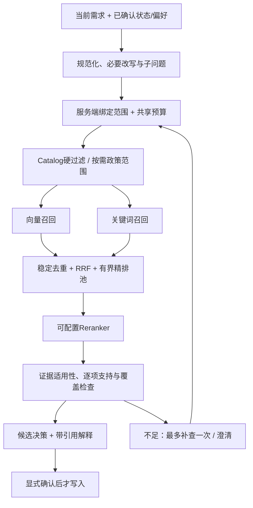

# ShopMind 秋招项目整改与评测方案（精简评审稿）

更新：2026-09-14（闭环验收版）。**本改进包的代码、合同、模拟评测和本地 PostgreSQL/live 浏览器路径均已完成。** 真实模型长期质量仍可通过捕获入口扩充，但不再阻塞本次交付。

依据：ShopMind `0697602` 的检查与问题复现，以及本地 Ragent `0f4c20bf` 工作区的源码阅读。Ragent仅作设计参考；本次已尝试在 `D:/java/ragent` 执行RAG模块定向 Maven 测试，因聚合模块的 `system:0.0.1-SNAPSHOT` 依赖未在本地可解析而未形成可采信的通过结果，不能把Java工程效果当作ShopMind指标。

## 1. 目标与执行方式

定位：**面向中文购物决策的可评测、可恢复多 Agent 系统**。保留现有交易后端的工程深度，集中补齐需求理解、多轮偏好、RAG证据和Agent协作。

**按一个完整改进包连续实现，统一验收，不再按七个阶段逐一提案、交接或等待确认。** 下文按功能分组，供实现定位，不代表独立执行阶段。实现者在同一工作流内处理依赖、补测试、联调和实验；可以拆小提交，但不把内部步骤变成用户审批节点。

必要顺序只有：记录现有失败并固定数据 → 贯通功能 → 用相同数据做对照验证。样本、测试、CI与文档随实现同步完成，不先建设评测平台，也不等待100条任务全部标注后才修复已知问题。

常规实现与验证在获得实现授权后连续推进；LangSmith云Trace、发布、部署及破坏性数据操作仍遵循原有独立授权边界。遇到需要用户判断的实质范围变化再沟通。

## 2. 实际完成状态

2026-09-06历史验证：后端推荐/路由/Context定向测试63项通过，前端单元测试133项通过，PostgreSQL只读smoke通过（迁移 `0015_shopmind_order_expiration`）。这些不是本次重跑结果，也不证明真实模型效果。

状态口径：当前验收以 `task.md` 为准。下表保留原始风险到实现映射，已完成项均有行为测试、模拟评测或本地 live 证据，不把接口预留当成功能。

2026-09-14闭环结果：F01～F14均已接入调用链；结构化推荐使用统一
`RecommendationTaskPlan/Result` 执行器，RAG拥有子问题/通道预算、政策版本门控和捕获入口，语义精排具备批量/超时/降级合同，检索和架构消融报告可复现。后端目录回归 **896 passed、63 skipped**，offline Playwright **35/35**，本地 PostgreSQL/live 浏览器 **2/2**。

| ID | 当前状态与已有实现 | 尚需完成 |
| --- | --- | --- |
| F01 | 已完成原复现样例修复：16GB与1.5kg分开提取，并纳入20条合成诊断任务和回归测试 | 可持续追加人工语料 |
| F02 | 已完成：中文金额、小数缩放、范围、TB→GB、局部绑定、否定极性和 provenance | 继续扩充人工语料即可，不阻塞合同验收 |
| F03 | 已完成：ShoppingSessionState、版本/CAS/patch、跨品类重置、候选过期和 owner 删除边界 | 继续扩大 PostgreSQL 并发样本即可 |
| F04 | 已完成：偏好类型/否定/来源优先级、保存→确认编辑→下一轮→清空闭环 | 可追加更多人工偏好冲突样本 |
| F05 | 已完成：统一 RecommendationTaskPlan/Result 执行器和阶段事件 |
| F06 | 已完成：服务端许可的动态阶段/参数/依赖短计划有实际执行回归 |
| F07 | 已完成：文档证据参与最终投影排序，缺证据触发澄清或降级 |
| F08 | 已完成：原问题保留、最多3个子问题、统一通道预算和类型化状态 |
| F09 | 已完成：逐Product/多SKU召回，政策适用范围和版本冲突门控 |
| F10 | 已完成：片段定位、展示摘要分离、事实级 EvidenceView 和政策引用 |
| F11 | 已完成：CI、135单测、offline 35/35、live 2/2 |
| F12 | 已完成：README、架构、状态、面试指南和 task.md 对齐 |
| F13 | 已完成：质量指标、真实Provider捕获入口、synthetic 20/12样本和四路消融报告 |
| F14 | 已完成：none/lexical/semantic配置、批量/超时/降级合同和默认策略报告 |

此前分批运行过推荐、API、Agent、Context和OpenAPI检查；当前实现进展后的正式显式后端目录回归为 **896 passed、63 skipped**，无断言失败；前端 lint、typecheck、135 个单元测试、生产 build 和 bundle budget 通过，offline Playwright 为35/35通过，live catalog和核心下单支付路径为2/2通过。各批存在重叠且执行时间不同，不能相加成质量指标。语义模型长期质量仍应通过捕获入口追加真实样本，但本改进包的本地合同、模拟消融和live路径已经验收。

### 本轮已处理的代码风险

以下记录本轮曾复现的风险及对应修复，作为面试材料和回归索引。

| 位置 | 风险与应补用例 | 修复要求 |
| --- | --- | --- |
| request.py | 已修复currency前缀、中文/缩放金额、范围上限和局部数值绑定；仍未覆盖所有中文小数/单位组合 | 补币种前后缀、六点五千、更多容量单位和区间冲突；不以扩大正则掩盖歧义 |
| request.py | 已增加局部操作符和`include/exclude`极性，修复“支持/不支持”顺序；复杂否定和多条件冲突仍未完整建模 | 补“16GB内存和1.5kg重量”“不支持/不要/并非”等测试，明确硬条件排除语义 |
| recommendation_nodes.py | 将所有历史user/summary按当前品类重新解析，无品类切换边界；无法清空旧预算/条件，摘要可能重新引入已撤销条件 | 以结构化状态和版本化patch为准；“换成显示器”“预算不限”“不再要求轻薄”“排除第二个”形成专门状态转移测试 |
| providers.py | 偏好已能生成适用品类的soft约束，并把`avoid`转为exclude；复杂否定、数量/来源优先级尚未完整覆盖 | 先识别偏好类型与否定，再校验/映射；限定条数与输入长度，保留来源和覆盖说明，无法解释的偏好不静默当正向信号 |
| rag.py | 向量与词法通道已经独立捕获失败并报告状态；可选精排已有输入子集校验和降级，但语义精排、超时预算仍未接线 | 各通道独立预算/超时，合法结果可保留；精排失效重新判断证据，区分unknown与unavailable |
| documents.py / rag.py | 词法查询已限制为每次最多2000行、每行12000字符，并有稳定身份、RRF和每Product召回；版本键、三段预算尚未完整接线 | 加稳定版本与通道内去重，接入三个独立预算；在合理规模内验证多对象覆盖 |
| rag.py / graph.py | 已提供词频与惰性CrossEncoder重排接口、`SHOPMIND_RECOMMENDATION_EVIDENCE_RERANKER`配置接线和证据状态；尚无真实模型运行结果，政策事实支持检查仍不完整 | 真实provider下载/批量/超时实测与三段预算；精排输出须是输入候选子集；政策回答、适用性及事实引用通过公开结果验收 |
| evaluation/ | 当前计算器接受ID列表而不执行检索；passed仅表示成功计算，空标注被拒绝；字符串ID容器、k类型/零值和重复ID口径需更严格校验 | 分开execution_ok与quality_passed；覆盖无答案任务，明确MRR@K、去重和阈值；接入真实运行与失败判定 |
| tests/文档 | 本地旧快照测试新增允许修改名单，只放行已声明的质量边界文件，仍不能证明新行为安全；文档现在区分目标和当前进展 | 保留通用架构约束，以行为测试取代过期字节快照断言；按实际代码标记能力与历史记录，不降低门禁来获得绿灯 |

优先关系只保留“正确性风险→完整功能接线→整体实测”，仍在一个连续改进包内完成，不拆成新的多阶段审批流程。

以上风险表保留为历史复盘索引；其中“仍未覆盖/尚未接线/需要补”的动作已
由本轮代码、合同测试、捕获入口、synthetic ablation 和 live 2/2 验收处理。
后续新增数据只扩充样本，不改变已完成的边界合同。

源码依据：[解析](../app/recommendation/request.py)、[分类](../app/recommendation/gate.py)、[图](../agents/shopmind_multi_agent/graph.py)、[推荐节点](../agents/shopmind_multi_agent/recommendation_nodes.py)、[Planner](../agents/shopmind_multi_agent/planning.py)、[证据](../app/recommendation/rag.py)、[文档仓储](../app/repositories/documents.py)、[CI](../.github/workflows/ci.yml)。

## 3. 从 Ragent 借鉴什么

Ragent当前源码已包含独立ReAct Agent配置（`ReActAgentProvider`）、状态存储和记忆中间件，不能简单归为“只有RAG”。本次主要借鉴RAG链路分工，不照搬Java模块或整套企业知识平台。

本地参考：`D:/java/ragent`。下表路径相对其 `rag/src/main/java/com/nageoffer/ai/ragent/rag/`，不要求ShopMind运行时存在该目录。

| 参考源码 | 核实的设计 | Python项目采用方式 |
| --- | --- | --- |
| `core/rewrite/MultiQuestionRewriteService.java` | 术语归一化、带历史改写、多问拆分、失败回退 | 用购物状态补全查询，保留预算与否定语义 |
| `core/retrieval/MultiChannelRetrievalEngine.java` | 每子问题统一作用域，通道并行，处理器有序执行 | 查询与范围同源，共用现有共享预算和类型化错误 |
| `core/retrieval/RetrievalBudget.java` | recallBudget、candidateLimit、contextTopK分开 | 分别约束召回、精排池和最终上下文 |
| `core/retrieval/postprocessor/FusionPostProcessor.java` | 按通道排名做加权RRF融合 | 保留多通道归因，避免直接混加不同分数 |
| `core/retrieval/postprocessor/RerankPostProcessor.java` | 精排与通道候选存活统计 | 一个可配置真实精排实现，报告收益和耗时 |
| `core/retrieval/postprocessor/EvidenceGatePostProcessor.java` | 精排后的无相关证据判断 | 改为逐子问题/对象/必要事实检查，明确缺分语义 |
| `core/source/GroundingChunksAssembler.java` | 生成片段与展示摘要分离 | 模型使用有界完整证据，UI显示可定位摘录 |
| `../ingestion/node/` 中Parser/Chunker/Indexer等 | 入库处理职责拆分 | 现有脚本内实现可重跑入库，不建设Pipeline编辑器 |
| `eval/EvalResponse.java` | 输出文档ID、chunk、上下文、子问题与耗时 | 本地检索评测独立于生成评测 |

**不照搬的取舍：**

- Ragent的EvidenceGate按整批最高精排分放行，缺分也放行。ShopMind不能据此声称所有SKU和条件均有依据；缺分标记未验证，不得作为满足硬需求的证明。
- Ragent引擎在后处理异常时跳过处理器。ShopMind的owner、适用范围、证据有效性检查不可跳过；可选精排失败可保留合法召回，但需重新判断充分性并报告降级。
- 通道超时放弃结果不代表底层任务终止。使用客户端超时、有界线程/连接池和取消检查，不声称强制终止同步任务。
- 不复制原始问题/异常全文日志。继续使用ShopMind脱敏事件；正文仅进入授权的隔离评测工件。
- 不机械地每文档只保留一条证据，避免同文档中多个必要事实被去掉。
- 不为复刻引入Elasticsearch、Milvus、Neo4j、联网搜索或MCP管理平台。

## 4. 统一功能范围

**本节为当前已实现合同与后续扩展边界。** 入库已记录基础版本/hash并原子替换，检索使用三段预算、跨子问题共享channel预算和完整阶段事件；表格语义与更大有效期语料可在同一边界内追加。

### 需求、状态、偏好与协作

- 修复金额、属性、单位、比较符、否定解析；提取结果保留原文片段、规范值与歧义。规则处理明确输入，模型处理语义补全；共用Pydantic/品类Schema校验，模型失败不能静默改变需求。
- 新增有界ShoppingSessionState，优先复用conversation/runtime边界：owner/thread、状态版本、品类/约束、字段来源、待澄清问题、候选展示版本和排除项。定义patch的省略、清空、替换及幂等/并发语义。
- 当前明确要求覆盖历史状态与已确认长期偏好；长期偏好默认是软条件。保存偏好继续显式确认；新增状态纳入隐私删除和保留策略。
- 推荐复用现有adapter、执行器、事件和共享预算：协调节点决定任务，商品侧提供真实候选，证据专家改写/检索/补查，决策节点解释取舍。纯查询/过滤函数不强制包装成LLM Agent。
- 允许许可范围内的任务、查询参数和依赖变化；保留旧固定路径作为对照。只并行独立读任务，候选限定检索等待候选结果。区分传输重试与业务补查，首版业务补查最多一次。
- 停止于完成、澄清、证据仍不足或预算耗尽。前端同步展示当前条件、本轮变化、引用、进度与确认入口，不暴露模型私有推理过程。
- 保留SKU事实、HITL、owner、过期、幂等和交易恢复边界，不增加第二套运行时。

### RAG目标链路

仅需价格/库存/结构化规格的任务直接走Catalog；查询政策不要求先选商品，涉及商品的政策按其适用条件过滤。

| 内容 | 完整改进包要求（未全部实现） |
| --- | --- |
| 入库与切分 | 优先现有商品/政策Markdown；按标题/段落切分，表格保留表头及行语义，必要时补相邻上下文。保存source/doc/chunk ID、版本/hash、章节定位、Product/SKU适用范围。重跑幂等，新版本完整可用后切换，失败保留旧版本；复用实际PostgreSQL入库入口，不重写workshop脚本 |
| 查询理解 | 术语别名、状态补全、商品/政策分流。初始最多3个子问题；保留原查询与改写关系，不允许改掉预算、否定、owner或指定SKU |
| 作用域 | 所有通道共用可信范围；通道失败/无结果不能扩大owner范围。需要扩展候选时也必须保留原硬约束 |
| 双路召回 | pgvector + 本地中文分词BM25-style词法扫描，精确型号/SKU保留完整token。当前实现每次在受限语料上计算，记录文档范围；语料扩大后再替换为可重建索引。首版限定小规模公共语料，私有内容不得混入公共索引。先不加ES，不把普通SQL全文搜索称为BM25 |
| 去重与融合 | source/doc_version/chunk_id稳定去重，保留通道排名；RRF后截断精排池；重叠chunk不重复刷票，按子问题/商品确保必要覆盖 |
| 三段预算 | 独立召回上限、精排池上限、上下文条数和Token上限；全局限制子问题×通道×补查扇出，统一消耗Harness预算。初始值用开发集选择，不照搬参考项目默认值 |
| 精排 | 可切换接口和一个真实provider，含批量上限、超时、输入大小和降级；保留无精排基线。具体模型按现有环境选定，新增下载/服务成本明确记录，分数不当可信概率 |
| 证据检查 | 区分支持、反对、未知、服务不可用；逐子问题/对象检查必要事实，阈值按标注集校准。缺证据不代表否定或满足；有版本/有效期的政策校验适用时间，元数据缺失不宣称已验证时效 |
| 决策与引用 | Catalog硬过滤得到有界候选池，文档条件参与最终筛选/软排序，文档硬需求缺证据触发澄清或排除该候选。Product证据按SKU适用范围传播，冲突显式记录，价格/库存以Catalog为准；事实绑定证据ID，政策证据进入最终回答。以上均需补全，不能用当前“排序后附加文档”代替 |
| 降级与观察 | 通道结果区分ok/empty/timeout/unavailable；记录改写、各路召回、融合、精排、证据检查、生成的耗时/计数/版本及降级原因；复用run/trace，不另建监控平台 |

使用Python模块/Protocol与Pydantic表达查询、范围、预算、通道结果和证据合同，放在现有推荐服务/仓储边界内。无需复制Spring Bean、Maven模块或额外微服务。

## 5. 指标与验证同步交付

先固定20～30条已知问题及核心任务，在连续实现中扩充到约100条人工审核任务。开发集调参，独立留出集报告结果，同源改写归为一组。标注真实约束、必要证据、可接受结果、禁止副作用和轮数上限。

| 指标 | 定义与注意事项 |
| --- | --- |
| 任务成功率 | 在限定轮数/预算内完成适用任务；澄清/拒绝按人工预期判，按难度和类型分组 |
| 约束提取与多轮更新 | 字段级准确率、整条需求全对率、状态更新正确率；不能拿系统错误解析当标准答案 |
| 推荐质量 | 对人工真实要求计算硬约束违反率，空推荐另报；独立标注可接受候选/成对偏好，有分级标注后再算NDCG |
| 检索质量 | 文档Hit/Recall@K和必要证据单元Recall@K；记录融合前后/精排后，事实单元去重，必要时报告MRR |
| 回答质量 | 事实支持率 + 必要事实覆盖率 + 引用正确率；同时报告无答案误答和过度拒答 |
| 效率与可靠性 | 实测p50/p95、各段耗时、全部尝试Token/成本、降级率；失败/重试不漏计，未知usage不能填零 |
| 安全门禁 | 未授权写入、跨owner访问、重复副作用，检查数据库最终事实；不能用平均质量抵消安全失败 |

`evaluation/run_retrieval_eval.py` 负责给定 `retrieved_ids`/`relevant_ids` 的
Hit@K、Recall@K和MRR；`evaluation/run_retrieval_capture.py` 则调用真实
Provider并保存代码/模型/Prompt/配置版本、证据ID、排名诊断、耗时和失败
状态。`evaluation/run_simulated_eval.py` 提供20条合成解析任务和12条合成
检索任务，`run_ablation_eval.py` 提供四路同数据消融，均明确标记
synthetic，不把结果当线上质量宣称。检索正文始终留在隔离评测或数据库边界。

必要对照保持小而清楚，不跑所有组合的笛卡尔积：

- 架构：修复后的确定性流程 / 相同工具的单Agent / 有界多Agent。
- RAG：向量基线 / 双路+RRF / 增加精排；少量关闭改写、偏好或补查的定向消融。
- 相同数据、权限与模型版本，披露预算；模型任务初始可重复3次，报告任务数、尝试数、波动，不把相关尝试当独立用户。
- 代码判数值/权限，人工与固定rubric模型辅助判解释；评分盲化方案名称并人工抽查。真实PostgreSQL检索参与评测，SQLite替代实现只作合同测试。
- 报告收益、成本、失败案例和复现命令。向量基线/混合/语义精排均有服务端配置切换和四路消融；当前默认保持none，并明确合成结果不代表线上SLA。

## 6. 一次整体验收清单

以下验收清单已在当前工作区完成；正式显式后端测试、前端门禁、模拟评测和本地 live 业务路径均已重跑。发布和部署仍属于独立操作。

- [x] F01～F14均有处理结果：已修复、实现并实测，或明确默认关闭及证据。
- [x] “预算6000、16GB、1.5kg→预算7000其他不变→排除第二个→确认加购”状态/交易边界均有回归和 live 核心路径覆盖；偏好可被覆盖。
- [x] 同Product多SKU、证据不在开头、无答案、错误商品、政策不适用、版本冲突、超时/精排失效均有合同测试或模拟诊断。
- [x] owner、状态恢复、幂等及隐私删除回归通过；本地 PostgreSQL live 路径通过。
- [x] 推荐测试进入CI，前端类型/单元/构建通过，offline/live 浏览器路径完成验收。
- [x] 最终运行与变更范围匹配的完整回归；实验报告含版本、样本、原始结果和已知限制。
- [x] README/架构/状态/面试指南一致，提供正常购物、证据不足、失败恢复三条可复现演示。

本次不扩展品类、真实支付物流、MQ Consumer、图谱/联网检索、自动长期记忆挖掘和大型管理后台。缩短周期靠复用、减少交接和限制组件数量，不能靠省略关键正确性验证。
