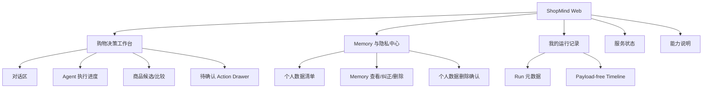
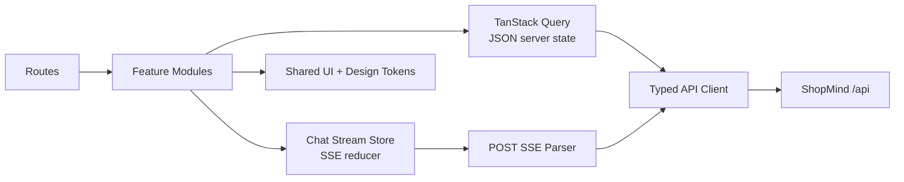

# ShopMind 前端实施方案

> 文档日期：2026-07-26
>
> 当前状态：React/Vite Web 前端已实现；Phase 1-6B-2 accepted/closed；Project Closure implementation in progress；Inbox/Consumer deferred

历史方案中的“当前状态：仓库尚无 Web 前端实现”已被上面的实际工程状态
取代；该历史措辞仅保留在这里用于文档演进追溯。
>
> 目标：为已完成的 ShopMind V6 后端提供安全、可用、可测试的中文 Web 界面

## 1. 结论

当前仓库已有 `frontend/` React/Vite 工程和真实 API 集成；
`examples/shopmind_reference_client.py` 仍作为命令行参考客户端保留。

`frontend/` 定位为 **ShopMind 购物决策工作台**，
而不是完整电商商城。它应优先把后端已有的核心能力正确呈现出来：

- 中文对话式购物决策；
- ordered SSE Agent 执行过程；
- 商品候选与比较结果；
- `add_to_cart` / `save_preference` 待确认 action；
- action 字段编辑、确认和取消；
- Memory 查看、纠正与删除；
- exact-owner run/trace 元数据查看；
- 健康、readiness 和 PII-safe 指标查看。

## 2. 产品目标

### 2.1 首要目标

1. 让用户通过浏览器完成从“提出购物问题”到“确认写入”的完整流程。
2. 把多 Agent 的执行状态转换为用户能理解的进度，而不是暴露内部调试 payload。
3. 严格保持后端身份、所有权、确认、幂等和删除安全边界。
4. 在桌面和移动端均可使用，并满足基本无障碍要求。
5. 前端可以独立构建、测试和部署，不把 Node.js 依赖混入 Python Runtime。

### 2.2 非目标

第一版不实现：

- 商品运营后台；
- 支付、订单履约、退款和物流；
- 通用 Agent workflow 编辑器；
- 在浏览器内配置远程 Agent endpoint；
- 在浏览器内保存身份签名 secret；
- 展示原始 PII 审计内容或完整内部 event payload；
- 替代生产 IdP、API Gateway 或可信 ingress。

## 3. 推荐技术栈

| 层次 | 选择 | 理由 |
| --- | --- | --- |
| UI 框架 | React + TypeScript | 适合事件驱动交互，API/event 类型可以编译期校验 |
| 构建工具 | Vite | 独立 SPA 开发、构建和静态资源部署简单 |
| 路由 | React Router | 页面边界清晰，支持隐私中心和运行详情深链接 |
| Server State | TanStack Query | 管理普通 JSON query/mutation、缓存失效和错误状态 |
| SSE State | 原生 `fetch` + `ReadableStream` + reducer | `/api/chat/stream` 是 POST，不能直接使用只支持 GET 的 `EventSource` |
| 表单 | React Hook Form + schema resolver | 适合 action 精确字段编辑和删除确认 |
| Schema | 由 FastAPI OpenAPI 生成 TypeScript types | 减少前后端契约漂移 |
| 样式 | CSS Modules + design tokens | 控制依赖，便于建立 ShopMind 自有视觉语言 |
| 单元测试 | Vitest + React Testing Library | 覆盖组件、reducer、SSE parser 和错误状态 |
| API Mock | MSW 或等价的请求级 mock | 使用真实 HTTP 语义测试 JSON/SSE/HITL 流程 |
| E2E | Playwright | 覆盖浏览器中的完整 chat/confirm/privacy 流程 |

选型不在方案阶段锁定“latest”版本；创建工程时应固定精确版本，并由依赖升级 PR
维护。React 官方提供 TypeScript 使用方式，Vite 官方提供 `react-ts` 模板，
TanStack Query 支持 React server state，Vitest 和 Playwright 分别用于单元与
浏览器测试：

- [React TypeScript](https://react.dev/learn/typescript)
- [Vite Getting Started](https://vite.dev/guide/)
- [TanStack Query](https://tanstack.com/query/latest/docs/framework/react/installation)
- [Vitest](https://vitest.dev/guide/)
- [Playwright](https://playwright.dev/docs/intro)

## 4. 页面信息架构



### 4.1 购物决策工作台 `/`

主页面采用三栏桌面布局、单栏移动布局：

- 左侧：会话/线程列表和“新对话”入口；
- 中间：用户消息、ShopMind 回复、候选商品与比较卡片；
- 右侧：Agent 执行进度、预算摘要和当前 action；
- 移动端：进度与 action 使用 bottom sheet。

输入区支持：

- 中文自然语言问题；
- 发送；
- 运行中停止；
- 失败后重新提交；
- 常用问题快捷入口；
- 清晰展示当前 thread。

### 4.2 Action Drawer

收到 pending action 时，不直接执行写入，而是打开专用确认区：

- action 类型和人类可读摘要；
- 商品、数量或偏好字段；
- 只允许后端 schema 声明的可编辑字段；
- 显示过期状态；
- “确认执行”和“取消”使用明显不同的视觉层级；
- 提交中禁止重复点击；
- 成功后刷新相应 UI 状态；
- owner/thread/expired/conflict 错误必须显示明确原因。

高风险删除不能复用普通 action 样式，应使用独立的 destructive confirmation。

### 4.3 Memory 与隐私中心 `/privacy`

- 调用 `/api/owner-data/inspect` 展示有界数据清单；
- 按类型查看 Memory，不显示不属于当前主体的数据；
- 通过 `/memory/correct` 精确纠正；
- 通过 `/memory/delete` 精确删除；
- 通过 `/owner-data/delete` 执行完整个人数据删除；
- 完整删除要求用户输入确认短语，并为每次操作生成新的
  `deletion_request_id`；
- 删除成功后清理前端缓存和当前会话状态。

### 4.4 我的运行记录 `/runs` 与 `/runs/:runId`

- 只调用 exact-owner `/api/owner-data/runs/inspect`；
- 展示 run id、状态、时间、Agent 阶段和非敏感统计；
- 不尝试获取消息正文或原始 AgentEvent payload；
- 时间线依据后端公开的 payload-free metadata 渲染；
- 深链接访问他人 run 时展示统一的不可访问状态，避免推断资源是否存在。

### 4.5 服务状态 `/status`

普通用户只需要基础可用性：

- `/api/health`；
- `/api/health/readiness`。

治理审计、preflight 和 service metrics 应只在部署策略允许时展示：

- `/api/health/governance-audit`；
- `/api/health/preflight`；
- `/api/health/service-metrics`。

前端不能把这些接口扩展成包含配置值、secret 或 PII 的运维控制台。

## 5. 前端架构



推荐目录：

```text
frontend/
  package.json
  vite.config.ts
  tsconfig.json
  src/
    app/
      App.tsx
      router.tsx
      providers.tsx
    api/
      client.ts
      generated.ts
      errors.ts
      sse.ts
    features/
      chat/
      actions/
      privacy/
      runs/
      health/
    components/
      Button/
      Dialog/
      ErrorState/
      StatusBadge/
    styles/
      tokens.css
      global.css
    test/
      server.ts
      fixtures/
  e2e/
  public/
```

原则：

- feature module 拥有自己的组件、hook、state 和测试；
- generated API types 不手工修改；
- 普通 JSON 状态与长连接 SSE 状态分开；
- UI 不依赖后端内部 Python model；
- 不在全局 store 复制所有 Query cache；
- event reducer 必须是纯函数并可 trajectory replay。

## 6. API 对接方案

| 前端能力 | API | 客户端处理 |
| --- | --- | --- |
| 非流式对话 | `POST /api/chat` | mutation，处理 reply、candidate context 和 pending action |
| 流式对话 | `POST /api/chat/stream` | `fetch` POST，按 SSE frame 增量解析 |
| action 确认/编辑/取消 | `POST /api/chat/confirm` | mutation，强制 idempotency 与提交锁 |
| 个人数据清单 | `POST /api/owner-data/inspect` | query，短缓存、离开页面可清理 |
| run/trace 查看 | `POST /api/owner-data/runs/inspect` | exact selector query |
| Memory 纠正 | `POST /api/owner-data/memory/correct` | mutation，成功后失效 inventory query |
| Memory 删除 | `POST /api/owner-data/memory/delete` | destructive mutation |
| 全量个人数据删除 | `POST /api/owner-data/delete` | confirmed destructive mutation |
| 健康状态 | `GET /api/health*` | 低频 query，不在后台高频轮询 |

### 6.1 POST SSE

`EventSource` 只能发起 GET，不能满足当前 `POST /api/chat/stream` 契约。因此使用：

1. `AbortController` 创建可取消请求；
2. `fetch` POST JSON body；
3. 校验 HTTP status 和 `content-type`；
4. 从 `response.body` 读取 `ReadableStream`；
5. 使用增量 UTF-8 decoder 处理跨 chunk 字符；
6. 按空行切分 SSE frame；
7. 解析 `event`、`id` 和 `data`；
8. 将 typed event 交给 reducer；
9. 按 sequence 拒绝重复或倒序事件；
10. 在 EOF、取消、错误时进入明确 terminal state。

“停止”按钮调用 `AbortController.abort()`，让浏览器断开流，由后端既有
cooperative cancellation 和 disconnect cleanup 负责服务端清理。第一版不假设
存在额外的 cancel endpoint。

### 6.2 幂等

- 每次用户提交生成新的 request id/idempotency key。
- 网络超时后的人工重试可复用原 key，防止重复 action。
- action confirm 提交期间禁用按钮。
- 客户端不得通过生成多个 key 绕过服务端 duplicate claim。
- 幂等记录以服务端结果为准，浏览器缓存不是事实来源。

### 6.3 类型生成

CI 启动 FastAPI OpenAPI schema 导出或读取受控 schema artifact，再生成
TypeScript 类型。至少对以下契约做编译检查：

- chat request/response；
- stream event discriminated union；
- pending action；
- confirm/edit/cancel request；
- owner-data request/response；
- structured API error。

如果后端 OpenAPI 尚不能完整表达 SSE event union，先增加一个只用于类型生成的
versioned schema 文件，不要在前端复制匿名 `Record<string, unknown>`。

## 7. 状态管理

### 7.1 Server State

TanStack Query 管理：

- owner-data inventory；
- Memory；
- run inspection；
- health/readiness；
- 非流式 mutation 结果。

query key 必须包含 effective resource selector，例如 `runId` 或 thread id。
切换已认证主体时清空整个 Query cache，不能复用上一主体的数据。

### 7.2 Chat Stream State

聊天运行使用独立 reducer，建议状态：

```text
idle
connecting
running
awaiting_confirmation
succeeded
failed
cancelled
```

reducer 保存：

- 当前 thread/run identity；
- 最后接受的 sequence；
- 可展示消息；
- Agent 阶段摘要；
- attempt/retry 状态；
- pending action；
- terminal error；
- 非敏感 usage/预算摘要。

刷新页面后的恢复只能使用后端公开恢复契约，不能把 pending action payload
长期写入 `localStorage`。

## 8. 身份与安全

### 8.1 开发环境

后端 `development` identity 模式下，可以提供显式 demo user/thread 输入，
但页面必须标记“仅开发环境”。该能力不能出现在 production build 的普通用户设置。

### 8.2 生产环境

推荐同源部署：

```text
Browser -> Trusted Ingress / BFF -> /api -> ShopMind FastAPI
        -> Static frontend assets
```

- 浏览器通过安全、HttpOnly、SameSite cookie 与可信入口建立会话；
- ingress/BFF 将 authenticated principal 转换为后端信任的身份；
- `SHOPMIND_IDENTITY_SIGNING_SECRET` 永远不进入 JavaScript bundle；
- 浏览器不能自行构造 `signed_header`；
- 不提供“自定义认证头”输入框；
- 不把 access token、用户消息、pending action 或 Memory 写入日志；
- production source map 单独控制访问；
- 错误上报先做字段 allowlist 和脱敏。

### 8.3 CORS 与 CSP

- 首选前后端同源，通过 `/api` reverse proxy，减少 CORS 和 cookie 风险；
- 分离域名时只允许明确 origin，不配置 wildcard credentialed CORS；
- 使用严格 CSP，至少限制 `default-src`、`script-src`、`connect-src` 和
  `frame-ancestors`；
- `connect-src` 只允许当前 ShopMind API；
- 禁止把远程 Agent endpoint 动态加入 CSP。

## 9. 视觉与交互方向

产品视觉应体现“可信赖的决策工作台”，避免做成通用聊天机器人：

- 主色使用低饱和蓝绿，强调理性、清晰和安全；
- 商品候选使用卡片和结构化属性，不把所有内容塞进气泡；
- Agent 进度默认显示人类可读阶段，调试字段折叠；
- 待确认写操作使用独立 action surface；
- destructive delete 使用红色警示、二次确认和不可逆说明；
- retry/timeout/budget blocked/cancelled 使用不同状态文案；
- 骨架屏只用于确定结构，长时间运行显示真实阶段；
- 所有状态不能只靠颜色表达。

建议 design tokens：

```text
color.background
color.surface
color.text.primary
color.text.muted
color.brand
color.success
color.warning
color.danger
color.agent.product
color.agent.rag
color.agent.preference
space.1 ... space.8
radius.sm / md / lg
shadow.surface / overlay
```

## 10. 无障碍与国际化

- 第一版界面语言为简体中文，但文案通过 message catalog 管理；
- 交互控件支持键盘操作和可见 focus；
- Dialog/Drawer 正确管理 focus trap 和返回焦点；
- SSE 新消息使用克制的 `aria-live`，不朗读每一个内部 event；
- loading、error、retry 和 cancelled 都有文本状态；
- 颜色对比达到 WCAG AA；
- 支持 `prefers-reduced-motion`；
- 金额、时间和数量使用 locale formatter。

## 11. 错误模型

前端统一将错误映射为：

| 类别 | UI 行为 |
| --- | --- |
| validation | 标记具体字段，不重试 |
| unauthenticated | 交给 ingress 登录流程，不展示资源细节 |
| forbidden/owner mismatch | 通用不可访问提示，不泄露目标是否存在 |
| action expired | 关闭确认按钮，引导重新发起请求 |
| conflict/idempotency | 读取服务端已存在结果或提示正在处理 |
| rate limited/admission blocked | 显示可重试时间，不自动高频重试 |
| budget blocked | 说明本次运行达到限制，可新建请求 |
| stream interrupted | 保留已确认显示内容，提供安全重试 |
| backend unavailable | 提供 request/correlation id，隐藏内部异常 |

mutation 默认不自动重试。普通 query 可以进行有限重试，但必须尊重服务器错误类型
和 `Retry-After`。

## 12. 测试策略

### 12.1 单元测试

- SSE chunk/frame parser；
- UTF-8 跨 chunk；
- sequence 去重与倒序拒绝；
- chat reducer 全部 terminal state；
- attempt scheduled/started/succeeded/exhausted；
- action schema 到表单字段的映射；
- structured error 到用户文案的映射。

### 12.2 组件测试

- 对话发送和停止；
- 商品候选与比较；
- action 编辑、确认、取消；
- 过期 action；
- Memory 纠正/删除；
- destructive confirmation；
- loading/error/empty/accessibility states。

### 12.3 E2E

至少覆盖：

1. JSON chat 成功；
2. ordered SSE 完整运行；
3. 用户中断 SSE；
4. add-to-cart confirm；
5. save-preference edit + confirm；
6. action cancel；
7. owner mismatch 被拒绝；
8. Memory correct/delete；
9. personal data delete confirmation；
10. run inspection 不含 payload；
11. readiness degraded；
12. 小屏幕关键流程。

E2E 使用隔离测试数据库和确定性 planner，不使用真实 LLM，不调用远程 RAG。

## 13. CI 与质量门禁

前端 PR 必须通过：

```text
install with frozen lockfile
lint
typecheck
unit/component tests
production build
Playwright critical-path E2E
generated API contract drift check
bundle size budget
```

后端现有 Python gate 保持独立运行。合并门禁应把两者组合，但前端失败不能通过
关闭 V6 后端 evaluation 来规避。

建议初始预算：

- 首屏 JavaScript gzip 目标小于 250 KB；
- 业务路由按页面 lazy load；
- source map 不公开部署；
- 不引入完整组件库只使用其中少量组件；
- 商品图片使用固定尺寸、lazy loading 和 fallback。

## 14. 开发与部署

### 14.1 本地开发

- FastAPI 继续运行在现有 Python 环境；
- Vite dev server 只代理 `/api` 到 loopback backend；
- 前端 `.env.local` 只允许非秘密公开配置；
- 不复制项目根目录 `.env`；
- 不让 Vite 暴露 `SHOPMIND_*_SECRET`。

### 14.2 生产构建

推荐将静态产物部署到可信 ingress/Nginx/CDN，并将 `/api` 反向代理到 FastAPI。
HTML 使用 no-cache 或短缓存，带 hash 的静态资源使用 immutable 长缓存。

部署顺序：

1. 后端先保持 V3/V6 兼容 API；
2. 部署新前端静态资源；
3. 执行 readiness 和前端 synthetic smoke；
4. 小流量启用；
5. 观察 stream error、confirm failure 和 latency；
6. 失败时只回滚静态资源，不回滚用户数据。

## 15. 分阶段实施

### F0：契约与脚手架

- 创建 `frontend/` React TypeScript Vite 工程；
- 固定 lockfile；
- 接入 lint/typecheck/test/build；
- 导出 OpenAPI types；
- 配置本地 `/api` proxy；
- 建立 design tokens 和基础页面框架。

验收：空应用可构建，API types 可重复生成，CI 不依赖真实模型。

### F1：JSON Chat MVP

- 完成对话布局；
- 接入 `/api/chat`；
- 展示回复和候选商品；
- 建立 structured error UI；
- 保存非敏感 thread id。

验收：用户可以完成一次非流式购物咨询。

### F2：Ordered SSE

- 实现 POST SSE parser；
- 实现 typed event reducer；
- 显示 Agent 阶段、attempt 和 terminal state；
- 支持 AbortController 停止；
- 覆盖断流、重复和倒序事件。

验收：SSE 与后端持久化顺序语义一致。

### F3：HITL Actions

- add-to-cart；
- save-preference；
- schema 驱动字段编辑；
- confirm/cancel；
- expiry/idempotency/owner 错误处理。

验收：所有写入只通过 `/api/chat/confirm` 完成。

### F4：Memory、隐私与运行记录

- owner-data inventory；
- Memory correct/delete；
- confirmed personal-data deletion；
- payload-free run/trace inspection。

验收：主体切换清空缓存，跨用户资源不可见。

### F5：生产状态与体验

- readiness/status 页面；
- 响应式和无障碍；
- 完整空/错/慢状态；
- 性能预算；
- Playwright critical path。

验收：desktop/mobile 主流程通过，WCAG AA 基础检查通过。

### F6：发布

- production CSP/CORS/ingress；
- 静态构建和版本标识；
- synthetic smoke；
- rollout/rollback runbook；
- 与后端 release operation gate 联动。

验收：可独立回滚静态资源，浏览器不持有身份签名 secret。

## 16. 总体验收标准

前端完成应同时满足：

- 所有公开用户流程均通过后端 API，不直连数据库；
- JSON 与 SSE 对话均可用；
- POST SSE 顺序、取消和 terminal state 正确；
- add-to-cart/save-preference 必须显式确认；
- action edit 只允许 schema 字段；
- owner-data 页面不能越权；
- personal-data deletion 有明确不可逆确认；
- 浏览器 bundle、storage、日志中不存在 secret；
- 关键流程具备单元、组件和 E2E 测试；
- production build 可部署、可观测、可独立回滚；
- 后端 V3 API handoff 和 V6 evaluation catalog 持续通过。

## 17. 开发前需要确认的产品选择

真正开始实现 F0 前，只需确认以下产品级选择：

1. 前端品牌定位：工程演示台还是面向终端消费者的购物助手；
2. 登录由哪个 ingress/IdP 提供；
3. 是否在第一版展示 service metrics；
4. 商品图片是否已有稳定、允许浏览器访问的资源地址；
5. 前端静态资源的目标部署平台；
6. 是否需要首版支持英文。

这些选择不会改变后端安全契约，但会影响导航、视觉、认证接入和部署配置。
## 18. F0 implementation record (2026-07-26)

F0 is implemented under `frontend/` and is intentionally limited to the
browser foundation. The scaffold uses pinned React, TypeScript, Vite, and
Vitest dependencies with a committed `package-lock.json`. It provides:

- `npm run lint`, `npm run typecheck`, `npm run test`, `npm run build`, and
  `npm run generate:api` quality commands;
- a Vite `/api` proxy to `http://127.0.0.1:8000` with no frontend secret
  configuration;
- the versioned `shopmind.frontend-api.v1` public types for chat, confirmation,
  SSE envelopes, owner-data, run inspection, and health responses;
- a browser-safe API client that uses contract types, scoped idempotency keys,
  and no identity signing secret;
- a `fetch` POST stream client using `ReadableStream`, incremental UTF-8
  decoding, standard SSE frame parsing, and sequence de-duplication;
- the initial route shell, design tokens, responsive global styles, and unit
  coverage for the SSE boundary and application shell.

F0 validation on this machine: lint passed, typecheck passed, 4 frontend unit
tests passed, API contract verification passed, and production build passed.
F1 is the next implementation stage; it will add JSON chat behavior without
changing the backend V3/V6 contract.

## 19. F1 implementation record (2026-07-26)

F1 JSON Chat MVP is complete. The `/` workbench now submits messages to
`POST /api/chat` through the typed client and renders the stable response
fields (`answer`, `status`, `tool_calls`, and `pending_action_id`). It also
provides a persisted opaque thread selector, a development-only user identity
field for the backend compatibility mode, empty/loading/success/error states,
structured retry messaging, quick prompts, responsive layout, and an explicit
notice that write actions still require the later F3 confirmation surface.

F1 does not persist message content or pending action payloads, does not parse
internal debug payloads as product data, and does not change any backend code.
The next stage is F2 ordered POST-SSE interaction.

## 20. F2 implementation record (2026-07-26)

F2 ordered POST-SSE interaction is complete. The default workbench transport
now calls `POST /api/chat/stream` using the existing `fetch` and
`ReadableStream` client. A pure stream reducer tracks connection, ordered
progress, terminal result, confirmation-required, failure, and cancellation
states. It accepts only increasing sequence numbers, maps client-visible event
categories to human-readable progress, and never renders arbitrary event
payloads or internal debug data.

The UI includes a real-time progress strip, stop action using
`AbortController`, terminal assistant response rendering, a JSON/stream
transport toggle, and the existing structured retry path. F2 tests cover the
actual `/api/chat/stream` request shape, terminal SSE rendering, reducer
ordering, duplicate/out-of-order rejection, cancellation, and missing-terminal
failure. F3 is the next stage for the explicit HITL action surface.
## 21. F3 implementation record (2026-07-26)

F3 HITL Actions is complete. A pending `confirmation_required` response now
opens an action drawer that uses only the public action boundary. The drawer
supports `add_to_cart` and `save_preference`, shows a bounded preview and risk
class, validates exact editable fields, and submits all writes through
`POST /api/chat/confirm`.

The client sends only `quantity` for add-to-cart edits, and only the allowlisted
preference type/value fields for preference edits. Confirm and cancel are
separate explicit actions, duplicate submits are disabled, and backend failure,
expiry, owner mismatch, and conflict responses remain visible without
pretending the write succeeded. No pending action payload is persisted in
browser storage. F4 owner-data, memory, and run-inspection pages are next.
## 22. F4 implementation record (2026-07-26)

F4 owner-data, memory, and run inspection is complete. The frontend now has an
application-scoped development identity context so Chat, Privacy Center, and
Run Inspector use the same owner selector without persisting identity secrets.
`/privacy` calls the exact-owner inventory endpoint, displays bounded counts and
memory records, supports allowlisted memory correction, requires a second
confirmation for memory deletion, and requires the exact full-deletion phrase
before issuing the explicitly confirmed deletion request. `/runs` supports one
run_id or trace_id selector at a time and renders only the public payload-free
run summary and ordered event facts.

Production mode leaves owner identity to the trusted ingress boundary; the
browser sends no signing secret. F4 validation passed with clean lint,
typecheck, 17 frontend tests, and production build.
The backend V1-V6 implementation was not changed. F5.1 health/status is
complete; the remaining F5 browser-level E2E setup is separate.
## 23. F5.1 implementation record (2026-07-26)

The first F5 slice is complete. `/status` now calls the public liveness and
deployment-readiness endpoints, treats the backend's readiness `503` JSON as a
valid blocked report, and renders sanitized aggregate/check facts with refresh,
loading, error, and retry states. Responsive status cards and bounded check rows
were added without introducing a UI framework. A local bundle-budget command
checks JavaScript and CSS output after production build; the current bundle is
within the configured limits.

F5.1 validation passed with clean lint, typecheck, 18 frontend tests,
production build, and bundle-budget check. Browser-level Playwright execution is
not claimed here because the repository does not yet include a browser runner;
adding that dependency/browser install is a separate authorized setup step.
## 24. F5.2 implementation record (2026-07-26)

F5.2 adds a project-local Playwright setup under `frontend/`, with a pinned
lockfile dependency, Chromium project configuration, Vite web-server startup,
separate E2E typechecking, and two mocked critical paths: ordered POST-SSE chat
completion and sanitized blocked readiness rendering. Vitest explicitly excludes
`e2e/` so the unit runner and Playwright runner do not load each other's tests.

The runner lists both tests successfully. Actual browser execution is currently
blocked because this machine has no Playwright Chromium executable. No browser
binary, global package, Node installation, backend service, or backend file was
changed automatically. Lint, app typecheck, E2E typecheck, 18 unit tests,
production build, and bundle-budget validation all pass. The next authorized
setup step is installing the project-required Playwright Chromium binary, then
running `npm run e2e`.
## 25. F5.2 browser verification addendum (2026-07-27)

The Playwright Chromium binary is now available on the development machine.
After correcting the Chat E2E expectation to assert the input is cleared and
the empty composer is disabled, both critical paths pass: `2 passed`. The
complete frontend validation is now clean: lint, app typecheck, E2E typecheck,
18 unit tests, Playwright E2E, production build, and bundle-budget check.
F5.2 is complete; F6 release configuration remains separate.

## 26. Phase 4B frontend implementation record (2026-08-08)

The Phase 4B frontend implementation is now present under `frontend/`. It adds
the generated Phase 4A Checkout/Order API client surface, the explicit Cart to
Checkout Preview to Confirm Order flow, identity-scoped unknown-result retry,
Order list/detail/cancel views, and responsive UI styling. Cart navigation to
Checkout never creates an Order; creation requires a valid backend Preview and
an explicit confirmation.

Validation passed with 20 Vitest files / 97 tests, 23 Playwright tests, lint,
app typecheck, E2E typecheck, production build, and bundle-budget checks.
Phase 4B is accepted and closed. Phase 5A Mock Payment and Phase 6A
Transactional Outbox are backend capabilities already available to the demo;
fulfillment, address/shipping/tax, automatic expiration, Redis, Inbox/Consumer
and real Payment providers remain outside scope.

## 27. Phase 6B-1 Core Demo Packaging (accepted/closed)

The real frontend now participates in the copyable `offline-demo`
Prepare/Start/Verify flow documented in `docs/demo_runbook.md`. The live
Playwright gate uses real browser, frontend, backend and PostgreSQL requests;
the normal mocked Playwright suite remains separate. The critical path is
Recommendation -> explicit SKU -> PendingAction confirmation -> Cart ->
Checkout Preview -> Create Order -> Mock Payment -> paid. Core startup never
requires LangSmith credentials or RocketMQ SDK/Broker/Publisher. Phase 6B-2
Minimal Observability is accepted/closed. Project Closure implementation is in
progress; Inbox/Consumer remains deferred.
