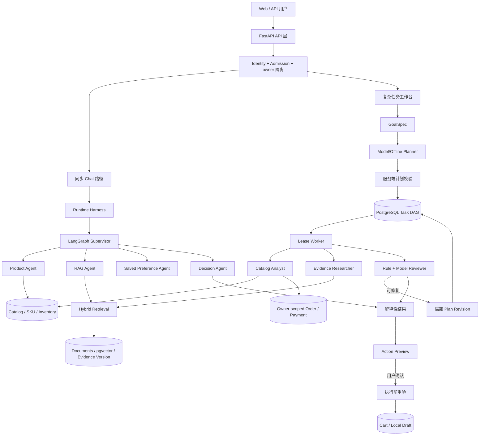

# ShopMind 秋招架构总讲：从一次购物任务看懂整个系统

> 适用版本：Agent Task Workbench 75/75 完成后的当前工作区，2026-09-21。
>
> 阅读目标：不先读代码，也能讲清项目做什么、为什么这样分层、LangGraph 在哪里、三个简历亮点怎样串成一次完整业务流程。
>
> 阅读顺序：本篇建立全貌 → 三篇 `interview_highlight_*` 逐个深入 → `interview_agent_engineering_pitfalls.md` 横向总结 Agent 工程通用问题 → `resume_project_summary.md` 取简历素材。

## 一、先用一句话理解项目

ShopMind 不是"让几个大模型互相聊天后推荐商品"的 Demo，而是一套把模型能力放进真实购物边界里的 Agent 系统：用户可以提出跨品类组合选购、设备兼容排查或售后条件分析，系统把目标拆成受约束步骤，查询 Catalog 和资料证据，经过规则与 Reviewer 检查后给出结果；涉及加购或保存售后草稿时，必须先让用户确认，再重新检查价格、库存、订单归属和版本。

最适合面试开场的例子是：

> 用户说"预算 12000 元，帮我选一台笔记本、一台显示器和一个扩展坞，要能正常连接"。系统先整理预算和三个必需槽位，从 Catalog 查 SKU，查询明确的兼容规则和产品资料，计算可行组合，再检查总价、币种、库存、兼容性和引用。证据缺失时不会猜，而是补查、澄清或降级。用户选中组合后，系统先生成加购预览，只有确认后才在一个事务里把整组商品加入购物车。

这个例子自然带出三个核心亮点：多 Agent 任务编排、RAG 证据检索、持久化任务与确认式执行。

## 二、先纠正一个最容易被追问穿的问题

当前项目有两套互补的编排机制，不能全部笼统说成 LangGraph：

| 编排面 | 解决的问题 | 当前实现 |
| --- | --- | --- |
| 同步对话协作 | 一次 Chat 请求需要路由到商品、资料、已保存偏好和汇总角色 | LangGraph `StateGraph` |
| 长任务工作台 | 跨多步、可等待用户、可重启恢复的组合/排查/售后任务 | PostgreSQL 持久化 DAG + Worker |

LangGraph 位于 `agents/shopmind_multi_agent/graph.py`，负责 V3 兼容对话路径。它适合一次请求内的路由、条件分支、角色调用和结果合并。

任务工作台位于 `app/shopping_tasks/`。它需要保存计划、步骤、租约、尝试、产物和事件，即使进程重启也能继续，因此没有只依赖内存中的 LangGraph 状态，而是实现了数据库驱动的任务 DAG 调度器。

两条路径共享 Catalog、RAG、Model Gateway、Harness、Tool Gateway、身份和业务服务。面试时可以说"LangGraph 负责同步多 Agent 对话图，复杂购物任务使用持久化 DAG 执行"，这比"所有任务都是 LangGraph"更准确，也更有工程含量。

## 三、术语表：先认这 14 个词

后面四篇文档反复使用这些名字。它们不是框架术语，是本项目定义的类型，全部能在代码里找到。

### 任务侧（`app/shopping_tasks/contracts.py`）

| 术语 | 一句话解释 | 类比 |
| --- | --- | --- |
| **GoalSpec** | 用户目标的结构化版本：硬条件、软要求、必需槽位、锁定选择、排除项、待澄清问题 | 需求文档 |
| **PlanProposal** | 一份计划提案，含若干 `PlanStep` 和 SHA-256 指纹；模型只能产出它，不能直接执行 | 施工图纸 |
| **PlanStep** | 一个步骤：key、capability、role、依赖列表、输出类型，`read_only` 默认 True | 图纸上的一道工序 |
| **Capability** | 白名单内的一个只读能力，如 `catalog_candidates`、`retrieve_evidence`。全项目共 10 个，**全部只读** | 工种许可证 |
| **Role** | 四个角色之一：coordinator / catalog_analyst / evidence_researcher / reviewer | 工种 |
| **StepResult** | 一次步骤执行的结果：状态、结构化输出、证据版本、输入指纹、usage、错误码 | 工序验收单 |
| **Artifact** | 不可变中间产物，带输入指纹、来源引用、证据版本和验证状态 | 半成品，带批次号 |
| **VerificationReport** | 验证结论：`pass` / `repairable` / `needs_input` / `rejected`，每个 issue 带 `allowed_repairs` | 质检报告，含返工建议 |
| **ActionPreview** | 待确认的写操作预览，绑定 owner、task、goal version、plan revision、artifact、TTL | 待签字的施工变更单 |
| **plan revision** | 计划修订号。局部修复会产生新 revision，旧步骤标记 `superseded` | 图纸版本号 |

### 运行时侧

| 术语 | 一句话解释 |
| --- | --- |
| **Harness**（`app/runtime/harness.py`） | 管**一次模型/Agent 运行**：run/trace id、幂等键、预算、事件、结果、错误 |
| **Tool Gateway**（`app/runtime/tool_gateway.py`） | 管**一次工具调用**：参数校验、agent allowlist、owner 检查、副作用等级、资源策略、输出上限、审计 |
| **lease / fencing token** | 租约表示"这段时间归我处理"；fencing token 保证失租的旧 Worker 迟到结果被拒绝 |
| **EvidenceVersion** | 资料的版本单元。全部节点入库成功后才原子切换 active publication，失败时旧版本继续可见 |

一句话记忆法：**Harness 管"一次运行"，Scheduler 管"一个长任务"，Gateway 管"一次工具调用"，Action Service 管"一次真实副作用"。**

## 四、项目量感

面试官会先形成一个规模直觉，所以这些数字值得记住（均可在仓库中核对）：

| 维度 | 规模 |
| --- | --- |
| 后端 Python 模块 | `app/` 178 个文件；`agents/` 26 个；`evaluation/` 44 个 |
| 数据表 | **46 张**：基础业务与 Runtime 17 张、任务工作台 12 张、Catalog/交易/AI 证据平台 17 张 |
| 数据库迁移 | Alembic **20 个**版本，当前 head `0020_task_worker_heartbeat` |
| API 路由模块 | **13 个业务路由模块**：health / catalog / chat / chat_stream / chat_confirm / pending_actions / shopping_tasks / cart / checkout / orders / payments / owner_data / ai_operations；另有 1 个内部 `_helpers.py` |
| 后端测试 | **181 个 `test_*.py`**，分布在 api(22) / evaluation(20) / integration(19) / runtime(18) / ai_platform(16) / agents(13) / recommendation(13) / repositories(11) 等 20 个子目录 |
| 前端 | React 19 + TS，13 条路由，Vitest 154 个单测，Playwright 离线 + live 两套 e2e |
| 品类覆盖 | Category Schema 覆盖 10 类消费电子 |

任务侧的关键上限（`contracts.py` 里的常量，不是"建议值"）：计划最多 12 步、并行前沿最多 3、局部修订最多 2 次、模型尝试最多 24 次、用户交互最多 5 轮、任务绝对过期 24 小时。

## 五、总体架构



这张图可以按五层理解。

### 1. 接入与身份层

FastAPI 提供 Chat、任务、SSE、动作确认、购物车等接口。用户身份不是由模型决定，服务端先绑定 owner，再做准入、限流、幂等和请求校验。后续任务、订单、草稿和动作都必须带同一 owner 语义。

### 2. Agent 编排层

同步 Chat 由 LangGraph Supervisor 选择需要的只读角色。复杂任务先生成 `GoalSpec` 和 `PlanProposal`，把计划持久化后交给 Worker。模型可以建议白名单内的步骤和依赖，但不能指定任意 URL、模型、owner 或写工具；服务端会把模型输出重新投影到可信合同并校验 DAG。

### 3. 业务能力层

角色不会自己创造商品事实。Catalog Analyst 调用窄能力查候选、兼容规则和本人订单；Evidence Researcher 只能按确定范围检索说明和政策；Reviewer 先使用确定性规则，再允许模型补充解释与引用问题。

### 4. 数据与证据层

PostgreSQL 保存业务数据、运行数据和任务数据；pgvector 保存资料向量。Redis 是可选的跨实例准入、速率、去重和缓存协调后端，不是多 Agent 之间发消息的总线。RocketMQ 只用于可选交易 Outbox 发布，不负责 Agent 调度。

### 5. 副作用层

只读 Agent 不能直接修改购物车或订单。系统把建议转换成有版本、归属和过期时间的 Action Preview。用户确认后，业务服务在短事务中重新检查商品、价格、库存、订单归属和引用版本，成功才写入；失败则整组回滚。

## 六、一次组合选购怎样完整运行

以下流程是面试时最值得讲熟的一条主线。

### 第一步：把自然语言变成当前任务目标

用户输入预算、品类、用途、锁定商品和排除项。系统将其整理为 `GoalSpec`，区分：

- 必须满足的硬条件，例如总预算；
- 用于排序或解释的软要求；
- 必须补齐的槽位，例如 laptop、monitor、dock；
- 已锁定的选择和明确排除的 SKU；
- 当前仍缺少的问题。

这样后续步骤处理的是结构化任务，而不是每一步重新理解整段聊天。

### 第二步：Planner 提出受约束计划

离线模式使用确定性计划；Agent 模式通过共享 Model Gateway 调用真实模型。一个组合任务通常包含：目标提取、Catalog 候选、兼容查询、证据检索、组合求解、结果验证和结果组织。

模型不是直接输出"买哪三个"，而是提出步骤与依赖。服务端检查：能力是否在白名单、角色是否有权限、依赖是否存在、有没有环、是否包含验证节点、步骤数和并行前沿是否超限。

### 第三步：计划和步骤进入 PostgreSQL

Task、Plan、Step、Attempt、Artifact、Event 分开保存。Task 保存当前状态和预算，Plan 保存修订版本，Step 保存每个节点的依赖与状态，Attempt 保存每次领取和使用量，Artifact 保存不可变中间产物，Event 为 SSE 提供单调序号。

进程崩溃不会让计划只剩一段日志；新 Worker 可以根据数据库状态继续领取未完成步骤。

### 第四步：Worker 按依赖执行有界并行

Worker 先用行锁和 `SKIP LOCKED` 领取任务，再领取依赖已经满足的 ready frontier。最多同时执行三个互不依赖的只读步骤，每个分支使用独立数据库会话，完成后按 task、plan revision、step token 保存结果。

组合任务中，Catalog 查询和初始证据查询可以在条件允许时并行；组合求解必须等待候选与兼容事实。并行不是"所有 Agent 一起跑"，而是只并行没有依赖的步骤。

### 第五步：规则验证与模型 Reviewer

确定性验证先检查预算、币种、组合是否为空、兼容三态和关键证据。模型 Reviewer 只能补充"解释是否完整、引用是否支撑、需求是否覆盖"等问题，不能修改价格、库存、owner，也不能把规则失败改成通过。

若报告为 `repairable`，系统根据问题定位受影响步骤，只让这些步骤和后继节点失效。例如证据不可用时重跑检索、验证和结果组织，不重跑已经有效的 Catalog 候选。最多允许两次计划修订，避免无限自我反思。

### 第六步：返回结果或等待用户

证据充分且规则通过时返回最多三套可解释组合。缺少预算、设备信息或关键兼容事实时进入 `waiting_input`，释放 Worker 租约，等用户补充后生成新 Goal 版本和 Plan revision。达到上限、没有进展或不在安全范围时返回明确的 unresolved/no-solution，而不是继续循环。

### 第七步：用户确认后才执行写操作

用户选择某个组合时先生成 Action Preview，绑定 task、goal version、plan revision、artifact、action version 和 TTL。确认接口锁定相关记录并按稳定 SKU 顺序检查库存和购物车，任何一个商品失败都会使整组不写入。重复确认使用原 Resolution 结果，不会重复加购。

## 七、一次真实请求的输入输出

上面是流程，这里是实际在网络上传输的东西。面试时能说出具体字段，可信度完全不同。

### 创建任务

```http
POST /api/shopping-tasks
Idempotency-Key: 7c1f...

{
  "user_id": "u-1024",
  "kind": "bundle_selection",
  "goal_text": "预算 12000，选一台笔记本、一台显示器和一个扩展坞，要能正常连接",
  "known_facts": [
    {"key": "budget", "value": 12000,
     "source_ref": {"source": "user_reported", "verified": false}},
    {"key": "currency", "value": "CNY",
     "source_ref": {"source": "user_reported", "verified": false}}
  ],
  "thread_id": "thread-8a2f"
}
```

注意 `known_facts` 里的每个事实都必须带 `source_ref`，`source` 只能是 `user_reported` / `catalog` / `order` / `policy` / `evidence` / `derived` 六种之一。**用户报告的事实和 Catalog 事实从一开始就是不同等级的**，不会在后续流程中被混为一谈。

同时 validator 会拒绝在 `known_facts` 里夹带 `owner` / `model` / `endpoint` / `mode` / `tools` / `role` / `url` 等控制字段，报 `control_fields_are_server_owned`——执行方式永远由服务端决定。

### 任务快照

```jsonc
{
  "task_id": "9f3c...", "owner_id": "u-1024",
  "kind": "bundle_selection", "status": "running",
  "mode": "offline",          // 或 "agent"
  "version": 3,               // 客户端下次操作要带 expected_version
  "goal": {
    "schema_version": "goal-spec.v1",
    "required_slots": ["laptop", "monitor", "dock"],
    "hard_constraints": {"budget": 12000, "currency": "CNY"},
    "open_questions": [],
    "version": 1
  }
}
```

### 步骤结果

```jsonc
{
  "task_id": "9f3c...", "plan_revision": 1,
  "step_key": "solve_bundle", "role": "catalog_analyst",
  "status": "completed", "output_kind": "bundle_proposal",
  "output": { "outcome": "recommended", "options": [ /* 最多 3 套 */ ] },
  "input_fingerprint": "<64位十六进制SHA-256>",
  "evidence_versions": ["evidence:2026.09.20"],
  "usage": {"prompt_tokens": null, "completion_tokens": null}
}
```

`usage` 允许为 `null`——表示"无法确定"，**不会当成 0**。这是个小细节，但它说明预算统计不会因为一次异常而悄悄少算。

### 验证不通过时

```jsonc
{
  "status": "repairable",
  "rule_version": "shopping-rules.v1",
  "reviewer_used": true,
  "issues": [{
    "code": "budget_exceeded",
    "message": "组合总价超过服务端预算。",
    "affected_skus": ["TECH-LAP-001", "TECH-MON-004"],
    "allowed_repairs": ["replace_component", "request_input"]
  }],
  "progress_fingerprint": "<64位十六进制SHA-256>"
}
```

**失败不只是说"错了"，还说明"允许怎么修"**——这是 `allowed_repairs` 的意义，也是局部修订能自动进行的前提。

### 确认动作

```http
POST /api/shopping-tasks/{task_id}/actions/{action_id}/confirm
Idempotency-Key: b93e...

{"user_id": "u-1024", "expected_version": 5, "confirmed": true}
```

服务端此时才锁定记录、重查价格库存归属，失败返回 `catalog_changed_repreview_required`，要求重新生成预览。

## 八、三个亮点分别解决什么问题

| 简历亮点 | 核心业务问题 | 主要工程答案 |
| --- | --- | --- |
| 多 Agent 任务编排 | 一个复杂目标怎样拆分、并行、检查和修复 | LangGraph 同步图 + 持久化 DAG、类型化合同、白名单、局部 revision |
| RAG 证据检索 | 资料相关不等于适用，过期/串商品会误导购买 | 版本化入库、Vector+Lexical、RRF、scope/version/policy gate、引用状态 |
| 持久化任务执行 | 长任务会超时、重试、重启，写操作还可能重复 | Task/Step/Artifact/Event 持久化、lease/fencing、幂等/CAS、HITL 重验事务 |

对应详细教材：

1. [亮点一：多 Agent 规划、协作与局部修复](interview_highlight_multi_agent_orchestration.md)
2. [亮点二：RAG 证据检索完整链路](interview_highlight_rag_evidence.md)
3. [亮点三：持久化任务、恢复与安全写入](interview_highlight_durable_execution.md)

另有一篇横向材料，把上面三篇的做法抽象成 Agent 工程的通用命题，用于回答"你觉得做 Agent 最难的是什么""踩过什么坑"：

4. [横向篇：Agent 工程的十个通用问题与本项目解法](interview_agent_engineering_pitfalls.md)

## 九、项目是怎样演进到今天的

"这个项目你做了多久、怎么迭代的"几乎必问。演进本身比最终形态更能说明工程判断，下面几次转向都可以展开讲。

| 阶段 | 做了什么 | 为什么要改 |
| --- | --- | --- |
| **V2 基础设施** | FastAPI + PostgreSQL + SQLAlchemy 骨架、Catalog 与 SKU 模型 | — |
| **V3 多 Agent 对话** | LangGraph Supervisor + Product/RAG/Preference/Decision 只读角色，API 契约定版 | 单个 Agent 拿全部工具，权限过大且失败难定位 |
| **V4–V6 Runtime** | 统一 Harness、Tool Gateway、幂等/预算/取消/SSE、trajectory replay、local/Redis 协调 | Agent 的重试、超时、预算逻辑散落在业务代码里，无法测试和复现 |
| **交易链路** | Cart → 签名 Checkout 快照 → Order → 库存预占 → Mock Payment → Transactional Outbox | 推荐做得再好，不接真实业务约束就只是 Demo |
| **购物证据平台** | 脚本式文档索引 → 版本化证据 Pipeline（Fetch/Parse/Chunk/Enrich/Index + 活动发布指针） | 导入一半失败时，线上会同时看到半新半旧的政策 |
| **Task Workbench** | PostgreSQL 持久化任务 DAG + Lease Worker + 局部修订 + HITL 动作（migration 0018–0020） | 组合选购要多次模型调用、要等用户、要能重启恢复，放在请求生命周期里做不到 |

三个最值得讲的转折：

1. **从"一个 Agent 拿所有工具"到"角色白名单 + Tool Gateway"**——起因是意识到一次 prompt injection 就可能触发写操作。
2. **从"脚本式文档索引"到"版本化证据 Pipeline"**——起因是导入中断会让线上看到不一致的政策版本，于是把"索引成功"和"业务发布成功"拆成两件事。
3. **从"请求内执行"到"持久化 DAG"**——起因是长任务遇到进程重启只能整个重做，而重做还会因为库存变化给出不同候选。这是最大的一次重构，也是现在简历第三条的来源。

这条线索的共同点是：**每次改动都不是为了用更新的技术，而是因为上一版在某个具体失败场景下不成立。**

## 十、两分钟口述模板

> 我做的是一个面向消费电子的 Agent 购物助手。它不只是回答"推荐哪款"，还支持笔记本、显示器和扩展坞的组合选购、兼容问题排查，以及结合本人订单和当前政策做售后条件分析。
>
> 架构上有两种编排：普通对话使用 LangGraph，把商品查询、资料检索、已保存偏好读取和结果汇总组织成只读协作图；需要跨多步和等待用户的复杂任务，则使用 PostgreSQL 持久化 DAG。模型可以提出白名单内的计划，但服务端会校验依赖、权限和预算，Worker 只并行执行没有依赖的只读步骤。
>
> 商品价格和库存来自 Catalog，说明、兼容资料和政策走混合 RAG。我用向量和关键词召回，再用 RRF 融合，并检查商品范围、证据版本和政策有效期。查不到关键证据时不会猜，而是澄清或降级。
>
> 为了让任务可恢复，我把计划、步骤、中间产物和事件都持久化，用租约和 fencing 防止两个 Worker 重复提交。涉及加购或售后草稿时，Agent 只能生成预览，用户确认后业务服务还要重新检查价格、库存、订单归属和版本，最后在事务里原子提交。

## 十一、面试官最可能追问的问题

**为什么既有 LangGraph 又自己做 DAG？** LangGraph 适合一次请求内的状态流转；复杂任务要跨进程、等待人类并保存每一步，因此需要数据库成为事实源。两者解决的生命周期不同。

**这算多 Agent 还是工作流？** 它是受约束的多 Agent 工作流，不是开放式自治 Agent。角色有独立职责、能力和结果合同，但关键商品规则由服务端确定性执行。

**模型到底决定什么？** 模型参与路由、计划提案和解释性复核；商品身份、价格、库存、硬兼容、owner 和写权限不由模型决定。

**为什么不用 RocketMQ 调度 Agent？** 当前任务需要强一致状态、租约和步骤依赖，PostgreSQL 更直接。RocketMQ 用于 Outbox 交易事件发布，不是 Agent 通信总线。

**项目最大的取舍是什么？** 为了可验证和可恢复，牺牲了一部分完全自主性。购物是高约束场景，可靠的范围、版本、规则和确认边界比让模型自由循环更重要。

**这个项目的边界在哪里？** 支付是 Mock Provider，没有真实银行卡、退款或对账；RocketMQ 只有 Publisher，Consumer 和 Inbox 未实现；售后只分析本人订单并保存本地草稿，不创建外部工单；没有承载过真实生产流量，所以没有 CTR、转化率或 SLA 数据。主动说出边界比被问出来好。

更多通用性追问（为什么不用纯 ReAct、哪个机制最难实现、重做一次会改什么）见 [横向篇](interview_agent_engineering_pitfalls.md) 的末尾。
