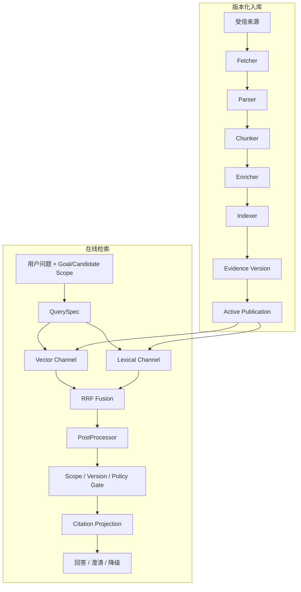

# 亮点二：RAG 证据检索完整链路

> 这一篇不是只讲“向量库 + 大模型”，而是讲资料怎样入库、怎样检索、为什么相关内容还不能直接引用，以及证据不足时系统怎样安全结束。

## 1. RAG 在购物业务里解决什么问题

Catalog 擅长回答 SKU、价格、库存和结构化规格，却不适合保存长篇说明、接口条件、排查步骤和退货政策。用户问“这个扩展坞能不能带两台显示器”或“我的订单是否还可以退货”，需要把商品/订单事实与说明/政策证据结合。

直接做向量检索会有四类危险：

1. 找到语义相似但属于另一款商品的资料；
2. 使用旧版本政策；
3. 把“没找到资料”解释成“不支持”；
4. 让文档里的旧价格覆盖当前 Catalog。

因此项目将 RAG 定义为“购物证据系统”，核心不是生成更流畅，而是控制资料的范围、版本、适用性和权威级别。

## 2. 事实权威先于检索相关性

| 事实类型 | 权威来源 | RAG 可以做什么 |
| --- | --- | --- |
| SKU、价格、币种、库存 | Catalog / Inventory | 提供说明，不能修改事实 |
| 明确兼容三态 | Compatibility Rule | 解释来源和条件 |
| 产品功能说明 | 当前活动 Product/Compatibility Evidence | 提供可引用依据 |
| 商城政策 | 当前活动 Store Policy + 结构化适用范围 | 解释政策，参与资格判断 |
| 用户个人订单/支付 | owner-scoped Order/Payment | RAG 无权创造个人事实 |

例如 Catalog 当前价格是 6299，旧文档写促销价 5999，最终价格必须使用 6299。RAG 排名再高也不能改变业务真值。

## 3. 整体由入库链和在线检索链组成



入库链解决“什么资料可以进入当前知识版本”；检索链解决“本次任务可以使用哪些证据”。两者缺一不可。

## 4. 资料入库 Pipeline

### Fetcher

只接收受信的仓库 Markdown 或管理员直接文本，不允许用户让 Agent 任意抓 URL。它读取内容、限制大小并计算来源/内容指纹。

### Parser

规范化文本、去除非法字符、提取标题并拒绝空内容。接口可以扩展 PDF/HTML，但当前不能声称已经支持任意文件。

### Chunker

优先按段落切块，超长段落再有界拆分。单块、单来源总长度和 chunk 数都有上限，防止索引放大与 embedding 成本失控。

### Enricher

给每个 chunk 加业务元数据：证据类型、product/SKU/category、compatibility key、policy type、地区、渠道、有效期、来源版本和 `authority=evidence_only`。这里的“增强”主要是绑定可验证范围，不是让模型扩写内容。

### Indexer

把 chunk 写入现有 Documents/pgvector。写入数量必须与预期一致，失败不能切换活动版本。重新索引某个来源只替换该来源的受控行，不执行全库 delete-all。

## 5. 为什么要做 Evidence Version

如果导入新政策时只成功一半，在线请求不能看到半新半旧数据。项目将“索引成功”和“业务发布成功”分开：

1. 创建新的 EvidenceVersion；
2. 节点逐步处理并保存状态；
3. 所有节点成功后才发布；
4. Active Publication 原子切换到新版本；
5. 失败时旧活动版本继续可见；
6. revoke 后新检索立即排除该版本，但历史记录仍可审计。

Document 记录关联 evidence version，在线 Repository 默认只查询当前活动且未撤销版本。确认动作前还会重验引用版本，避免用户确认时依据已经失效。

## 6. 在线检索先确定业务范围

RAG Agent 不能只拿一句自然语言去全库搜索。它先生成受限 `QuerySpec`，包括：

- 原始问题，必须保留；
- product ids、SKU codes 或 category；
- compatibility keys；
- policy type、region、channel；
- 有效时间；
- 最多三个子问题；
- 共享 deadline 和通道调用预算。

模型改写只能缩小或等价表达问题，不能扩大商品、owner、政策和外部地址。若模型改写失败，保留原问题和原范围继续检索。

## 7. 为什么同时使用向量与词法检索

向量检索擅长语义表达：用户说“适合移动办公”，资料可能写“轻便、长续航”。词法检索擅长精确词：SKU、HDMI 2.1、USB4、政策编号或“未拆封”。

只用向量容易串相似型号，只用关键词会漏掉口语表达。项目并行执行 Vector 与 Lexical Channel，每个通道返回稳定文档身份、排名、来源和状态。

通道状态不是简单成功/失败，而是区分：

- `ok`：有结果；
- `empty`：正常查询但无结果；
- `unavailable`：依赖不可用；
- `timeout`：超过共享 deadline；
- `disabled`：配置关闭。

这个区别决定系统应继续、降级还是澄清。

## 8. RRF 怎样融合结果

向量分数和词法分数量纲不同，直接相加没有稳定意义。RRF 只使用名次：

```text
RRF(d) = Σ 1 / (k + rank_channel(d))
```

一份资料在多个通道排名靠前，会累积更高融合分。RRF 的优点是简单、稳定、不要求校准原始分数。

但 RRF 只解决排序，不解决正确性。排在第一的片段仍可能属于错误商品、过期政策或缺少必要条件，因此后面必须经过 Evidence Gate。

## 9. PostProcessor 与 Evidence Gate

后处理器只能在可信召回池内去重、截断或重排，不能凭模型生成新的 document id。随后依次检查：

1. 文档身份是否真实存在；
2. evidence version 是否仍活动、未撤销；
3. product/SKU/category 是否属于本次范围；
4. compatibility key 是否对应当前设备关系；
5. policy type、region、channel 是否适用；
6. `valid_from/valid_until` 是否覆盖当前时间；
7. Catalog 候选白名单是否允许引用；
8. 文档中的指令是否试图扩大权限或调用工具。

任何必需 gate 异常都 fail closed。可选 reranker 失败时保留 RRF 顺序，不扩大候选。

## 10. 引用怎样对外展示

通过 gate 的结果才投影为公开 citation。公开字段只包含受控 source id、标题、版本、证据类型、适用范围和有界摘要，不直接把任意 URL 或文档内部指令交给前端。

回答中的每个关键结论应能对应来源：

```text
结论：扩展坞与显示器组合在当前规则中受支持
结构化依据：Compatibility Rule = supported
解释依据：当前活动 compatibility evidence
限制：只覆盖已记录接口和供电路径
```

引用存在不代表模型任何文字都正确，所以结果还要进入 VerificationReport。

## 11. 证据不足时怎样处理

### 可以降级但继续

用户只关心预算和内存，Catalog 事实充分，但商品说明暂时不可用。系统仍可展示候选，同时标记 evidence degraded，不能声称资料已经证明额外功能。

### 必须澄清

用户要求确认扩展坞与某显示器是否兼容，但缺少准确型号或接口条件。系统询问型号/连接方式，不能从“都有 USB-C”推断支持视频和供电。

### 返回 unknown/unresolved

通道不可用、活动版本被撤销或政策范围不匹配，而且该证据决定最终结论。系统保留不确定性并说明缺口。

最重要的规则是：`empty` 不等于“不支持”，`unavailable` 也不等于业务否定。

## 12. 一次兼容排查实例

用户说：“扩展坞连接显示器后没有画面。”

1. GoalSpec 保存设备和症状；
2. Retrieval QuerySpec 限定 dock/monitor 与 compatibility 证据；
3. Vector 查“无画面/显示输出”等语义，Lexical 查明确接口和型号；
4. RRF 合并，但只保留当前活动版本；
5. Compatibility Rule 给出 supported/unsupported/unknown；
6. Evidence Researcher 生成一项受信安全检查，例如确认输入源或线缆规格；
7. Reviewer 检查该步骤是否被资料支持；
8. 系统进入 waiting_input 等用户反馈；
9. 用户反馈标记为 `user_reported`，下一轮不假装系统亲自完成了物理检查。

## 13. 最难的工程问题

**索引更新的一致性。** 用 staged version 和活动指针解决，不让半成品对外。

**语义相关但业务不适用。** 用 scope、候选白名单、政策元数据和版本 gate 解决。

**通道故障语义混乱。** 每个 Channel 返回 typed status，共享 deadline，但独立记录 Vector/Lexical 失败。

**重排器引入假文档。** 只允许重排可信原候选，document identity 不匹配直接拒绝。

**文档覆盖业务事实。** 通过权威矩阵，Catalog/Order 优先，Evidence 只用于解释和政策依据。

## 14. 怎样量化但不编数字

工程范围可以真实说明：最多 3 个子问题、一次受限补查预算、Vector/Lexical 两通道、版本发布/撤销、明确的政策与范围 gate。

质量指标若以后做实验，可看 Recall@K、MRR、引用适用率、关键证据缺失识别率和每任务检索成本。当前项目有确定性与 PostgreSQL 验收，但不能凭 RRF 的存在声称准确率提升多少。

## 15. 面试追问与回答

**为什么不用 Elasticsearch？** 当前规模使用 PostgreSQL + pgvector 可以同时管理业务范围、版本和向量，降低系统复杂度。数据量和检索吞吐达到新瓶颈后再评估 ES/OpenSearch。

**RRF 的 k 怎么选？** k 控制名次贡献衰减，项目固定版本化参数保证回归稳定；具体质量最优值需要数据集评估，不能凭经验声称最优。

**怎样防 Prompt Injection？** 文档只是数据，不获得工具权限；检索范围和引用 ID由服务端控制，文档中的“忽略规则/访问 URL”等指令不能改变 Tool Gateway 或 QuerySpec。

**政策冲突怎么办？** 先按类型、地区、渠道和有效期过滤，再按活动版本判断。仍冲突则显式返回不确定，不让模型投票决定法规/政策事实。

## 16. 30 秒口述

> 我的 RAG 不只是把文档放进向量库。资料先经过 Fetch、解析、切块、业务范围增强和索引，全部成功后才原子发布新证据版本。在线检索先限定商品和政策范围，再并行做 pgvector 语义召回与关键词召回，用 RRF 按名次融合。结果还要检查商品范围、活动版本、地区渠道和政策有效期，最后才生成引用。关键证据不足时返回澄清、unknown 或降级，绝不会把“没检索到”说成“不支持”。
