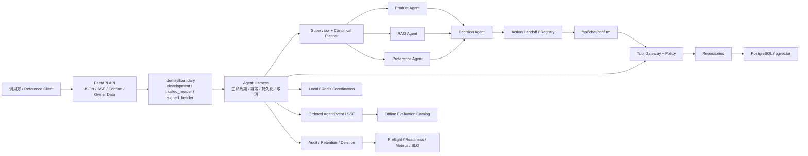

# ShopMind 完整项目介绍

> 文档日期：2026-07-26
>
> 实现状态：V1–V6 已完成
>
> 当前分支：`main`
>
> V4–V6 实现提交：`908b918`
>
> Release Candidate 验证文档提交：`690b0cb`
>
> 当前正式发布版本：`v3.0.0`

## 一句话介绍

ShopMind 是一个面向中文购物决策场景的 Agent Engineering 参考后端。它把
多 Agent 协作、运行时约束、持久化、流式事件、安全写入、人工确认、故障恢复、
隐私治理和离线评估组合为一套可运行、可测试、可审计的工程实现。

项目使用 FastAPI、LangGraph、PostgreSQL/pgvector、SQLAlchemy、Alembic，
并提供可选的 Redis 协调和 LangSmith 观测能力。

ShopMind 的重点不是实现完整商城，而是回答一个工程问题：

> 一个会读取商品和用户上下文、能够协作推理并准备写操作的 Agent 系统，
> 怎样才能在真实后端边界内做到安全、可控、可恢复和可验证？

## 当前完成度

ShopMind 的 V1–V6 规划已经全部落地，V5 退出条件和 V6 exit criteria 均已满足。
当前没有剩余的产品实现 Slice。代码已从 fresh detached worktree 完成全量验证，
工作区验证前后均保持干净。

需要区分“实现完成”和“发布完成”：

- **实现完成**：V1–V6 代码、测试、评估、运行文档和发布候选验证已经完成。
- **正式发布未执行**：V4–V6 已合并到 `main`，但尚未创建新版本 tag 或部署。
- **当前正式 release**：仍是 `v3.0.0`。

| 阶段 | 状态 | 主要成果 |
| --- | --- | --- |
| V1 | 完成 | 单 Agent 购物助手、工具调用、用户偏好和确认式加购 |
| V2 | 完成 | PostgreSQL/pgvector、Repository、Alembic 迁移、seed/index/smoke 工具 |
| V3 | 已发布 | 多 Agent 读图、受保护的写 handoff、候选上下文、API/CI 事件和 LangSmith 评估 |
| V4 | 完成 | Agent Harness、运行持久化、Memory/Context、SSE、运行控制和 Tool Gateway |
| V5 | 完成 | 规范化规划、并行协作、Adapter、预算、重试、通用 HITL action 生命周期和恢复 |
| V6 | 完成 | 评估目录、故障重放、协调后端、身份边界、审计/保留/删除、生产检查和参考客户端 |

## 适用场景

ShopMind 适合用于：

- 学习和评审生产级 Agent Runtime 的分层方式。
- 验证多 Agent 规划、并行执行、重试和预算策略。
- 演示读 Agent 与写操作之间的安全隔离。
- 构建需要 SSE、取消、幂等和断点恢复的 Agent API。
- 设计可持久化、可审计、可删除的 Agent Memory。
- 建立不依赖真实模型或外部网络的确定性 CI evaluation gate。
- 作为团队内部 Agent 平台、购物助手或决策助手的参考实现。

## 总体架构



系统有四条核心边界：

1. **公开 API 边界**：保留 V3 JSON 行为，同时增加 SSE、治理和运行检查接口。
2. **Agent Runtime 边界**：Harness 统一管理运行、事件、预算、取消、重试和持久化。
3. **Tool 与写入边界**：读 Agent 不能直接写入，写动作必须经过 Gateway 和确认。
4. **治理边界**：身份、所有权、审计、保留和删除由服务端控制，不信任请求自报身份。

## Agent 分工

| Agent | 职责 | 工具权限 |
| --- | --- | --- |
| Supervisor | 识别意图、选择路由、组织执行计划 | 不调用业务工具 |
| Product Agent | 商品搜索、详情读取和商品比较 | 商品只读工具 |
| RAG Agent | 检索商品知识、政策和文档上下文 | 检索只读工具 |
| Preference Agent | 读取用户购物偏好 | 偏好只读工具 |
| Decision Agent | 汇总专业 Agent 结果并生成结构化建议 | 不调用业务工具 |
| Write Handoff | 将明确的写意图转换为待确认 action | 只准备动作，不直接写入 |

Product、RAG 和 Preference 等专业 Agent 可以由 canonical plan 有界并行执行，
再由 Decision Agent fan-in。Supervisor 和 Decision Agent 不拥有写工具。

## 功能清单

### 1. 中文购物决策

- 商品搜索、商品详情、候选商品比较。
- 基于商品文档和政策的 RAG 检索。
- 读取用户偏好并参与推荐。
- 结构化汇总多个专业 Agent 的结果。
- 使用同一用户、同一线程且未过期的候选上下文消解商品。
- 在商品不明确时拒绝危险写入，而不是猜测目标商品。

### 2. 统一 Agent Harness

每次 Agent 调用都经过统一 Harness，负责：

- 创建 conversation、run 和 correlation identity。
- 校验幂等键并处理重复请求。
- 写入运行状态和有序生命周期事件。
- 绑定用户、线程和运行所有权。
- 管理成功、失败、取消和恢复状态。
- 将同步 JSON 与 SSE 执行映射到同一内部运行语义。
- 在 API、Agent 和 Repository 之间传递结构化运行上下文。

### 3. 规范化规划与并行协作

- 确定性 planner 是默认、可复现的基线。
- 可选 LLM planner 只能提出结构化计划，最终仍必须通过 canonical plan 校验。
- 空计划和写计划不会无意义调用 planner 模型。
- 支持有界 fan-out/fan-in，而不是无限制创建任务。
- 使用 typed `AgentTask` / `AgentResult` envelope 传递任务与结果。
- 计划步骤具有稳定 identity，便于幂等、重试和 trajectory 对比。
- shared budget 在父运行和专业任务之间统一结算。

### 4. Agent Adapter 与远程边界

- 本地 in-process Adapter 是默认生产路径。
- Adapter Registry 由服务端选择，客户端不能指定任意执行端点。
- local 与 HTTP Adapter 使用同一结构化任务/结果契约。
- 已有模型无关的 Adapter equivalence gate 验证行为一致性。
- remote RAG 为默认关闭的可选能力，只允许固定 HTTPS endpoint 和 allowlist。
- HTTP 响应大小、超时、错误类型和反序列化均有边界控制。
- 当前没有开放任意远程 A2A，也没有让请求直接提供远程地址。

### 5. 预算、故障与重试

Runtime 支持以下有界预算：

- step 次数；
- tool 调用次数；
- token 与 cost；
- deadline 与 duration；
- delegation 次数；
- 专业任务 attempt 次数。

专业 Agent retry 由服务端拥有，最多三次，默认配置
`SHOPMIND_AGENT_TASK_MAX_ATTEMPTS=1`，因此默认关闭重试。

只有 typed unavailable/timeout 等可重试故障可以进入 retry。attempt 事件结构化、
严格有序、可持久化并可由 SSE 消费，覆盖：

- retry scheduled；
- retry started；
- success after retry；
- attempt exhausted；
- non-retriable failure；
- budget blocked；
- cancellation before retry。

每个失败 attempt 都参与 usage 和 budget 对账，避免“失败重试不计费”的错误语义。

### 6. SSE 与运行控制

`POST /api/chat/stream` 提供有序 SSE 生命周期流：

- 运行和计划事件；
- 专业任务与 attempt 事件；
- tool/policy 事件；
- action handoff 事件；
- 完成、失败和取消事件。

流式运行具有：

- bounded event buffer；
- cooperative cancellation；
- 本地并发限制；
- admission lease；
- 断开连接后的清理证据；
- 与持久化 AgentEvent 一致的顺序语义。

### 7. Memory 与 Context

- PostgreSQL 持久化会话、运行、事件和用户 Memory。
- 将“长期可用的 Memory”与“单次调用选中的 Context”分开建模。
- Context 有数量和大小边界，避免无限上下文增长。
- Memory 写入受所有权、类别和数据策略控制。
- 支持用户查看、纠正和精确删除自己的 Memory。
- PostgreSQL 重启后可恢复待确认 action 和运行轨迹。

### 8. Tool Gateway 与策略控制

所有受控工具调用经过 Tool Gateway，策略维度包括：

- Agent capability allowlist；
- 工具所有权；
- 参数和资源范围；
- 用户/线程 ownership；
- 调用预算；
- side-effect classification；
- confirmation requirement；
- 结构化拒绝原因和审计事实。

这是一套应用级 policy sandbox，不宣称提供操作系统级进程隔离。

### 9. 通用 HITL Action 生命周期

ShopMind 当前注册两类写 action：

- `add_to_cart`：确认后加入购物车；
- `save_preference`：确认后保存用户偏好。

完整生命周期包括：

1. 从明确意图准备 pending action；
2. 返回可确认的结构化 action；
3. 在允许字段范围内进行精确编辑；
4. 通过 `/api/chat/confirm` 确认或取消；
5. 服务端重新校验 owner、thread、expiry、schema 和 idempotency；
6. 仅在确认成功后调用 Tool Gateway 执行写入；
7. 持久化结果，以支持 restart/resume/replay。

读 Agent 始终不能直接加入购物车或写用户偏好。

### 10. 身份与所有权

`IdentityBoundary` 支持三种服务端身份模式：

- `development`：本地兼容模式；
- `trusted_header`：由可信入口注入已认证主体；
- `signed_header`：短时、一次性 HMAC ingress identity。

生产模式要求可信入口负责认证和身份注入。业务请求中的 `user_id` 不能覆盖
已认证主体；如果两者冲突，服务端会拒绝请求。

所有 conversation、run、event、memory、pending action 和 owner-data 操作都按
effective principal 进行 exact-owner 校验。

### 11. PII-safe 审计、保留与删除

- 审计只记录 fingerprint 和结构化事实，不存储原始敏感 payload。
- audit event 具有独立的 retention/expiry。
- Governance audit emission 提供连续失败告警和恢复日志。
- `/api/owner-data/*` 提供有界数据清单、Memory 纠正和删除。
- 完整个人数据删除需要明确确认和 `deletion_request_id`。
- 删除只覆盖 ShopMind 拥有的个人数据，不误删商品/文档 catalog 或继承的
  customer/order seed 数据。
- owner run/trace inspection 不返回消息内容或 AgentEvent payload。

### 12. 本地与 Redis 协调

Runtime Coordination 提供同一接口的两种实现：

- `LocalRuntimeCoordinationBackend`：默认，线程安全、单进程、无外部依赖。
- Redis backend：显式启用，用于多实例共享协调状态。

协调能力包括：

- admission lease 与续租；
- fixed-window rate limit；
- duplicate claim；
- TTL/LRU cache；
- token-specific release；
- versioned same-slot Redis key；
- Lua 原子操作；
- 连接失败时 sanitised fail-closed 行为。

Redis 不是默认依赖，也不是当前所有状态的通用持久化层。

### 13. 可观测性与生产运维

- 结构化 AgentEvent 和 correlation identity。
- PII-free governance audit health snapshot。
- 静态 production configuration preflight。
- live deployment readiness 检查。
- bounded per-replica service metrics。
- 版本化 service SLO 契约。
- cleanup success evidence。
- 离线 rollout、rollback 和 incident release-operation checks。
- 可选 LangSmith trace/experiment；默认测试不依赖 LangSmith。

### 14. 确定性离线评估

V6 使用闭合、版本化的 evaluation catalog 组合各类确定性 suite。默认 gate
不需要真实 LLM、外部 HTTP、凭据或 LangSmith 网络访问。

| Evaluation | 当前结果 |
| --- | ---: |
| Planner policy | 10/10 cases，70/70 checks |
| Plan trajectory replay | 13/13 cases，195/195 checks |
| Adapter equivalence | 5/5 cases，24/24 checks |
| Action lifecycle | 10/10 cases，60/60 checks |
| Resilience replay | 6/6 cases，72/72 checks |
| Coordination equivalence | 5/5 cases，18/18 checks |
| Governance lifecycle | 5/5 cases，42/42 checks |
| Release operations | 7/7 cases，42/42 checks |
| V6 catalog regression | 8/8 suites，61/61 cases，488/488 suite checks，48/48 baseline checks |

accepted baseline 只读使用，不会在普通 gate 中被自动改写。

### 15. Public API Reference Client

`examples/shopmind_reference_client.py` 只通过公开 API 演示：

- JSON chat；
- ordered SSE；
- generic HITL confirm/resume；
- Memory inspection；
- exact-owner、payload-free run/trace inspection。

客户端默认只允许 loopback HTTP；远程地址必须使用 HTTPS。它不接收任意认证头
或身份签名密钥，避免把可信入口职责下放给示例客户端。

## 公开 API

| 方法与路径 | 功能 | 关键约束 |
| --- | --- | --- |
| `GET /api/health` | 基础存活检查 | 不返回密钥 |
| `GET /api/health/governance-audit` | PII-safe 审计发射健康状态 | 只返回聚合/结构化状态 |
| `GET /api/health/preflight` | 生产配置预检结果 | 不泄露配置值 |
| `GET /api/health/readiness` | live deployment readiness | 检查运行依赖和清理证据 |
| `GET /api/health/service-metrics` | bounded service metrics/SLO | 进程/副本级数据 |
| `POST /api/chat` | V3 兼容 JSON chat | 统一 Harness 和所有权校验 |
| `POST /api/chat/stream` | ordered SSE chat | admission、buffer、取消和清理 |
| `POST /api/chat/confirm` | 确认、取消或编辑 pending action | 唯一通用写确认边界 |
| `POST /api/owner-data/inspect` | 查看个人数据清单 | exact-owner、有界返回 |
| `POST /api/owner-data/runs/inspect` | 查看个人 run/trace 元数据 | 不返回内容和 event payload |
| `POST /api/owner-data/memory/correct` | 精确纠正 Memory | owner 与 schema 校验 |
| `POST /api/owner-data/memory/delete` | 精确删除 Memory | owner 与目标校验 |
| `POST /api/owner-data/delete` | 事务性删除 ShopMind 个人数据 | 显式确认和 request id |

V3 的 `/api/chat`、`/api/chat/confirm` 和安全确认语义保持向后兼容。

## 数据与持久化

核心数据通过 SQLAlchemy Repository 访问 PostgreSQL：

- conversations；
- agent runs；
- ordered agent events；
- memory records；
- idempotency records；
- action registry / pending actions；
- governance audit facts；
- 商品、偏好、购物车和检索数据。

pgvector 用于向量检索。Alembic 迁移从 `0001` 演进到当前 head
`0007_governance_audit`。

运行时数据库由 `DATABASE_URL` 选择，真实 integration tests 使用
`TEST_DATABASE_URL`。配置加载不会覆盖显式进程环境变量。

## 关键安全不变量

- 读 Agent 不能调用写工具。
- Supervisor 和 Decision Agent 不拥有业务写工具。
- 购物车和偏好写入只能在确认之后执行。
- action 必须属于同一用户和线程，并且未过期。
- 请求体中的身份不能覆盖 authenticated principal。
- tool、action、memory、run 和 event 均执行 exact-owner 校验。
- 客户端不能提供任意 Agent endpoint 或选择远程 transport。
- retry、parallelism、buffer、budget 和 retention 都有服务端上限。
- 日志、审计和健康接口不得暴露 secret 或原始 PII payload。
- 幂等、取消和失败 attempt 都必须进入结构化状态与 usage 对账。

## 默认运行方式

推荐的可复现基线：

```env
SHOPMIND_AGENT_MODE="multi"
SHOPMIND_SUPERVISOR_ROUTER="deterministic"
SHOPMIND_AGENT_PLANNER="deterministic"
SHOPMIND_AGENT_TASK_MAX_ATTEMPTS="1"
```

其他重要默认值：

- 专业 Agent transport 默认 `in_process`。
- coordination backend 默认 `local`。
- retry 默认关闭。
- remote RAG 默认关闭。
- LangSmith tracing 是可选能力。
- 默认测试不使用真实 LLM。

## 验证记录

最终 V4–V6 Release Candidate 在不读取项目 `.env` 的 fresh detached worktree
中执行，结果如下：

```text
Full suite: 668 passed, 6 skipped
PostgreSQL integration: 23 passed, 2 Redis tests skipped
PostgreSQL + Redis integration: 25 passed
PostgreSQL smoke: passed, migration 0007_governance_audit
V3 API handoff smoke: 3/3
Production preflight: 6/6
Release operations: 7/7 cases, 42/42 checks
V6 catalog: 8/8 suites, 61/61 cases,
            488/488 suite checks, 48/48 baseline checks
Git status before/after validation: clean
```

历史 V3 release 基线为 `227 passed, 4 skipped`，LangSmith evaluator scores
为 `6/6` 且均为 `1.0`。

## 快速开始

本项目在当前 Windows 开发环境中统一使用：

```powershell
conda run -n pythonLearn D:\DL\Anaconda3\envs\pythonLearn\python.exe ...
```

不要直接执行 `python`、`pytest` 或 `uv run`。

启动 API：

```powershell
conda run -n pythonLearn D:\DL\Anaconda3\envs\pythonLearn\python.exe -m uvicorn app.main:app --reload
```

运行全量测试：

```powershell
$env:LANGSMITH_TRACING = "false"
conda run -n pythonLearn D:\DL\Anaconda3\envs\pythonLearn\python.exe -m pytest -p no:cacheprovider
```

运行只读 PostgreSQL smoke：

```powershell
conda run -n pythonLearn D:\DL\Anaconda3\envs\pythonLearn\python.exe scripts\smoke_postgres.py
```

运行 V3 handoff smoke：

```powershell
conda run -n pythonLearn D:\DL\Anaconda3\envs\pythonLearn\python.exe scripts\smoke_v3_handoff.py --json
```

运行完整 V6 evaluation catalog：

```powershell
conda run -n pythonLearn D:\DL\Anaconda3\envs\pythonLearn\python.exe evaluation\run_catalog_eval.py --output-json artifacts\v6-evaluation-catalog\summary.json
```

调用参考客户端：

```powershell
conda run -n pythonLearn D:\DL\Anaconda3\envs\pythonLearn\python.exe examples\shopmind_reference_client.py chat --message "推荐一款办公键盘" --user-id demo-user --thread-id demo-thread
```

日常检查不要运行 seed、document index 或 destructive bootstrap。

## 目录结构

| 路径 | 内容 |
| --- | --- |
| `agents/shopmind_agent.py` | V1 legacy 单 Agent 路径 |
| `agents/shopmind_multi_agent/` | 多 Agent graph、planner、events、permissions、handoff |
| `app/api/` | FastAPI 路由和 schema |
| `app/runtime/` | Harness、协调、身份、治理、监控等 runtime 能力 |
| `app/repositories/` | PostgreSQL Repository |
| `app/db/` | SQLAlchemy 数据库基础设施 |
| `tools/` | 商品、RAG、偏好、购物车等工具 |
| `alembic/` | 数据库迁移 |
| `evaluation/` | 确定性离线 evaluation runners、catalog 和 baselines |
| `evaluators/` | LangSmith/评价器逻辑 |
| `scripts/` | smoke、preflight、readiness 和 release operation 工具 |
| `examples/` | Public API reference client |
| `tests/` | 单元、API、runtime、安全、文档和 integration tests |
| `docs/` | 架构、运行设计、开发、运维和发布候选文档 |
| `workshop_modules/` | 保留的历史 TechHub workshop，不是当前产品路径 |

## 明确不包含的范围

当前项目有意不实现：

- 当前 V6 仓库没有 Web 前端；后续实现建议见
  [前端实施方案](frontend_implementation_plan.md)；
- 完整商城、订单履约、支付和退款系统；
- 任意 Agent 可直接执行写操作；
- 请求驱动的任意远程 HTTP/A2A endpoint；
- 默认依赖真实 LLM 或外部模型网络；
- generic HITL 工作流平台；
- 操作系统级 sandbox；
- Redis 作为全部业务数据的持久化数据库；
- 跨地域分布式事务和通用分布式调度；
- 生产 IdP/JWKS 服务本身；
- 自动 push、tag、部署或生产数据 bootstrap。

这些边界使项目聚焦于 Agent Runtime 和安全决策后端，而不是扩展成通用电商或
分布式工作流平台。

## 接下来可以做什么

V6 实现本身已经完成。后续工作属于发布和产品化选择，需要单独授权：

1. 选择 V4–V6 的正式版本号并创建 tag/release notes。
2. 在目标环境配置可信 ingress、PostgreSQL、可选 Redis 和生产 secrets。
3. 执行 preflight、readiness、rollout/rollback 演练后部署。
4. 按[前端实施方案](frontend_implementation_plan.md)在 `frontend/` 开发 Web UI。
5. 如果要演进 V7，应先建立新的目标和 roadmap，而不是继续扩大 V6 范围。

## 延伸文档

- [Agent 接手与操作规则](../AGENTS.md)
- [项目当前状态](project_status.md)
- [完整路线图](../PLAN.md)
- [系统架构](architecture.md)
- [V4–V6 Runtime 设计](agent_runtime_design.md)
- [API 设计](api_design.md)
- [V3 API 兼容契约](v3_api_handoff_contract.md)
- [前端实施方案](frontend_implementation_plan.md)
- [开发与数据库指南](development.md)
- [运维手册](operations_runbook.md)
- [V6 Release Candidate 验证记录](v6_release_candidate_notes.md)
