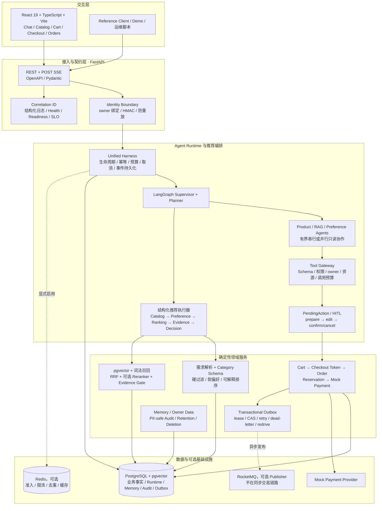
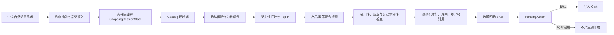

# ShopMind 项目架构、功能设计与简历提炼

> 更新时间：2026-09-14  
> 用途：先完整理解项目，再从中选择 4～5 条写入简历。本文描述的是当前工作区实现，不把历史路线图或尚未落地的设想算作已完成能力。

## 1. 项目定位

ShopMind 是一个面向中文消费电子选购的全栈 Agent Engineering 项目。它把自然语言需求转成可解释、可追溯的 SKU 推荐，并通过人工确认将推荐安全地衔接到购物车、结算、订单、库存预占、模拟支付和事务 Outbox。

这个项目最有价值的地方不是简单地“接入大模型做推荐”，而是把不确定的 Agent 推理与确定性的业务系统分层：

- 模型或 Agent 负责需求理解、只读信息协作和结果解释；
- Category Schema、Catalog、排序器和证据门控负责约束校验与确定性决策；
- PendingAction/HITL 负责把“建议”与“写操作”隔离；
- PostgreSQL 负责 SKU、价格、库存、订单、支付和事件的最终事实；
- Harness、Tool Gateway、评测与治理模块负责运行预算、权限、重试、审计、回放和可观测性。

一句话概括：**这是一个以 Agent 为交互与决策入口、以确定性规则和 PostgreSQL 事务为安全底座的智能购物决策与交易系统。**

## 2. 总体架构图

架构中的关键边界：

1. 推荐结果可以提出某个 SKU，但不能直接修改购物车。
2. 只有 owner 一致、未过期且显式确认的 PendingAction 才能进入写路径。
3. 文档证据不拥有价格、库存和 SKU 真值；这些事实始终由 Catalog/PostgreSQL 提供。
4. Redis 只承担可替换的分布式协调，不能替代交易数据库。
5. RocketMQ 发布失败不会回滚已经提交的订单，可靠交接由同事务写入的 Outbox 记录保证。

## 3. 一次请求如何运行

### 3.1 推荐主链路

实现要点：

- 支持人民币前后缀、中文金额、`k`/`万`、范围、TB/GB 换算、局部数值绑定和否定极性，避免把“16GB 内存、1.5kg 重量”错误绑定。
- 当前 Category Schema 覆盖笔记本、手机、显示器、平板、相机、耳机、键盘、鼠标、路由器和音箱 10 类消费电子；每个属性定义类型、单位、合法范围、比较方式和缺失值策略。
- Catalog 先执行价格、库存、属性等硬过滤；已确认长期偏好只作为软排序信号，当前轮显式要求拥有更高优先级。
- 推荐执行由 `RecommendationTaskPlan/Result` 描述，默认包含 Catalog、Preference、Ranking、Evidence、Decision 五个阶段；计划有依赖校验、最大步数、取消检查、阶段事件和失败合同。

### 3.2 多轮状态设计

系统不重新解析整段聊天记录来猜测当前条件，而是保存一个版本化的 `ShoppingSessionState`：

- 以 owner + thread 隔离，保存当前品类、预算、结构化属性、字段来源、待澄清项、候选 SKU 和排除项；
- 新一轮只 patch 本轮出现的字段，支持显式清空；切换品类时重建属性集合；
- 使用单调版本号和乐观 CAS，阻止旧请求覆盖较新的购物状态；
- 只保存无正文的有界 patch history，降低隐私和上下文膨胀风险；
- 候选序号 30 分钟后过期，避免用户说“排除第二个”时误指向已经变化的列表。

这一设计解决了 Agent 项目中很常见但容易被忽略的问题：多轮对话不是简单拼接历史文本，而是一个需要定义 merge、clear、conflict、expiry 和 ownership 语义的状态机。

### 3.3 RAG 与证据设计

RAG 不是无条件执行，也不直接替代 Catalog：

1. 保留原始问题，最多拆成 3 个产品或政策子问题。
2. 服务端把检索范围绑定到当前问题和候选集，所有通道共享调用预算。
3. 分别执行 pgvector 语义召回与有界词法召回，通过稳定文档身份去重。
4. 使用 Reciprocal Rank Fusion（RRF）融合不同分数量纲的排名。
5. 可选词法或 CrossEncoder 语义重排；重排器只能返回融合池中的文档，超时或失败时保留可信融合结果并标记 degraded。
6. 按 SKU、政策适用范围和最新文档版本检查证据；缺少证据时返回 unknown/unavailable，而不是把“没查到”误判为“满足”或“不满足”。
7. 对外只投影经过校验的文档引用和精简摘录，文档正文仍留在数据库或隔离评测工件中。

价格、库存、在售状态、SKU 身份仍由结构化 Catalog 决定。RAG 主要补充产品说明、规格语义和政策依据。

### 3.4 Agent 协作与 Runtime

- Supervisor 负责意图分类和路由，不持有业务工具。
- Product Agent 只读商品，RAG Agent 只读文档，Preference Agent 只读偏好，Decision Agent 只做结构化汇总。
- 独立的只读任务可以在共享预算内有界并行；写请求、单路请求和有依赖的步骤不会盲目并发。
- 本地 Agent 与可选 HTTP RAG Specialist 复用同一 typed adapter 合同，并有等价性评测；远程路径由服务端配置，API 调用方不能指定任意地址。
- Harness 为 JSON Chat、POST SSE 和确认操作提供统一的 run/trace ID、顺序事件、截止时间、重试、取消、token/cost/tool/step 预算以及持久化生命周期。
- Tool Gateway 集中执行 Pydantic 参数校验、Agent allowlist、owner 检查、敏感操作策略、资源策略、输出上限和调用审计。

这部分的工程价值在于：Agent 的规划、工具调用、失败和恢复不再散落在业务代码中，而是进入统一、可测试、可回放的运行时合同。

## 4. 从推荐到交易的功能设计

### 4.1 HITL 安全写入

推荐 Agent 全部位于只读路径。加购或保存偏好时，系统先创建 typed PendingAction，支持 prepare、精确字段 edit、confirm、reject、expire、resume 和 replay。确认时再次验证 owner、状态、过期时间和动作 schema；未确认、取消、越权或过期都不会产生业务写入。

这种设计比“让 Agent 直接调用 add_to_cart”更适合简历表达，因为它展示了对模型不确定性、最小权限和副作用隔离的理解。

### 4.2 购物车与结算快照

- 购物车以 SKU 为粒度并按 owner 隔离，修改数量时重新校验 Catalog 和可用库存。
- Checkout Preview 只读取稳定的 Cart/Catalog 快照，不创建订单。
- 服务端生成带 owner、购物车指纹、价格指纹和有效期的签名 token。
- 创建订单时重新验证 token 与当前事实，阻止客户端篡改价格或使用过期快照。

### 4.3 订单与库存一致性

- OrderItem 快照产品/SKU 名称、编码、单价和币种，避免后续 Catalog 变化污染历史订单。
- 创建订单时按稳定 SKU 顺序加 PostgreSQL 行锁，使用条件更新预占库存，降低死锁并防止超卖。
- 多 SKU 任一项失败则整笔事务回滚；成功后订单进入 `pending_payment`，Reservation 进入 `active`。
- 订单取消或超时会释放 Reservation；后台过期扫描使用 `FOR UPDATE SKIP LOCKED`，允许多个 worker 安全分批处理。
- `Idempotency-Key + request hash + owner` 支持同请求重放，并拒绝同 key 不同请求的冲突复用。

### 4.4 模拟支付与恢复

支付把外部调用拆成三个边界：

1. 短事务 claim PaymentAttempt 并提交；
2. 在数据库事务之外调用 Mock Provider，避免网络延迟长期持锁；
3. 持久化 provider 结果，再用新事务锁定 Order、Attempt、Reservation 和 Inventory，原子完成扣减、状态迁移和 Outbox 写入。

`provider_succeeded` 是一个持久化中间态：如果渠道已经成功但本地最终提交失败，系统可继续 finalization，而不是再次扣款。Payment 与 Cancel 都锁订单：支付先取得有效 claim 时取消返回 `payment_in_progress`；取消先提交时，支付不会调用 Provider。

这里实现的是 Mock Payment 和恢复协议，不是真实支付、银行卡、退款或 webhook。

### 4.5 Transactional Outbox

订单创建、取消、过期和支付成功事件与业务状态在同一个 PostgreSQL 事务中写入。独立 worker：

- 通过短租约和 `FOR UPDATE SKIP LOCKED` claim 事件；
- 在事务外向可选 RocketMQ Publisher 发布；
- 用 CAS 标记完成，旧 worker 不能覆盖新租约；
- 支持有界重试、退避、dead-letter 和显式 redrive；
- 按订单维持事件顺序，使用稳定 event ID 支持未来 Consumer 去重。

系统明确采用 at-least-once，而不是虚假的 exactly-once。当前只实现 Producer/Publisher，Consumer、Inbox 和消费端去重仍是后续边界。

## 5. 前端功能

前端位于独立的 `frontend/`，采用 React 19、TypeScript、Vite、React Router、TanStack Query、React Hook Form 和 Zod。OpenAPI 生成类型作为前后端契约来源。

当前页面和交互包括：

- 对话式购物工作台：POST SSE 生命周期、推荐卡片、结构化约束、证据状态和引用；
- Catalog：品类、商品与 SKU 详情浏览；
- 最多 4 个 SKU 的对比抽屉；
- PendingAction Drawer：确认、取消和错误恢复；
- Cart、Checkout、订单列表、订单详情、支付与 PaymentAttempt 历史；
- Privacy：owner 数据清单、Memory 更正/删除、完整个人运行数据删除；
- Runs：无 payload 的 run/trace 检查；
- Status：健康、预检、就绪状态和服务指标。

对于响应丢失等未知结果，前端会保留原请求体和 Idempotency-Key 后重试，不会生成一个新 key 导致重复订单或支付。

## 6. 安全、治理和生产参考能力

- Identity 由服务端选择：开发环境兼容 body user，生产参考模式支持 trusted header 或带时间戳、nonce、HMAC-SHA256 的 signed header。
- signed header 的指纹通过 local/Redis 原子 claim 防重放；身份不一致在进入 Agent、存储或写操作前返回稳定 401/403。
- owner-data API 支持精确 owner 的运行数据盘点、Memory 更正/硬删除和显式确认的完整删除。
- Governance Audit 只保存 domain-separated fingerprint 和封闭枚举元数据，不保存原始消息、凭据、URL 或任意 payload；审计失败不会改变主业务结果。
- 静态 production preflight、实时 readiness、迁移 head、协调后端、清理证据、服务成功率/p95 SLO 和发布/回滚/事故检查均有独立合同。
- Correlation ID、PII-safe JSON 日志和状态迁移日志用于串联一次 HTTP、订单、支付和 Outbox 处理。

这些属于“生产参考实现”，不应在简历中直接表述为已经承载真实生产流量。

## 7. 质量保障与可量化证据

项目测试强调确定性基线和真实状态验证，不依赖每次都调用模型：

| 层级 | 目前仓库记录的验证 |
| --- | --- |
| 后端回归 | 最新交接记录为 **896 passed、63 skipped**；不同批次有重叠，不做累加 |
| PostgreSQL / Redis | PostgreSQL integration **23/23**；组合验证 **25/25** |
| 前端 | lint、typecheck、**135** 个单元测试、production build、bundle budget 通过 |
| 浏览器 | offline Playwright **35/35**；本地真实 Catalog 与核心下单支付链路 **2/2** |
| V3 API handoff | **3/3** |
| V6 evaluation catalog | **8/8 suites、61/61 cases、488/488 checks、48/48 baseline checks** |
| Release operations | **7/7 cases、42/42 checks** |

推荐质量侧另有：

- 20 条合成需求解析任务和 12 条合成检索任务；
- Hit/Recall@K、MRR、必要证据 Recall、硬约束违反率、事实支持率、引用正确率等指标计算器；
- deterministic single、bounded multi、hybrid RRF、semantic rerank 四路消融；
- 真实 Provider/PostgreSQL retrieval capture 入口，记录代码、模型、Prompt、配置版本、证据 ID、耗时和脱敏失败信息。

必须注意：合成数据只证明合同和回归稳定，不等于真实用户推荐质量提升；语义 reranker 目前也没有可对外宣称的线上收益或 SLA。

## 8. 技术栈

| 方向 | 技术 |
| --- | --- |
| Agent / LLM | LangGraph、LangChain、结构化 Pydantic 合同、可选 LLM Router/Planner |
| Backend | Python、FastAPI、SQLAlchemy、Alembic、Pydantic |
| 数据 | PostgreSQL、pgvector；Redis 为可选协调后端 |
| 检索 | Vector Search、bounded lexical BM25-style recall、RRF、可选 CrossEncoder rerank |
| 交易与消息 | 行锁、条件更新、乐观 CAS、Idempotency、Transactional Outbox、可选 RocketMQ |
| Frontend | React 19、TypeScript、Vite、React Router、TanStack Query、Zod |
| 测试 | pytest、Vitest、Testing Library、Playwright、真实 PostgreSQL 并发测试 |
| 工程化 | OpenAPI 类型生成、GitHub Actions、preflight/readiness、结构化日志、评测基线与回放 |

## 9. 这个项目适合强调的亮点

### 亮点一：不确定推理与确定性业务解耦

Agent 只负责它擅长的理解、规划和解释，所有硬约束和写操作都要通过 Schema、Catalog、Tool Gateway、HITL 和事务验证。这个设计比堆叠 Agent 数量更能体现工程判断。

### 亮点二：完整的 Agent Runtime，而不是一次性 Chain

项目实现了统一 Harness、typed adapter、运行预算、截止时间、重试、取消、流式事件、幂等、持久化、trajectory replay、local/HTTP specialist 等价性和 local/Redis coordination，能回答“Agent 失败后如何恢复、如何限权、如何复现”的问题。

### 亮点三：RAG 结果进入业务决策前有证据边界

混合召回、RRF、可选重排只是中间过程；最终还要验证 SKU 适用范围、政策版本和必要事实覆盖，并显式呈现 unknown/degraded。这比“接入向量库”更具区分度。

### 亮点四：交易一致性细节扎实

SKU 级事实、签名结算快照、幂等请求、稳定加锁顺序、库存预占、支付恢复中间态、支付/取消竞态、订单过期以及 Outbox crash window 都有明确状态机和真实数据库测试。

### 亮点五：评测、安全和可运维性一起设计

项目同时覆盖模型无关基线、检索捕获、消融评测、owner 隔离、PII-safe 审计、删除权、preflight/readiness、SLO 和发布操作检查。它能作为“如何把 Agent demo 做成可交付工程”的完整案例。

## 10. 简历可选写法（建议最终保留 4～5 条）

下面是偏后端/Agent 工程岗位的推荐版本。数字均来自当前仓库验收记录；投递前应以最终提交和最后一次 CI 结果更新。

**项目：ShopMind — 智能购物决策与交易 Agent 系统**  
**技术栈：FastAPI、LangGraph、PostgreSQL/pgvector、SQLAlchemy、React/TypeScript、Redis、RocketMQ**

1. 设计并实现面向中文消费电子选购的多 Agent 系统，以 LangGraph Supervisor 编排 Product、RAG、Preference、Decision 等只读角色，通过 Pydantic Schema 与确定性 Catalog 过滤/排序生成可解释的 SKU 级推荐，覆盖 10 类商品。
2. 构建混合 RAG 证据链路，将 pgvector 语义召回与有界词法召回经 RRF 融合，并加入可选 CrossEncoder 重排、SKU/政策适用性和文档版本门控；用共享预算和 unknown/degraded 状态避免检索失败被包装成确定答案。
3. 建立 Agent 安全写入与多轮状态机制：通过 Tool Gateway 最小权限、owner/thread 隔离和 PendingAction/HITL 阻断未确认副作用；以版本化 ShoppingSessionState、乐观 CAS、显式 patch/clear 和候选过期支持预算修改、排除候选与断点恢复。
4. 打通 Cart—签名 Checkout 快照—Order—Inventory Reservation—Mock Payment—Transactional Outbox 交易链路，利用 PostgreSQL 行锁、条件更新、请求哈希幂等和持久化 `provider_succeeded` 状态处理超卖、重复请求、支付/取消竞态及响应丢失恢复。
5. 搭建模型无关的 Agent 评测与交付门禁，覆盖 trajectory replay、故障恢复、权限治理、检索指标、四路消融和真实 PostgreSQL/浏览器链路；仓库最新记录为后端 **896 passed、63 skipped**、offline Playwright **35/35**、live 核心路径 **2/2**。

如果简历空间较小，建议保留第 1、2、3、4 条，把第 5 条压缩后并入项目末尾；如果投递传统后端岗位，可弱化第 2 条，强化第 4 条的数据库并发与一致性。

## 11. 不同岗位的取舍建议

| 目标岗位 | 优先写 | 面试重点 |
| --- | --- | --- |
| Agent / LLM 应用工程 | 1、2、3、5 | 有界规划、Tool Gateway、RAG 证据充分性、评测和失败降级 |
| Python 后端 | 1、3、4、5 | FastAPI 契约、PostgreSQL 事务、幂等、并发竞态、Outbox |
| 全栈 | 1、3、4、5，并补 React | POST SSE、OpenAPI 类型生成、恢复型 UX、真实浏览器链路 |
| 平台 / Agent Infra | 2、3、5，再补 Runtime | Harness、adapter、预算/取消/回放、Redis 协调、治理与 readiness |

## 12. 面试时最值得展开的四个问题

1. **为什么不允许 Agent 直接加购物车？** 讲只读 Agent、Tool Gateway、PendingAction、owner 绑定和二次确认。
2. **为什么需要 ShoppingSessionState，不能只把历史消息都塞进 Prompt？** 讲结构化 patch、clear、CAS、过期和 token/隐私边界。
3. **支付渠道已经成功、本地事务失败怎么办？** 讲事务外 Provider 调用、`provider_succeeded` 持久态和幂等 finalization。
4. **数据库提交和 MQ 发布之间如何避免丢事件？** 讲 Transactional Outbox、lease、CAS、at-least-once 和未来 Inbox 去重。

## 13. 不能夸大的边界

- 支付为 Mock Provider，不含真实银行卡、退款、webhook 或自动对账。
- RocketMQ 只有可选 Publisher；Consumer、Inbox 和消费端去重尚未实现。
- Redis 用于 Agent Runtime 的可选协调，不是 Cart/Order 的事实存储。
- 当前评测包含合成数据和本地 live 验收，不能宣称线上 CTR、转化率、推荐准确率或生产 SLA。
- LangSmith 是可选实验旁路，正常开发、Core Demo 和默认测试不依赖云端 Trace。
- 项目尚未经过真实生产流量验证，简历用“生产参考能力/工程化设计”比“生产级系统”更准确。

## 14. 代码索引

| 主题 | 主要位置 |
| --- | --- |
| Agent 图与路由 | `agents/shopmind_multi_agent/graph.py`、`planning.py`、`recommendation_nodes.py` |
| 推荐解析与排序 | `app/recommendation/request.py`、`constraints.py`、`ranking.py`、`service.py` |
| 多轮购物状态 | `app/recommendation/session_state.py`、`app/repositories/runtime_shopping_state.py` |
| RAG 证据 | `app/recommendation/rag.py`、`app/repositories/documents.py` |
| Runtime / Tool Gateway | `app/runtime/` |
| HITL | `agents/shopmind_multi_agent/write_handoff.py`、`app/runtime/actions.py` |
| Cart / Order / Payment | `app/services/cart.py`、`checkout.py`、`orders.py`、`payments.py` |
| Outbox | `app/outbox/` |
| 身份与治理 | `app/security/`、`app/governance/` |
| HTTP API | `app/api/routes/`、`app/schemas/` |
| React 前端 | `frontend/src/features/` |
| 评测 | `evaluation/`、`tests/` |
