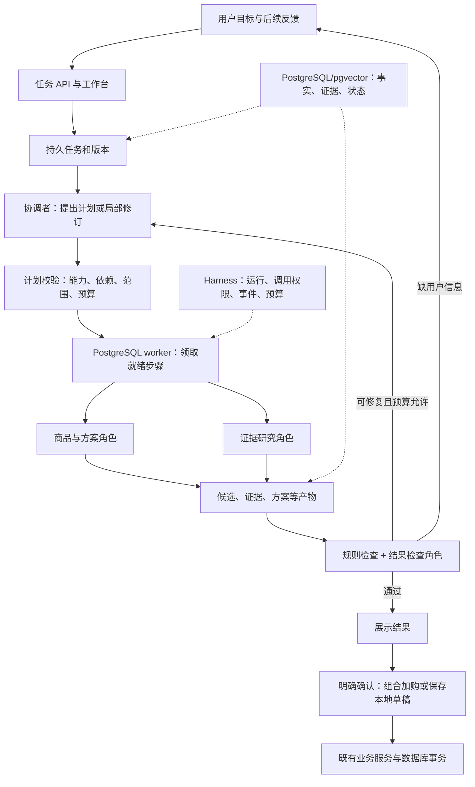

# ShopMind Agent 秋招升级方案与新窗口交接

日期：2026-09-20。状态：**已实施并于 2026-09-21 完成 75/75 验收**。对应 OpenSpec change：`evolve-shopping-agent-task-workbench`；实际证据见 `shopmind_agent_upgrade_acceptance.md`。

本文是新窗口实施入口，主体只有五部分。它定义目标业务、架构、实施顺序和完成条件，不是已完成功能介绍。实际约束与验收见 [design.md](../openspec/changes/evolve-shopping-agent-task-workbench/design.md)、[specs](../openspec/changes/evolve-shopping-agent-task-workbench/specs/) 和 [tasks.md](../openspec/changes/evolve-shopping-agent-task-workbench/tasks.md)。三者发生冲突时必须先对齐再实现；旧简历文档不能覆盖新合同。

## 一、项目要改成什么，以及为什么值得做

**目标名称：ShopMind——消费电子选购与服务协同 Agent 工作台。** 保留购物主题，把系统从“给出几个商品推荐”扩展成“持续完成一个有条件、有依赖、需要检查与修正的购物任务”。工程目标是让任务规划、专业协作、RAG、人工确认和运行恢复真实贯通，而不是增加 Agent 名称或可选配置。

面试中的产品描述应在完成后能够成立：

> 用户可以提出一整套设备选购目标，系统会整理条件、制定受约束计划、查询商品和资料、形成组合并检查预算与兼容性。发现问题时只调整相关部分，缺少信息时询问用户，最后展示有依据的方案并等待确认。用户还可以围绕设备连接问题继续排查，或结合本人订单与商城政策分析售后条件。

**本次必须实现三种有界任务，而不是任选其一。** 实施按先主场景、后扩展场景推进，但所有验收任务完成前不能宣布整个变更完成。

| 任务 | 用户输入例子 | 必须交付什么 | 明确边界 |
| --- | --- | --- | --- |
| 组合选购，主场景 | 一万元配笔记本、显示器、扩展坞，希望一根线连接 | 合法组合、总价、规格、兼容判断、引用、替代项、版本和确认入口 | 最多三个选购槽位；本期只选库内商品，不跨平台下单 |
| 连接兼容排查 | 这套设备接显示器没画面 | 已知设备与连接事实、可执行检查建议、用户反馈、排除原因、解决或信息不足结论 | 只做安全的接口/线材/设置级建议，不远程控制设备、不要求拆机 |
| 售后资格分析 | 买的这台电脑能退吗，帮我整理申请材料 | 本人订单事实、适用政策、缺失条件、资格分析和经确认保存的本地申请草稿 | 不执行退款、不创建外部工单、不声称平台已受理 |

组合选购必须支持后续修改，例如“总预算降到 9000，显示器保留”；排查必须支持等待用户回答后继续；售后必须在没有可信送达日期等事实时明确给出未知或条件性判断，不能使用默认 14 天规则直接宣布可退。

**不用把所有业务都建成独立 Agent。** 核心保留四类职责：协调者、商品/方案分析角色、证据研究角色、结果检查角色。订单读取、预算计算、兼容规则、草稿保存是受限工具或业务服务；用户已保存偏好是可选信息源；本次选购条件与选择记录属于任务状态。统一划分可以在三个场景复用。

本次不改成任意 Research/Code/Data 通用平台，不引入 Coding Agent、任意 Python 执行、浏览器代购、真实支付退款、分布式微服务、ES/图谱或强制联网搜索。它们不会成为完成本方案的前置条件。React 前端、FastAPI、LangGraph、Pydantic、SQLAlchemy、PostgreSQL/pgvector 继续保留，Redis 按配置选用，RocketMQ 仍仅为交易 Outbox 发布端。

## 二、从什么基础出发：可复用能力和必须补齐的缺口

本次核对 ShopMind HEAD 为 `2198bd5`，工作区有大量未提交的 AI 平台实现与文档。`D:/java/ragent` HEAD 为 `5f3c35e3`，本次只作源码阅读。以上是核对时的定位信息，不代表两个工作区干净，也不能当作所有未提交内容的固定版本证明。新窗口先记录当时 HEAD、工作区差异和所用源文件摘要，保留用户原有变更。

现有 `adopt-ragent-engineering-patterns` 清单显示 72/72 已勾选，**这不意味着运行闭环已经完全接通**。本变更单独实施，不回滚或伪造旧任务状态；代码缺口在新清单中修复。

| 现有基础 | 核对事实 | 本次处理 |
| --- | --- | --- |
| 单商品推荐、类别定义、Catalog/SKU | 已有十类目录和确定性筛选排序；尚无 dock 类别定义 | 复用单品候选能力，补 dock、明确兼容数据和组合求解 |
| Supervisor/Planner | 默认规则生成计划；可选模型只能在标准计划上做很小修改 | 新增独立任务规划合同，允许白名单能力内的依赖计划与有限局部修订，旧路径保持兼容 |
| Adapter、分支状态和执行器 | 有类型化交接、独立任务并行；现有并行执行器拒绝带依赖计划 | 新任务调度按就绪前沿分批执行，不把旧执行器冒充通用 DAG 调度器 |
| Decision 与证据检查 | 已有汇总和部分冲突检查 | 新增带明确问题定位的 VerificationReport，以及补查/替换/澄清闭环 |
| Harness、Run、事件和轨迹 | 有运行持久化、请求重放与轨迹重新读取比较 | 增加真正持久化的步骤输入、产物、尝试、恢复领取和提交 fencing |
| 证据入库 | 有同步五阶段、版本/任务/节点表和领取函数；CLI 同步执行 | 补发布/索引事务一致性，明确同步入库的实际边界，不宣称现有任意节点自动恢复 |
| 检索框架 | 默认 RAG 仅复用公共 RRF；独立 Pipeline 与主链路未完全统一 | 先贯通新任务入口，再受控切换旧推荐入口，并验证业务范围和失败语义 |
| 证据撤销 | `revoke_evidence` 删除活动指针，不直接清掉旧 Document 片段 | 引入版本关联和活动发布过滤，撤销立即影响新检索与待确认产物 |
| 模型与协调 | Gateway/扩展存在适配缝；需核实工厂生命周期、共享计数和续租 | 新任务真实调用经过共用 Gateway，协调复用应用生命周期，失败尝试与预算持续记账 |
| 订单与支付 | 有订单、预占、模拟支付；没有完整物流送达事实或售后工单业务 | owner-scoped 只读接入；新增最小草稿表和事实缺失语义，绝不把用户口述当数据库已验证事实 |
| 验证 | 有工程回归、合成样本和评测脚本 | 保留既有门禁，新建业务验收目录，真实检索不使用硬编码排名；合成报告不作为效果提升证据 |

主要现有入口：`agents/shopmind_multi_agent/`、`app/runtime/`、`app/recommendation/`、`app/ai_platform/`、`app/services/pending_actions.py`、`app/repositories/`、`frontend/src/features/`。详细扩展位置以 design.md 为准。

**RAG 怎样借鉴 ragent。** 它可以作为设计参照，不直接变成 ShopMind 的 Java 后端服务。本次实际阅读的核心位置均位于 `D:/java/ragent/rag/src/main/java/com/nageoffer/ai/ragent/`：

| ragent 位置 | 可借鉴内容 | ShopMind 的业务适配 |
| --- | --- | --- |
| `rag/core/retrieval/channel/SearchChannel.java` | 统一通道、启用判断、结果身份 | Vector/Lexical 共用不可扩大的商品/品类/政策范围，状态区分 empty 与 unavailable |
| `rag/core/retrieval/MultiChannelRetrievalEngine.java` | 子问题与范围同源、并行通道、预算、后处理与归因 | 总截止时间约束，候选与引用绑定任务版本；不是把所有原始结果直接交给模型 |
| `rag/core/retrieval/postprocessor/SearchResultPostProcessor.java` | 可排序的处理链 | 明确每阶段输入输出；必需检查 fail closed，可选重排失败才允许保留安全候选 |
| `rag/core/retrieval/postprocessor/EvidenceGatePostProcessor.java` | 重排分阈值和缺分处理 | 阈值只能用于相关性，不能代替商品范围、政策有效期、版本和 owner 校验 |
| `rag/core/rewrite/QueryRewriteService.java` | 查询改写、多问题与失败回退 | 保留原问题；模型只能改表达，不能改变 SKU、地区、预算和有效期范围 |
| `ingestion/engine/IngestionEngine.java`、`ingestion/node/` | 入库阶段划分，可供实施时继续核对 | 不整套复制通用知识库、飞书/任意 URL 抓取和基础设施 |

ragent 当前引擎会捕获后处理异常并继续，其证据分阈值在缺少重排分时也可能放行。**ShopMind 不能直接复制此语义**：重排可以降级，但作用域、活动版本、政策时间检查失败必须不返回未经检查的证据。保留必要来源与许可证说明，若复用实际代码按仓库 Apache-2.0 许可处理；本次没有运行 Java 构建或声称其测试通过。

## 三、目标架构与业务闭环：让 Agent 真正完成任务

**从用户目标到受验证产物。** 前端新增任务工作台，创建一个持久任务。协调者在服务端允许范围内整理目标并提议计划，后端先校验计划合法性，再安排专业角色执行。角色交付的是商品候选、证据包、组合方案、排查记录或售后分析等可检查产物，而不是一段无法追踪的长文本。



**四类角色的责任。** 协调者负责目标、计划、选择下一步及终止判断；商品/方案角色查询与组织候选并调用确定性组合计算；证据角色根据明确范围查说明/政策、返回引用和缺口；检查角色评估方案是否覆盖请求、解释是否支持，并返回可定位的问题。硬预算、商品可售、兼容条件、owner 和动作权限永远由规则判断，模型 Reviewer 无权将规则失败改成通过。最终文字由已验证产物渲染/受约束组织，不增设一个万能写入 Agent。

**规划是真正的受限变化，而不是把固定五步换个名字。** 新任务的模型规划可以选择或省略必要的只读步骤、设置合法依赖，并在检查指出具体问题后补查或替换受影响部分。能力目录、用户归属、可用工具、全局预算和写动作授权由服务端固定。拒绝环、未知工具、越权参数、扩大证据范围和要求直接支付的计划。离线规则规划保留相同合同，可复现测试，但 UI/轨迹必须显示当前模式。

本期默认限制：每份计划最多 12 步、单次并行最多 3 步、最多 2 次局部修订、同一步临时故障最多 2 次尝试、整个任务累计最多 36 次步骤尝试、每个活跃执行回合默认 120 秒且服务端上限 300 秒；等待人输入期间不持有执行租约。限制由服务端配置且记录到任务，用户不能用“重新开始”或反复 resume 重置累计预算。详细取消、迟到结果和恢复规则见 design/specs。

**组合方案闭环。** 三个槽位各召回最多 5 个合法 SKU，确定性枚举最多 125 种组合，检查总价、币种、必需槽位、库存和明确兼容规则，展示最多 3 个完整方案。缺预算先问；缺接口事实返回 unknown；确实无可行组合才返回 no_solution。预算不可被模型自行放宽。用户要求保留显示器时形成锁定选择，其余槽位才允许修订。冲突报告明确指出哪一条条件、哪些 SKU 和哪些资料有问题；相同进展指纹再次出现就停止修复，避免无限循环。

当前缺少扩展坞类别和足够结构化接口事实，必须补受控样例数据。不要根据 USB-C 外形推断视频输出或供电；本期使用明确的 SKU 对/组合兼容规则及事实来源，包含支持、不支持、未知三态。任务通过后仍需重新核实价格、库存和当前证据，才能准备组合加购。一次组合确认全有或全无地写入购物车，不自动下单或支付。

候选数量受上限约束时，无解结论必须说明“当前已检查候选中没有可行组合”，并标注搜索是否截断，不能宣称全库或市场上都不存在方案。

**排查闭环。** 用户选已有方案或指定库内 SKU/设备型号，系统记录连接方式、症状和已做检查，依据受信排查资料提出一项安全检查，等待用户回答后更新假设并继续。反馈有来源标识，用户说“换线无效”是用户观察，不是模型完成了一次物理测试。不能重复询问已回答问题；缺证据、达到轮次上限或需要实物检测时返回未解决原因与建议。总问题轮次上限为 5，保留排除原因与引用。

**售后闭环。** 从本人订单取得商品、支付等已有事实，再找当前适用政策。送达日期、拆封、损坏情况等不存在可信记录时，明确缺失；用户补充只标 user_reported，输出条件性判断，不升级成已验证资格。缺当前政策时不能使用模型常识或现有 helper 的默认期限。草稿可包含确认过的主张和待补材料，但保存前预览，确认后只生成本地记录，不变更订单、不退钱、不发外部消息。

**任务生命周期必须真的持久化。** 新任务独立于一次 HTTP 请求；创建返回 accepted，独立 worker 在短事务领取步骤，调用模型/工具时不持有业务锁，完成后带租约 token 与计划版本提交产物。已完成且输入/版本仍有效的步骤可复用，执行中失去租约的只读步骤可重新领取；旧 worker 的迟到结果不得覆盖新结果。暂停澄清和动作确认用数据库状态，不靠挂住线程。

**前端以任务结果为中心。** 新增 `/tasks` 和 `/tasks/:taskId`，展示目标、可读计划、当前步骤、耗时/失败、方案对比、引用、验证问题、补充信息和确认卡片。重连读取快照加事件游标，避免重复事件；用户修改任务后旧方案显式失效。后端调试字段、原始 Prompt、模型思维链与敏感工具参数不展示给普通用户。

## 四、怎样实施：从可复用工程变成可运行产品

本变更是中到大型增量改造，不是只改 Prompt。实施按下表顺序推进；每阶段产物都被下一阶段实际调用，没有用孤立类、Fake 或任务勾选代替集成。`tasks.md` 已在对应 PostgreSQL、浏览器、生产回滚和真实模型证据通过后完成 75/75 勾选。

| 阶段 | 必须落地 | 阶段出口 |
| --- | --- | --- |
| A：事实基线与合同 | 记录工作区、复核旧能力、确定三场景合同、数据来源与角色工具表 | 旧路径回归基线和 gap 表；不混用旧文档的“完成”结论 |
| B：任务与恢复骨架 | 新表/API/worker、租约、事件、预算、版本、用户隔离与删除 | 真实 PostgreSQL 证明双 worker、崩溃、续租、过期与迟到结果安全 |
| C：业务数据与 RAG 接通 | dock/兼容样例、政策结构化规则、版本化片段、混合检索、门控、归因 | 从新任务入口到真实文档库检索；撤销和过期不可再引用；无网络离线 gate |
| D：组合任务闭环 | 合法计划、就绪前沿调度、确定性求解、检查报告、有限修订、组合确认 | 能完成主场景、改预算/锁定商品、修复兼容冲突、无解解释和原子加购 |
| E：服务场景和模型接入 | 排查等待/继续、订单政策分析、本地草稿；新任务模式真实 Gateway/模型 Adapter | 三场景同合同贯通；至少可用受控模型替身验证选择与修订，不冒充真实模型质量 |
| F：前端与整体验收 | 任务工作台、真实 API/DB 浏览器链路、回归、报告与交接 | 验收目录逐条可追溯，文档同步；真实模型样例单独记录授权与结果 |

阶段并非让用户逐一审批的流程；一旦新窗口得到实施授权，应在范围内持续推进。缺少外部模型授权只阻塞该项实测，其他阶段照常完成，最后明确未验证项。任何新增上线、真实支付、云 Trace 或破坏性数据动作仍需独立授权。

验收至少覆盖：完整三件套、总预算无解、锁定显示器后修改、兼容未知澄清、已知不兼容替换、重排失败降级、必需门控失败拒绝、文档跨商品污染、活动版本撤销、排查等待后继续、排查无进展结束、本人/他人订单隔离、送达事实缺失、售后草稿确认重放、组合加购单项库存失败全回滚、模型非法计划回退、两 worker 竞争、失租迟到结果、进程重启复用步骤、请求/SSE 重连与事件顺序、任务删除与暂停过期。

数据和质量要求是“可解释的验收”，不是论文门槛。新建至少 24 个独立任务案例，组合 10、排查 6、售后 6、跨场景安全/恢复 2，并另外覆盖上述存储与并发负例；案例的预期产物、关键事实、失败理由和是否允许副作用必须人工可核对。报告分开列工程测试、真实 PostgreSQL 检索、模型替身、获授权真实模型与浏览器结果。模型预算不足或没跑不能填 100%。不设虚构准确率/延迟提升，不复用旧合成消融指标声称多 Agent 优于单 Agent。

**完成定义：** 三种任务在新 UI 中调用真实 API 与隔离数据库完成，规划/检索/检查/修订/等待/确认/恢复路径可观测；新的 Model Gateway、检索框架不只存在于单元测试；旧单品推荐和交易仍通过回归；没有跨用户访问和未确认业务写入；剩余限制、模型实测状态与复现命令写入验收报告。未跑到真实模型时只能称“工程闭环完成、真实模型验收待执行”，不能称全部要求完成。

## 五、新窗口从哪里开始，以及交付时必须留下什么

新窗口先阅读仓库 `AGENTS.md` 和本机 `.local/retailpilot-runbook.md`，再读本文、[proposal.md](../openspec/changes/evolve-shopping-agent-task-workbench/proposal.md)、[design.md](../openspec/changes/evolve-shopping-agent-task-workbench/design.md)、六份 specs 和 [tasks.md](../openspec/changes/evolve-shopping-agent-task-workbench/tasks.md)。本变更继承旧代码，但不把旧 `adopt-ragent-engineering-patterns` 的完成清单当作新需求完成证据。

入口命令：

```powershell
openspec status --change evolve-shopping-agent-task-workbench --json
openspec instructions apply --change evolve-shopping-agent-task-workbench --json
```

Python 遵循仓库规定的既有 Conda 环境，普通运行显式关闭 LangSmith。不要运行 raw python/pytest/uv，也不要重建环境或打印 `.env`。数据库验收通过 `TEST_DATABASE_URL` 和隔离 schema，注意部分旧测试仍读取运行配置，新窗口必须先核对目标和隔离守卫。当前代码 migration head 是 `0017_ai_extension_registry`，新增迁移从实际 head 继续，不能修改旧 revision 来伪装升级。

可以直接复制给新窗口的任务说明：

> 请使用 `$openspec-apply-change` 实施 `evolve-shopping-agent-task-workbench`。先阅读 `D:/python/retailpilot/docs/shopmind_agent_upgrade_plan.md` 以及该 change 的 proposal/design/specs/tasks。目标是消费电子组合选购、兼容排查、售后资格分析与本地草稿的 Agent 工作台，贯通计划、检索、验证、局部修订、人工确认和真实步骤恢复。`D:/java/ragent` 仅作为只读 RAG 工程参考，不能改 Java 项目，也不要引入无关 Coding Agent 或通用平台。保留工作区已有变更和旧 API/交易安全边界。逐项实施并按场景与数据库结果验收，不能只补类或通过 Fake 测试就勾完成。普通测试禁用 LangSmith；未经明确授权不运行有成本的真实模型/云实验、不发布部署、不清空共享数据库。外部实测受阻时继续完成其他工作，交接中明确剩余项。

最终实施交付应包含：更新后的 tasks 勾选与逐项证据、`docs/shopmind_agent_upgrade_acceptance.md`、任务演示运行说明、OpenAPI 与前端类型、迁移和回滚说明、隔离样例数据、实际模型/提示/配置/语料版本记录（不含秘密）、简历三条亮点和五分钟演示脚本。当前窗口只准备这些要求，不生成虚假的验收报告。

推荐新简历主线在完成后再写为：复杂任务多 Agent 协作与有界修订；购物证据混合检索与业务验证；Harness 下的持久任务恢复与确认式执行。写作要依实际能力和实测结果，不再靠扩充名称或编造数字增加亮点。
