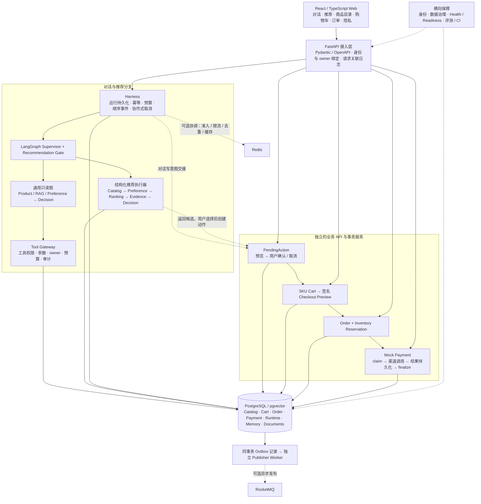
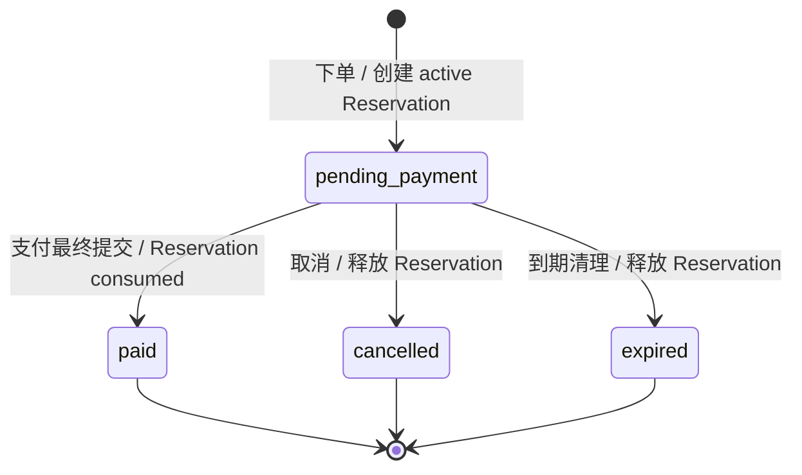
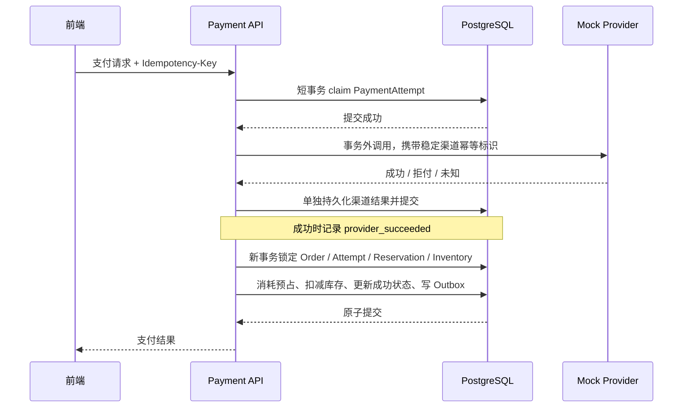
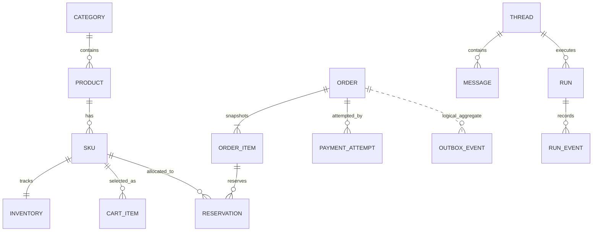

# ShopMind：架构、功能设计与简历选材（代码核对版）

> 如果你还不熟悉这个项目，请先阅读更通俗的 [项目介绍与面试讲解版](D:/python/retailpilot/docs/shopmind_project_plain_explanation.md)。本文适合在理解业务主线后继续核对实现细节。

> 核对日期：2026-09-14。阅读对象：准备把当前项目写进简历的开发者。  
> 本文依据当前工作区代码，而非只依据路线图；工作区含未提交实现，因此不把“代码已存在”写成“已正式发布”。保留原有 `resume_project_summary.md`，本文作为独立的深入梳理。  
> 建议阅读顺序：第 1～3 节了解全貌，第 4～8 节理解设计，第 10～12 节选择简历内容。

## 1. 这个项目到底是什么

**ShopMind 是面向中文消费电子选购的全栈购物决策系统：用 Agent 编排需求理解和只读查询，用结构化规则生成可解释的 SKU 推荐，再通过用户确认衔接购物车、订单、库存预占和模拟支付。**

仓库名是 RetailPilot，当前产品名是 ShopMind；历史 workshop 和 V1 单 Agent 代码仍保留，但不是当前产品的全部。简历项目名可以写为：

**ShopMind｜基于 LangGraph 的智能购物决策与交易系统**

可以把它理解为三个相互配合的系统：

| 部分 | 用户得到什么 | 主要工程问题 |
| --- | --- | --- |
| 购物决策 | 输入中文需求，得到明确型号、SKU、匹配理由、对比和证据 | 需求歧义、硬约束、偏好、多轮修改、检索失败 |
| Agent 运行平台 | 可观察、可限权、可恢复的执行过程 | 工具权限、预算、幂等、超时、协作、运行持久化 |
| 交易业务 | 确认加购、结算、下单、模拟支付和订单状态 | 价格可信、库存并发、重复提交、支付恢复、消息可靠交接 |

这里最适合展示的能力，是**如何把不确定的语言交互接到确定性的业务流程上**。目前没有真实支付、实际电商平台交易和线上用户规模证据。

## 2. 总体架构：一个模块化后端，两个主要执行分支

当前应称为“模块化单体后端 + 独立 Web 前端 + 可选后台 worker”。多个 Agent 主要运行在同一后端进程中，不能仅凭 Agent 数量就称为微服务或分布式 Agent 集群。

下图提供可直接查看的静态版本；其后的 Mermaid 可在支持 Mermaid 的 Markdown 预览器中编辑。


[查看可放大的 SVG 矢量原图](D:/python/retailpilot/docs/assets/shopmind_architecture_review.svg)。PNG 已通过本地浏览器渲染并检查排版。



读这张图时要注意：

- **不是所有 HTTP 请求都进入 Harness 或 LangGraph。** 商品目录、购物车、订单和支付有自己的 API、服务与事务边界。
- **不是所有推荐阶段都经由 Tool Gateway。** 通用 Agent 工具调用受 Gateway 控制；结构化推荐通过受信任的领域 provider 和确定性函数执行。
- **推荐的终点是候选与解释。** 用户选择和确认后，动作服务才执行加购；创建订单、支付也通过显式业务 API 发起。
- **PostgreSQL 保存业务事实。** SKU 表保存价格，Inventory 表保存库存；文档不能覆盖这两类真值。
- Redis、远程 HTTP Specialist、RocketMQ 是按配置启用的扩展，不是运行核心 Demo 的必要条件。

## 3. 用户能做什么

| 功能 | 当前设计 | 关键结果或失败语义 |
| --- | --- | --- |
| 中文需求推荐 | 提取预算、品类和属性；Schema 校验后筛选、排序 | 推荐、需要澄清、不支持品类、无匹配等结构化结果 |
| 多轮追问 | 在同 owner、同 thread 的购物状态上 patch、clear | 修改预算、保留未修改条件、排除候选；陈旧状态拒绝覆盖 |
| 商品与政策查询 | Catalog 查事实，RAG 查说明和政策 | 返回引用及证据状态，检索异常可降级 |
| 个性化 | 读取已确认的偏好作为软排序信号 | 当前轮明确条件优先；保存长期偏好需确认 |
| SKU 对比 | 输出规格字段、分项分数，前端提供对比抽屉 | 对比具体配置，而非仅对比模糊商品名称 |
| 商品浏览 | 品类页、商品详情、SKU 选择 | 浏览入口也经过 PendingAction 才新增购物车项 |
| 购物车管理 | owner 隔离；数量更新包含期望版本 | 陈旧修改返回冲突，更新时复核商品与库存 |
| 结算下单 | 预览价格，签名快照，下单时重新验证 | 价格或购物车变化后要求重新预览 |
| 库存和订单 | 预占、支付消耗、取消释放、过期释放 | 并发条件下保持库存与订单状态一致 |
| 模拟支付 | PaymentAttempt + Mock Provider + 本地最终提交 | 区分成功、拒付、处理中/未知及可恢复中间态 |
| 事件可靠交接 | 业务事务同步写 Outbox，worker 异步发布 | 重试、死信、人工 redrive；允许重复投递 |
| 隐私和运维 | Memory 更正/删除、owner 数据检查、运行检查、健康状态 | 精确归属查询，运维响应避免暴露请求正文 |

前端源码入口是 [router.tsx](D:/python/retailpilot/frontend/src/app/router.tsx)，包含 `/`、`/catalog`、`/checkout`、`/orders`、`/privacy`、`/runs`、`/status` 等路由；购物车等交互也通过抽屉/组件呈现。

## 4. 推荐系统如何设计

### 4.1 先判断请求，再选择执行路线

LangGraph 先经过 Supervisor 和 Recommendation Gate，区分通用只读查询、结构化推荐、澄清、不支持的品类和写意图。

通用读图中，Product Agent 负责商品读操作，RAG Agent 负责文档检索，Preference Agent 负责偏好读取，Decision Agent 负责结果汇总。Supervisor 和 Decision 没有业务写工具。

结构化推荐则走专门的五阶段任务链：


当前 `RecommendationTaskPlan/Result` 明确描述阶段、依赖、最大步骤、阶段事件和失败结果。执行器按照依赖顺序选择可执行步骤，当前默认五阶段串行。它与支持有界并行的通用只读 Agent 执行器是两套相关但不同的机制。

代码入口：[graph.py](D:/python/retailpilot/agents/shopmind_multi_agent/graph.py)、[recommendation_nodes.py](D:/python/retailpilot/agents/shopmind_multi_agent/recommendation_nodes.py)、[executor.py](D:/python/retailpilot/app/recommendation/executor.py)。

### 4.2 Category Schema：把品类差异放进数据定义

当前目录有 10 个品类定义：笔记本、手机、显示器、平板、相机、耳机、键盘、鼠标、路由器、音箱。**10 类表示已定义品类合同，不表示每一类都有同等丰富的真实商品和实测推荐质量。**

每个品类通过 JSON + Pydantic 模型定义属性类型、单位、枚举/范围、硬软约束角色、排序方向、权重、缺失值处理和展示字段。通用引擎读取定义进行处理，新增相似品类可以复用过滤、排序和展示逻辑。

例如“预算 6000 元，16GB 内存，重量不超过 1.5kg 的笔记本”会被拆成预算和品类属性，而不是作为一整段文本直接交给排序器。解析代码处理中文金额、`k`/`万`、GB/TB、分句内数值绑定及部分否定表达；不应据此宣称支持任意中文需求。

硬约束决定“能否进入候选”，软偏好决定“满足基本条件后更喜欢谁”。硬条件不匹配不能靠其他维度加分补偿。缺失值使用 Schema 中的显式语义。

代码入口：[品类模型](D:/python/retailpilot/app/recommendation/categories/models.py)、[品类注册表](D:/python/retailpilot/app/recommendation/categories/registry.py)、[需求解析](D:/python/retailpilot/app/recommendation/request.py)。

### 4.3 排序是可解释规则，不是模型随意打分

排序先检查库存可用性、预算和属性硬约束，再按属性定义生成归一化信号。当前核心思想可以简化为：

```text
候选总分 = round(100 × Σ(有效属性权重 × 匹配信号) / Σ有效属性权重)
```

匹配信号包含高值更优、低值更优、偏好匹配、缺失中性/惩罚等策略。返回 `ScoreBreakdownItem`，让前端展示各项分数及原因。之后按商品去重，最多保留 3 项 SKU 推荐，避免同一商品多个配置占满列表。

对需要文档支持的问题，后续证据阶段还可能按引用覆盖数量、原分数等稳定规则调整已有候选顺序；它不能引入 Catalog Top-K 之外的新 SKU。

设计价值是结果可复现、可解释、可做回归，不是已经训练了个性化学习排序模型。

代码入口：[ranking.py](D:/python/retailpilot/app/recommendation/ranking.py)、[service.py](D:/python/retailpilot/app/recommendation/service.py)。

### 4.4 多轮状态、长期偏好和 Context 是三件事

| 对象 | 保存什么 | 解决什么 |
| --- | --- | --- |
| `ShoppingSessionState` | 当前购物任务的品类、预算、属性、字段来源、候选和排除项 | 本轮修改什么、保留什么、清除什么 |
| 已确认 Preference / Memory | 跨轮可复用的偏好和显式记忆记录 | 后续请求读取用户已认可的信息 |
| `ContextSlice` | 为一次运行选出的消息、摘要、记忆和购物状态引用 | 限制上下文长度，保留来源和归属 |

多轮设计示例（用于说明状态语义，非本次实际模型对话记录）：

1. 用户提出“6000 元以内，16GB 内存的笔记本”，保存结构化条件与候选。
2. 下一轮“预算改成 7000”，只更新预算，保留品类和内存条件。
3. “不要第二个”，只有当前候选未过期且序号有效时，才解析成明确 SKU 排除项。
4. 显式清空条件时记录清空语义，避免从旧消息中重新补回。

持久化位于 conversation thread metadata，使用单调版本和数据库条件更新 CAS，拒绝旧请求静默覆盖新状态；保留最多 20 条不含原始对话正文的 patch 摘要。当前购物状态候选有效期为 30 分钟；历史 V3 `CandidateContext` 是另一套上下文，不能把它的 10 分钟 TTL 混用。

ContextManager 按归属、有效期、来源、优先级和粗略 token 估计选择上下文。当前没有自动长期记忆抽取或自动摘要压缩，也不应把字符数估算说成精确 tokenizer 计费。

代码入口：[session_state.py](D:/python/retailpilot/app/recommendation/session_state.py)、[状态持久化](D:/python/retailpilot/app/repositories/runtime_shopping_state.py)、[context.py](D:/python/retailpilot/app/runtime/context.py)。

### 4.5 RAG：先限定事实范围，再检索和融合

产品价格、SKU 身份、在售状态和库存来自结构化 Catalog；RAG 补充说明、规格语义和政策依据。

当前证据链路：

1. 保留原问题，并生成有界的产品/政策子问题，子问题上限参数为 3。
2. 产品文档检索绑定候选商品映射的白名单；政策单独检索并检查适用范围与版本元数据。
3. 使用 pgvector 向量召回与有界 BM25 风格词法召回。
4. 以稳定文档身份去重，用 RRF 按排名融合，避免直接相加不同量纲的相似度分数。
5. 可选词法或 CrossEncoder 语义重排；限制候选规模，重排失败时保留融合结果并记录降级。
6. 输出可用性状态、候选引用和查询相关的短摘录。

预算首先约束一次 provider 检索中的通道调用。对需要文档的问题，节点在 `unknown/degraded` 时还可能进行一次有界业务复查，因此不宜把单次检索预算直接称为整次请求的固定总调用上限。

对于需要文档支持的请求，如果最终为 `unknown/unavailable`，当前节点会返回澄清并清空推荐；纯目录条件推荐可在检索失败时保留 Catalog 结果并标记证据状态。

**实现边界：** 当前有来源、候选范围、政策元数据和整体证据状态校验，但不能宣称已完成对每个自然语言事实的语义蕴含验证。引用数量也不等于事实正确率。检索质量收益需要真实数据和人工标注。

代码入口：[rag.py](D:/python/retailpilot/app/recommendation/rag.py)、[documents.py](D:/python/retailpilot/app/repositories/documents.py)。

## 5. Agent 工程部分：如何限制、观察和恢复运行

### 5.1 Harness 管统一生命周期

`ShopMindRuntimeHarness` 将 Chat 和确认操作映射为 `RunRequest → RunContext → RunResult`，统一处理运行标识、持久化、事件顺序、上下文、幂等和控制检查。

`Idempotency-Key` 按 owner 和操作作用域绑定请求。同 key 同输入可以读取已持久化结果；同 key 不同输入、仍在执行的 key 等情况会被拒绝。完成结果重放避免再次调用工具或追加消息。

运行预算包括时间、步骤、工具调用、提示上下文等合同与检查；使用量也有 token/cost 等字段。部分限制依赖调用前后检查和 provider 返回值，不能说成能够硬中断所有外部调用或精确限制实际账单。

### 5.2 SSE 展示的是生命周期事件

`POST /api/chat/stream` 与 JSON Chat 共用运行语义，传输有序事件及最终 `run.result`。前端使用 `fetch + ReadableStream` 处理 POST SSE，并处理顺序、重复事件、终止和重试。

当前不是逐 token 的模型原生输出。队列有容量限制，准入受限；取消与超时主要发生在协作检查边界，已经运行的同步工具无法保证立即停止。

### 5.3 协作是有边界的计划执行

通用读图提供确定性 Planner，可显式启用 LLM Planner 并对照 canonical plan 校验。独立任务可以按配置有界并行；执行期间隔离各分支状态，再归并结构化结果，共享调用和使用量预算。

Specialist 重试针对特定超时/不可用错误，默认单次尝试，最大次数受服务端限制。不可将有依赖的结构化五阶段推荐画成“5 个 Agent 同时调用模型”。

本地和可选 HTTP RAG Specialist 使用 typed adapter 合同；远程地址及 allowlist 由服务端掌握。它体现的是传输抽象和等价性验证，不是默认远程 A2A 部署。

### 5.4 Tool Gateway 和 HITL 各负责一道边界

Gateway 检查工具能力白名单、结构化参数、owner/thread、敏感操作授权、输出与调用预算，并记录成功或失败调用。HITL 再约束具体副作用：把“建议执行”保存为 PendingAction，经过用户明确确认才写入。

这属于应用层权限与资源策略，不是 OS 沙箱、容器隔离或数据库账号级隔离。

代码入口：[harness.py](D:/python/retailpilot/app/runtime/harness.py)、[tool_gateway.py](D:/python/retailpilot/app/runtime/tool_gateway.py)、[plan_executor.py](D:/python/retailpilot/app/runtime/plan_executor.py)、[streaming.py](D:/python/retailpilot/app/runtime/streaming.py)。

## 6. 从推荐到交易：每一步如何确保一致性

### 6.1 PendingAction：选择商品不等于已经加购

推荐加购使用 source run、owner/thread 与选中 SKU 进行归属及候选校验；目录浏览也有专用的动作准备入口。动作保存预览、数量、版本/类型和过期时间等信息，确认时再次校验当前业务条件。

当前同时保留历史 `/api/chat/confirm` 和 `/api/pending-actions/.../confirm`。不能沿用旧文档，把 `/api/chat/confirm` 说成整个现版本唯一的购物车写接口：当前还有用户直接发起的改数量、删除和清空 API。

正确描述是：**读 Agent 没有购物车写权限；Agent 提出的新增加购动作必须确认，用户直接管理购物车则走受身份约束的业务接口。**

动作合同还支持保存偏好、指定字段编辑、取消、过期处理和已持久化结果重放。并非任意工具都能自动转换成动作，动作类型和可编辑字段需要显式注册/定义。

代码入口：[pending_actions.py](D:/python/retailpilot/app/services/pending_actions.py)、[动作路由](D:/python/retailpilot/app/api/routes/pending_actions.py)、[Cart 路由](D:/python/retailpilot/app/api/routes/cart.py)。

### 6.2 Checkout：前端金额只能展示，服务端负责确认事实

结算预览读取购物车与目录，检查库存、上下架、币种等，并签发含 owner、购物车项/数量/版本指纹、价格行和到期时间的 token。预览不创建订单，也不预占库存。

下单时服务端验证签名和归属，再对照当前购物车、SKU 价格与库存。由此处理“用户打开结算页后，数量或价格发生变化”的情况。金额采用 Decimal 处理。

代码入口：[checkout.py](D:/python/retailpilot/app/services/checkout.py)、[tokens.py](D:/python/retailpilot/app/checkout/tokens.py)。

### 6.3 订单与库存：预占和实际扣减分开

```text
可售数量 available = on_hand_quantity - reserved_quantity

下单成功：reserved += quantity；on_hand 不变
支付完成：reserved -= quantity；on_hand -= quantity
取消/过期：reserved -= quantity；on_hand 不变
```

创建订单按稳定 SKU 顺序锁定关联事实，并使用条件更新验证剩余库存。订单、明细、Reservation 与 Outbox 在同一事务内产生；任一 SKU 失败，整单回滚。数据库约束与业务检查共同维护库存合法性。

OrderItem 保存名称、SKU 编码、单价和币种快照，避免后续商品改价改变历史订单。订单幂等结合 owner、key 和请求 hash：同请求返回同订单，冲突复用 key 则报错。

取消与过期释放预占库存。过期清理通过 `FOR UPDATE SKIP LOCKED` 分批处理锁定的订单，使多个 worker 可以协作，而非全部争抢同一批记录。



状态图只描述 Order；PaymentAttempt 有独立的处理中、渠道成功、最终成功等状态，不能混为一个字段。

代码入口：[orders.py](D:/python/retailpilot/app/services/orders.py)、[order_expiration.py](D:/python/retailpilot/app/services/order_expiration.py)、[订单数据模型](D:/python/retailpilot/app/orders/models.py)。

### 6.4 支付：处理“渠道已成功，本地还没提交”

这是交易部分最值得讲清楚的亮点之一。



这样设计的原因：

- 渠道调用期间不占着业务行锁等待网络，缩短事务持锁时间。
- `provider_succeeded` 是已提交的恢复点。若本地 finalization 失败，重试可继续完成本地事务，而不是再次发起扣款。
- 未知结果有独立状态和查询/重试语义，不能简单当成失败后创建另一笔支付。
- 支付 claim 和订单取消以订单锁协调。有效支付先占用订单时，取消返回 `payment_in_progress`；取消先提交则后续支付不能继续调用渠道。

目前 Provider 是 Mock，实现用于演示支付协议和故障恢复。它不是接入支付宝/微信支付后的真实资金系统，也不包含退款、webhook 或自动对账系统。

代码入口：[payments.py](D:/python/retailpilot/app/services/payments.py)、[支付 API 事务划分](D:/python/retailpilot/app/api/routes/payments.py)。

### 6.5 Outbox：让业务提交和消息发布之间可恢复

订单创建、取消、过期、支付成功时，把业务变更与待发事件写进同一 PostgreSQL 事务。独立 Publisher 先在短事务内领取事件并提交，再到事务外发 MQ，最后用租约 owner 做条件更新确认成功。

| 故障 | 当前处理机制 |
| --- | --- |
| 业务事务失败 | 业务事实和 Outbox 一起回滚 |
| 数据库已提交，MQ 不可用 | 事件留在 Outbox，退避重试 |
| worker 领取后崩溃 | 租约过期后可重新领取 |
| 消息已发出，标记成功前崩溃 | 可能重复发送相同 event ID |
| 旧 worker 恢复后写回 | lease owner 条件更新阻止覆盖新领取者 |
| 达到尝试上限 | 进入 dead-letter，支持显式 redrive |
| 同一订单有多个事件 | aggregate sequence 限制领取顺序，前序未处理会阻塞后序 |

交付语义是 **at-least-once（至少一次，可能重复）**。当前没有 Consumer、Inbox 或消费端去重，因此不能宣称端到端 exactly-once 或完整消息消费闭环。独立 worker 的职责划分也不代表单个 worker 内已经并行发送全部消息。

代码入口：[repository.py](D:/python/retailpilot/app/outbox/repository.py)、[publisher.py](D:/python/retailpilot/app/outbox/publisher.py)、[RocketMQ 适配](D:/python/retailpilot/app/integrations/rocketmq.py)。

## 7. 数据模型为什么要这样分



这是核心概念关系图，不是完整数据库 DDL；Outbox 的 aggregate 关联是逻辑关系，不表示数据库外键。

Product 表示商品系列，SKU 表示可购买的配置，Inventory 表示 SKU 库存。购物车和订单落实到 SKU，解决“推荐的是某款电脑，但买的是哪种内存/硬盘配置”的问题。

会话、消息、Run 和事件属于运行记录；Memory/Preference 属于可复用用户信息；文档及向量属于证据；治理审计单独保存指纹和受限元数据。业务事务、Agent 状态和审计并不等于同一张万能 JSON 表。

仓库同时保留旧 `products/orders/cart_items` 等表与新 `shopmind_*` 领域表。阅读代码、讲数据库设计时，应以当前 Catalog/SKU/Order 服务使用的模型为准，不能将历史种子订单算作新交易系统真实业务量。

数据入口：[Catalog 模型](D:/python/retailpilot/app/catalog/models.py)、[Runtime 与兼容模型](D:/python/retailpilot/app/db/models.py)、[订单模型](D:/python/retailpilot/app/orders/models.py)、[支付模型](D:/python/retailpilot/app/payments/models.py)。

## 8. 前端、身份和可运维性如何配合

前端使用 React 19、TypeScript、Vite、React Router、TanStack Query，表单相关依赖包含 React Hook Form/Zod。OpenAPI 生成 TypeScript 类型，减小前后端字段漂移；Vitest 和 Playwright 分别覆盖组件/API 状态与浏览器流程。

订单、支付等不确定响应的恢复保留原请求和幂等 key，让用户可以安全重试。对于购买流程，这比单纯显示“网络错误，请重试”更关键。

身份由服务端配置选择：开发兼容模式、trusted header、或带时间戳/nonce/HMAC 的 signed header。签名模式使用 local/Redis claim 防重放；生产使用仍依赖可信 ingress，不能把开发时传入 user ID 的模式称为完整登录系统。

owner-data API 提供本人数据盘点、Memory 更正/删除、显式确认删除。完整删除有明确数据边界，不包括共享 Catalog、文档和历史种子数据；指纹审计有独立保留规则。Run 检查返回受限运行元数据和事件摘要，不开放完整请求/工具 payload。

运行治理提供请求 Correlation ID、受限字段 JSON 日志、静态配置预检、实时依赖就绪检查、审计健康、服务成功率/p95 和 Outbox 状态。指标主要是单进程窗口，不能称为已部署的 Prometheus/Grafana 集群监控或已有生产 SLA。

可选 Redis 使用原子操作协调准入租约、限流、去重和 TTL 缓存；它不承担本项目交易库存的最终状态。Core Demo 不要求 MQ 或 LangSmith，普通测试关闭云追踪。

## 9. 验证证据：可以说到什么程度

### 9.1 本次实际执行

为核对近期结构化推荐和状态能力，关闭 LangSmith 后执行：

```powershell
$env:LANGSMITH_TRACING = 'false'
conda run -n pythonLearn D:\DL\Anaconda3\envs\pythonLearn\python.exe -m pytest tests/recommendation tests/repositories/test_runtime_shopping_state.py tests/evaluation/test_simulated_eval.py tests/evaluation/test_ablation_eval.py -q
```

结果为 **70 passed，3 warnings，12.73s**。警告涉及依赖弃用、测试中的 Decimal 序列化和 pytest 缓存目录写入；无断言失败。本次没有重跑全量回归、真实 PostgreSQL/Redis 集成、浏览器或真实模型评测，因此不把下表当成本次执行结果。

### 9.2 仓库已有验收记录

| 证据 | 当前文档记录 | 简历使用方式 |
| --- | --- | --- |
| 后端目录回归 | `AGENTS.md` 和改进评审记载 896 passed / 63 skipped；`project_status.md` 局部仍写 892 | 存在口径差异，最终投递以固定提交最新 CI 为准 |
| 前端 | 改进评审记载 135 单测、mocked Playwright 35/35、live 2/2 | 可描述分层测试；live 是两条本地场景，不是所有功能穷尽覆盖 |
| V6 catalog | 历史验收 8 suites、61 cases、488 suite checks、48 baseline checks | 是确定性运行工程评测，不是推荐正确率 |
| PostgreSQL/Redis | 文档记录 PostgreSQL 23/23、组合 25/25 等不同阶段批次 | 不能相加为独立用例数量，也不能替代新交易阶段结果 |
| 新交易测试 | 源码包含末库存竞争、同 key 并发、AB/BA 多 SKU 锁序、支付/取消竞态、Outbox 崩溃窗口 | 强调验证场景比罗列历史总数更有说服力 |

记录来源：[AGENTS.md](D:/python/retailpilot/AGENTS.md)、[改进评审](D:/python/retailpilot/docs/autumn_recruitment_improvement_review.md)、[project_status.md](D:/python/retailpilot/docs/project_status.md)。

### 9.3 推荐质量与“消融”需要特别区分

项目有 20 条合成需求案例、12 条合成检索案例，以及检索/推荐指标计算、真实检索捕获入口。它们能证明合同和回归检查存在。

但本次查看 `run_ablation_eval.py` 发现：脚本将同一次合成质量/检索结果复用到多个 variant，`cost_multiplier` 也是预设常量；它没有分别执行四种真实架构或重排方案。因此当前最多称为**合成报告框架**，不能称为已经完成有效的四路实测消融，更不能据此声称降低成本或提升召回率。

语义 CrossEncoder 已有实现入口，也不等于已证明优于 RRF。若后续希望写“Recall@K 提升 X%”，需要固定数据集与人工相关性标注，分别真实运行基线和实验配置，保留原始检索结果、版本、延迟和样本数。

代码入口：[合成评测](D:/python/retailpilot/evaluation/run_simulated_eval.py)、[消融报告脚本](D:/python/retailpilot/evaluation/run_ablation_eval.py)、[真实检索捕获入口](D:/python/retailpilot/evaluation/run_retrieval_capture.py)。

## 10. 哪些亮点最值得写进简历

| 优先级 | 推荐强调 | 为什么值得写 | 面试时要讲出的细节 |
| --- | --- | --- | --- |
| 1 | Schema 驱动的可解释购物推荐 | 有具体领域约束，避免只写“接入 LLM” | 硬软约束、缺失值、排序分解、SKU 真值 |
| 2 | 安全 Agent Runtime 与 HITL | 展示权限与副作用边界 | Gateway 与动作服务区别、幂等重放、确认前后验证 |
| 3 | 混合 RAG 与证据降级 | 展示检索如何参与业务决策 | Top-K 白名单、RRF、政策适用性、unknown/unavailable |
| 4 | 交易一致性与支付恢复 | 后端深度最明确 | 预占/消耗、锁序、支付中间态、支付取消竞态 |
| 5 | Outbox 与真实状态验证 | 展示失败窗口与可靠交付意识 | claim/lease/CAS、重复发送、死信、集成测试 |

多轮状态 CAS 也是很好的亮点，可并入第 1 点；统一 Harness、SSE 和预算可并入第 2 点。前端全流程作为项目完整性补充，若投全栈岗位再单列。

## 11. 简历候选文案：先给 5 点，再决定保留哪些

下列是选材稿，还不是必须原样粘贴的最终版。“设计并实现”等个人贡献表述，应与本人实际承担工作一致。暂不加入未经实测的收益百分比。

**项目简介：** 面向中文消费电子选购的全栈购物决策系统，通过 LangGraph 编排只读 Agent 与结构化推荐，支持多轮需求修改、证据解释、人工确认加购，以及订单、库存预占和模拟支付流程。

**核心技术：** Python、FastAPI、LangGraph、Pydantic、SQLAlchemy、PostgreSQL/pgvector、React/TypeScript。扩展能力包含 Redis 协调和 RocketMQ Publisher。

1. **结构化推荐与多轮状态：** 基于 LangGraph 和品类 Schema 构建 SKU 推荐链路，覆盖 10 类消费电子定义，结合硬约束过滤、软偏好加权和分项解释；以 owner/thread 隔离、版本 CAS 和候选过期支持多轮预算修改与候选排除。
2. **混合检索与证据控制：** 融合 pgvector 与词法召回并通过 RRF 排序，将产品证据限定于 Catalog 候选范围，结合政策适用性/版本过滤及可用性状态，支持检索降级和证据不足时的澄清。
3. **Agent 运行与安全写入：** 通过统一 Harness 管理运行持久化、幂等重放、预算和 SSE 事件，以 Tool Gateway 约束读 Agent 权限，通过 PendingAction/HITL 显式确认加购及偏好写入。
4. **交易一致性与支付恢复：** 实现签名结算快照、订单幂等和库存预占，利用 PostgreSQL 行锁、稳定锁序与条件更新处理并发库存竞争；通过 Mock Payment 的持久化 `provider_succeeded` 中间态恢复本地提交失败。
5. **可靠事件交接与验证：** 实现同事务 Outbox 和可选 RocketMQ Publisher，通过租约、CAS、退避重试、死信及 redrive 处理发布故障；建立 PostgreSQL 并发/回滚测试和前端浏览器验收，覆盖支付取消竞态与发布崩溃窗口。

如果只写 4 点，建议把“安全写入”并入第 1 点，保留“推荐、多轮”“RAG”“交易恢复”“Outbox/验证”四个主题。偏 Agent 岗时则保留 Runtime 独立一条，将交易与 Outbox 合并；偏后端岗时重点展开第 4、5 点。

不建议把 5 条都写成技术名词串。每条尽量保留一个明确问题、两三个关键机制和一个可验证结果；具体量化数据可在固定最终提交后再补。

## 12. 面试讲解顺序与表述边界

### 可以按这条线讲 2～3 分钟

“用户输入预算和需求后，系统先将其转成有类型的品类约束，读取真实 SKU 数据做硬过滤和确定性排序，再检索候选对应的说明与政策，返回带理由和引用的推荐。多轮对话维护版本化购物状态。读 Agent 不能直接改购物车，用户确认 PendingAction 后才加购。结算时用签名快照验证价格与购物车，订单通过 PostgreSQL 行锁和库存预占处理并发。模拟支付把渠道调用放在事务外，用渠道成功中间态支持恢复；订单与支付事件同事务写入 Outbox，再由 worker 可靠发布。”

### 容易被追问的 6 个问题

| 问题 | 回答主线 |
| --- | --- |
| 为什么用多个 Agent？ | 隔离读职责、权限、输入输出与观测；只有独立任务才适合并行。当前尚无实测证明多 Agent 必然优于单 Agent |
| 模型在哪里发挥作用？ | 支持模型/结构化适配路径，但默认路由及关键业务规则可确定性执行；不能把所有节点都称为独立 LLM 推理 |
| 为什么 SQL 和 RAG 都要有？ | SQL/Catalog 管可验证的价格、库存、身份和属性，RAG 管非结构化说明与政策；两者职责不同 |
| 如何防重复加购/下单/支付？ | 动作状态与结果重放、owner 作用域幂等 key、请求 hash、数据库约束、订单锁和稳定渠道标识共同约束 |
| MQ 发成功后进程崩了怎么办？ | 租约过期后可能重发相同事件，这是至少一次；当前消费端去重尚未实现 |
| 项目效果如何证明？ | 展示当前可复现的合同、并发、回滚和浏览器证据；推荐质量/成本收益需要另外补真实对照实验 |

### 这些写法需要避免

| 容易夸大的说法 | 与当前代码更一致的说法 |
| --- | --- |
| 全自主多 Agent 自动购买 | 只读 Agent 推荐 + 用户确认 + 独立交易 API |
| 已上线分布式微服务 Agent 平台 | 模块化单体，默认进程内协作，提供可选远程适配与 Redis 协调 |
| 流式 token 输出、即时硬中断 | 有序 SSE 生命周期事件、最终结果与协作式取消 |
| LLM 自学习推荐、自动长期记忆 | Schema 驱动规则排序、显式偏好和有界记忆上下文 |
| 证据门控消除幻觉 | 限制证据范围并暴露不确定性，尚无全面事实蕴含保证 |
| 四路消融证明成本下降/效果提升 | 已有合成报告框架，真实对照实测待补 |
| 接入真实支付、端到端 exactly-once | Mock Payment 恢复协议、Outbox 至少一次发布 |
| 高并发生产系统、百万用户、99.99% SLA | 已有并发测试与生产参考治理能力，尚无对应线上规模证明 |

本文只新增分析文档和架构图；不修改业务实现，不替代现有架构/状态文档，也不更新发布状态。
