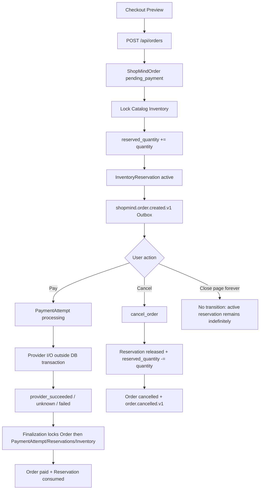
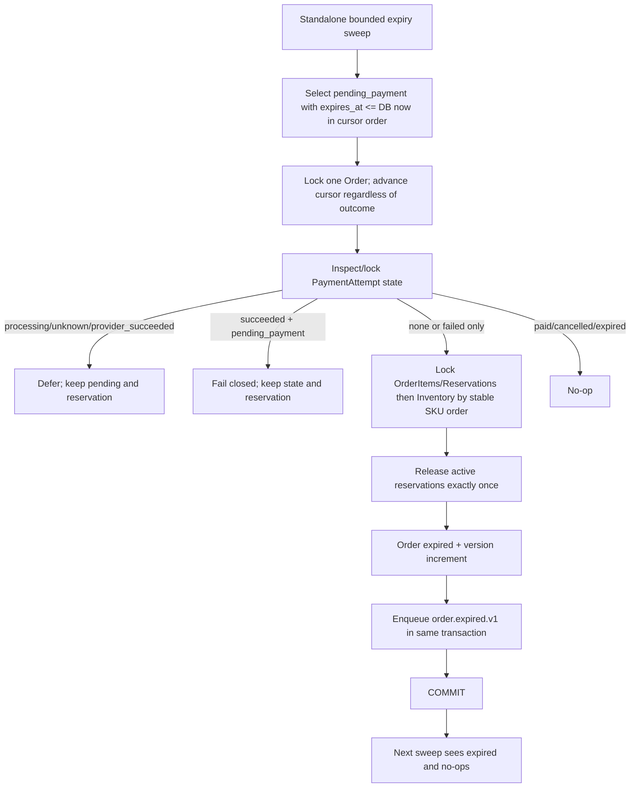

## Context

See `proposal.md` for motivation. This design is based on the current brownfield implementation, not the older documentation.

Current facts:

- `ShopMindOrder` has status CHECK `pending_payment/cancelled/paid`, a version, idempotency key/hash, created/updated timestamps, but no deadline (`app/orders/models.py:17-48`). Public `OrderStatus` has the same three values (`app/schemas/orders.py:14-46`).
- Create Order first persists a pending-payment candidate, then locks Catalog SKU/Product/Inventory and the user's canonical Cart, increments `reserved_quantity`, inserts one `ShopMindInventoryReservation` per OrderItem, deletes the Cart rows, and enqueues `shopmind.order.created.v1` before the caller commits (`app/services/orders.py:156-330`).
- Cancel locks the Order, rejects `paid`, checks payment attempts before release, locks OrderItems/Reservations and Inventories in stable SKU order, decrements `reserved_quantity`, marks Reservations released, moves the Order to `cancelled`, and enqueues `shopmind.order.cancelled.v1` (`app/services/orders.py:371-428`). The V3 contract extends this check to the complete PaymentAttempt history, including inconsistent `succeeded` attempts; there is no parallel expiry path yet.
- Inventory constraints already enforce non-negative on-hand/reserved quantities and `reserved_quantity <= on_hand_quantity` (`app/catalog/models.py:109-123`). Reservation constraints already distinguish `active`, `released`, and `consumed` (`app/orders/models.py:85-111`).
- Payment attempts are `processing`, `unknown`, `provider_succeeded`, `failed`, or `succeeded`; the active unique index covers the first three (`app/payments/models.py:17-86`). A payment claim locks the Order before creating `processing`, commits before provider I/O, and finalization locks Order then PaymentAttempt, Reservations, and Inventories (`app/services/payments.py:124-209,282-368`).
- Outbox events are immutable versioned envelopes with aggregate sequencing (`app/outbox/contracts.py:16-39`) and are enqueued by the Order/Payment service in the same caller transaction (`app/outbox/repository.py:194-210`). The standalone publisher claims with `FOR UPDATE SKIP LOCKED` and leases (`app/outbox/repository.py:265-315`, `app/outbox/publisher.py:25-93`).
- No Order expiry worker or FastAPI background loop exists. The existing standalone worker pattern is `scripts/run_outbox_publisher.py:14-25`.

## Current-state flow



## Target-state flow



## Goals / Non-Goals

**Goals:**

- Persist a stable deadline at Order creation and make it part of the public Order fact.
- Add one shared reservation-release helper used by cancel and expiration without rewriting the Order service wholesale.
- Make expiration payment-safe, lock-order-safe, idempotent, bounded, and transactionally coupled to inventory and Outbox.
- Keep current Checkout, canonical Cart, mock Payment, Outbox publisher, identity, and Agent boundaries intact.
- Make existing pending rows and existing API data deterministic through a non-destructive migration.

**Non-Goals:**

- Real payment provider/webhook/reconciliation platform, processing timeout recovery, refund/chargeback, fulfillment/shipping/tax/coupon, distributed scheduler platform, Kubernetes manifests, metrics backend, Redis/RocketMQ Consumer/Inbox, or frontend redesign.
- No reservation changes during Checkout Preview; only Order creation reserves inventory.
- No automatic migration of historical Cart or PendingAction data.

## Decisions

### 1. Persisted deadline and state machine

Add nullable `expires_at` to `ShopMindOrder` for the migration phase, but every newly created `pending_payment` Order SHALL receive a non-null UTC, timezone-aware deadline computed once as `created_at + Settings.shopmind_order_payment_ttl_seconds`. Use a documented default of 1,800 seconds (30 minutes) with bounded Settings validation; the persisted value, not current configuration, is authoritative for an existing Order. After the migration backfill, the database SHALL enforce that `pending_payment` and `expired` rows have non-null `expires_at`; `paid` and `cancelled` rows may retain null.

Extend the database CHECK and Python/public literals with `expired`. The long-term state machine is:

```text
pending_payment → paid
pending_payment → cancelled
pending_payment → expired
```

No transition from `paid` or `cancelled` to `expired` is allowed. An already `expired` Order is terminal and sweep is a no-op.

Idempotent create replay returns the existing Order including its original `expires_at`; it never recomputes or extends the deadline. This preserves the existing request-hash/idempotency behavior at `app/services/orders.py:127-137`.

The exact deadline predicate is `now >= expires_at`. A payment operation that creates a new attempt is allowed only while `now < expires_at`; equality is already expired. The expiration candidate query uses the equivalent `expires_at <= now` predicate.

### 2. Payment/expiry eligibility matrix

The expiration service SHALL use the following explicit matrix after locking the Order and its PaymentAttempt state:

| Order status | PaymentAttempt status | Deadline reached | Expiry action | Reason |
|---|---|---:|---|---|
| `pending_payment` | none | yes | expire and release | No payment operation exists |
| `pending_payment` | `failed` only | yes | expire and release | All attempts are terminal failed |
| `pending_payment` | `processing` | yes | defer | Provider operation may still settle |
| `pending_payment` | `unknown` | yes | defer | Provider outcome is uncertain; releasing could strand a charge |
| `pending_payment` | `provider_succeeded` | yes | defer | Provider accepted payment; finalization must consume reservation first |
| `pending_payment` | `succeeded` | yes | fail closed | Inconsistent local state; do not release, mark paid, or auto-repair |
| `pending_payment` | none/failed | no | no-op | Deadline not reached |
| `paid` | any | any | no-op | Terminal paid state |
| `cancelled` | any | any | no-op | Terminal cancelled state |
| `expired` | any | any | no-op | Already terminal and idempotent |

Cancel and expiry use one explicit terminal-transition payment matrix; the exact public error name is selected from existing typed error conventions, but the inconsistent `succeeded` state must remain machine-readable:

| Order status | Payment history | Cancel | Expire after deadline |
|---|---|---|---|
| `pending_payment` | none | allow | allow |
| `pending_payment` | failed only | allow | allow |
| `pending_payment` | processing present | block/defer; no release | defer; no release |
| `pending_payment` | unknown present | block/defer; no release | defer; no release |
| `pending_payment` | provider_succeeded present | block/defer; no release | defer; no release |
| `pending_payment` | succeeded present | fail closed; no release | fail closed; no release |
| `paid` | any | terminal/no release | no-op |
| `cancelled` | any | idempotent/terminal | no-op |
| `expired` | any | terminal/no release | no-op |

For `pending_payment`, Cancel and Expiry SHALL inspect/lock the relevant PaymentAttempt history before any Reservation or Inventory lock used for release. `succeeded` plus `pending_payment` is not converted to `paid`, reconciled, refunded, or otherwise repaired by either path.

Payment claim must first resolve the existing idempotency key and return/reconcile an existing attempt according to the current payment contract. Only for a genuinely new key does it lock the Order and enforce `now < expires_at` before creating `processing` or invoking Provider I/O. Thus `now == expires_at` rejects a new claim, while an existing same-key replay/recovery/finalization path remains available after the deadline. A claim that commits `processing` before the deadline remains protected: the expiry sweep sees the active attempt and defers. `provider_succeeded` likewise defers until existing finalization locks the Order and completes `paid`/consumed reservation. A `succeeded` attempt while the Order is still `pending_payment` is inconsistent: the sweep emits bounded structured diagnostics and leaves Order, reservations, and payment facts unchanged; it does not mark the Order paid or invent a repair. Recovery of permanently stuck `processing`/`unknown` is future work, not an unsafe expiry shortcut.

### 3. Shared reservation release helper

Extract the minimum helper from `cancel_order`, conceptually `release_active_reservations(session, order_id, ...)`, which receives already-owned locks and:

The helper SHALL NOT decide PaymentAttempt eligibility and SHALL NOT inspect payment history as a hidden side effect. Its callers own the payment-safety gate. The required conceptual order for both Cancel and Expiry is:

```text
lock Order
→ inspect/lock relevant PaymentAttempts
→ determine terminal-transition eligibility
→ only if eligible: lock Reservations/OrderItems
→ lock Inventory in stable SKU order
→ release_active_reservations(...)
→ set cancelled or expired
→ enqueue the corresponding Outbox event
```

The helper then:

1. Loads OrderItems and their unique Reservations in deterministic `(sku_id, item_id)` order.
2. Requires every reservation to match the OrderItem and be `active`.
3. Locks CatalogInventory rows in sorted `sku_id` order.
4. Performs conditional `reserved_quantity >= reservation.quantity` updates, increments inventory version, and marks each Reservation `released` with UTC `released_at`.

The helper SHALL not mutate Order status or enqueue an event; cancel sets `cancelled`/`order.cancelled.v1`, while expiry sets `expired`/`order.expired.v1`. The helper is idempotent by caller state: a second expiry sees `expired` and returns before release; a partially inconsistent pending Order fails and rolls back rather than decrementing twice.

### 4. Lock ordering and race safety

The current and proposed lock order is:

| Path | Lock order | Assessment |
|---|---|---|
| Create Order | Catalog SKU → Catalog Product → Inventory → user Cart; then inserts Reservation | Existing order creation path; expiry does not acquire these locks before Order transition |
| Cancel | Order → complete PaymentAttempt history/eligibility gate → OrderItems/Reservations → Inventory sorted by SKU | Existing Order-first protection; V3 extends the gate to `succeeded` before any release |
| Payment claim | owner Order → existing PaymentAttempt key/active attempt | Existing `claim_payment_attempt` order; provider I/O occurs after commit |
| Payment finalization | Order → PaymentAttempt → OrderItems/Reservations → Inventory sorted by SKU | Existing `finalize_payment` order |
| Expiry | Order → complete PaymentAttempt history/eligibility gate → OrderItems/Reservations → Inventory sorted by SKU | Aligns with cancel/finalization and serializes terminal decisions |

The sweep selects candidates using `status = pending_payment AND expires_at <= now`, ordered by `(expires_at, id)`, with `FOR UPDATE SKIP LOCKED` where supported. A sweep invocation owns a seek cursor `(last_expires_at, last_order_id)` and advances it past every selected candidate before committing that candidate's short transaction, regardless of whether the result is expired, deferred, inconsistent, or failed. This guarantees each distinct Order is attempted at most once in one invocation; a later invocation can retry deferred or failed Orders. Candidate selection is only a bounded first layer: after the Order lock is acquired, the worker re-checks status/deadline and inspects/locks the complete PaymentAttempt history before deciding whether release is eligible. Two workers therefore cannot process the same Order concurrently. Payment finalization, Cancel, and Expiry all serialize on the Order: whichever obtains the Order lock first makes the state decision; the second re-checks status and payment state. If finalization has already consumed the reservation and set `paid`, later Cancel/Expiry observe `paid` and perform no release. If Cancel or Expiry obtains the lock first, it must pass the complete payment-safety gate before invoking the release helper; a `provider_succeeded` or `succeeded` state therefore cannot be followed by release through a normal race path. The second actor either observes a terminal state, defers, or receives a typed non-payable/non-cancellable result.

### 5. Worker model and bounded work

Recommend an independent optional CLI/worker, not a FastAPI lifespan loop:

- a reusable `expire_orders_once(session_factory, settings, now=...)` service performs at most `batch_size` Order attempts;
- a one-shot `scripts/expire_orders.py` can be run by an external scheduler, and an optional `scripts/run_order_expiry_worker.py` can poll at a bounded interval using the existing standalone worker convention;
- each Order transition is its own short transaction, so one malformed/inconsistent Order rolls back without permanently blocking later Orders; the current invocation records the failure and advances rather than selecting it again;
- selection orders by `(expires_at, id)` and uses `FOR UPDATE SKIP LOCKED` on PostgreSQL. SQLite/local tests use the same service with an injected clock and cannot prove row-lock races;
- candidate, attempted, expired, deferred-payment, inconsistent, and failed counts are returned/logged as a bounded summary without Order-item details, PII, or unbounded exception text;
- the worker does not start automatically with FastAPI and does not require Redis/RocketMQ.

If an Order is deferred due to active/uncertain payment, log only a bounded code such as `order_expiration_deferred_payment_active`; an inconsistent `succeeded` attempt uses a distinct bounded code such as `order_expiration_inconsistent_succeeded_attempt`. No new Order status is introduced. The next sweep may revisit either state, but neither is retried within the same sweep invocation.

### 6. Outbox contract and transaction boundary

Add `shopmind.order.expired.v1` to `app/outbox/contracts.py` with the existing `OutboxEventEnvelope` and aggregate sequencing. Its bounded payload contains `order_id`, `status: expired`, `expired_at`, and a reason such as `payment_deadline`; it does not include provider secrets or unnecessary PII/item payloads.

The expiry transaction is:

```text
lock Order/payment/reservations/inventory
→ release active reservations
→ Order.status = expired, version += 1
→ enqueue order.expired.v1
→ COMMIT
```

Crash before commit rolls back all facts and the event. Crash after commit leaves an expired Order, released reservations, and a pending Outbox row; the next sweep no-ops and the existing standalone publisher delivers/retries the event. The unique `(aggregate_type, aggregate_id, aggregate_sequence)` Outbox constraint and terminal Order state prevent a second business transition/event. Event publication is intentionally outside the business transaction, as in the existing Outbox design.

### 7. Migration and existing pending Orders

Add a linear migration after `0014_shopmind_outbox_events` (expected `0015_shopmind_order_expiration`) that:

1. Adds nullable `expires_at`.
2. Extends the Order status CHECK to include `expired`.
3. Backfills existing `pending_payment` rows deterministically as `created_at + 1800 seconds`, using the documented default rather than reading mutable process environment during migration.
4. Leaves `paid`/`cancelled` rows terminal; their `expires_at` may remain null.
5. Adds a database CHECK equivalent to `(status IN ('paid', 'cancelled') OR expires_at IS NOT NULL)` after backfill, so `pending_payment` and `expired` rows cannot persist without a deadline.
6. Adds a bounded query index such as `(status, expires_at, id)` for the sweep.

The migration is non-destructive. It must backfill before adding the non-null-by-status CHECK. New application code treats a pending row with null deadline as a migration/data-integrity error, never as an indefinitely eligible row. Integration migration tests must prove upgrade from a pre-expiration schema, pending-row backfill, terminal-row preservation, CHECK behavior for both `pending_payment` and `expired`, and index existence.

### 8. API/frontend compatibility

Extend `OrderStatus` and `OrderView` with `expired` and `expires_at: datetime | None`. Add typed `order_expired` to the payment/order error contract where needed. Payment claim for an expired Order returns a typed error before provider I/O; it creates no new valid PaymentAttempt and does not reserve inventory. Cancel on an expired Order returns the existing `order_not_cancellable` typed boundary (or an equivalent stable code) without a second release.

Frontend changes are limited to generated OpenAPI types, `OrderStatus` rendering, and the PaymentSection guard/message so an expired Order shows “expired” and cannot start/retry payment or cancel. No Order/Checkout UI redesign is included. Checkout Preview remains unchanged and never reserves inventory.

## Alternatives

### A. FastAPI in-process background loop

Rejected. Multiple web replicas could duplicate work, process lifecycle/restart behavior is coupled to HTTP, and a crash/reload can silently stop cleanup. It conflicts with the existing standalone Outbox worker precedent.

### B. Independent CLI/Worker with database locking

Recommended. It is optional for the demo, easy to invoke from an external scheduler, testable without starting the API, and uses PostgreSQL row locks rather than a new lease table.

### C. Request-time lazy cleanup

Insufficient as the only mechanism: an abandoned Order is never visited, so inventory remains reserved. It may be a harmless future optimization but does not solve the leak.

### D. External scheduler/CronJob as the only product feature

Useful in production, but manifests and distributed scheduler infrastructure are out of scope. The application supplies a bounded one-shot command/worker contract that an external scheduler can call.

### E. Expire Orders with any non-succeeded PaymentAttempt

Rejected. `processing`, `unknown`, and `provider_succeeded` can represent provider-side money movement or an unresolved outcome. Expiring them would permit “payment succeeded after reservation release.” The safe local choice is defer; stuck-payment reconciliation is future work.

## Risks / Trade-offs

- **Payment processing race** → resolve existing idempotency keys before the new-claim guard; then lock Order, apply the complete payment-safety gate before Cancel/Expiry release, require `now < expires_at` for genuinely new claims, defer all active/uncertain payment states, and fail closed on inconsistent `succeeded` state.
- **Provider-succeeded finalization delay** → keep the active reservation and pending Order until existing finalization completes; do not expire based only on the deadline.
- **Deadlock/double release** → preserve Order-first ordering and stable SKU ordering; use one Order lock plus `SKIP LOCKED` and conditional inventory updates.
- **Hidden payment gate in release helper** → keep PaymentAttempt eligibility in Cancel/Expiry callers and make the helper responsible only for reservation/inventory invariants.
- **Stuck processing/unknown attempts** → explicitly defer and count/log boundedly; do not invent a payment timeout/reconciliation subsystem in this Change.
- **Sweep starvation** → use a per-invocation `(expires_at, id)` seek cursor and advance it on every selected outcome; future invocations retry deferred/failed Orders.
- **Existing pending rows** → deterministic migration backfill using the documented default TTL; no dynamic deadline drift or destructive cleanup.
- **Demo worker not started** → expose an explicit one-shot command and optional standalone loop; deployment/scheduler invocation remains an operational concern.

## Migration Plan

1. Add migration/model/schema/settings contract and deterministic tests for new deadlines, status, index, and existing pending-row backfill.
2. Add shared reservation release helper and reuse it from cancel, preserving current behavior.
3. Add payment claim deadline guard and typed expired-order rejection; do not alter provider I/O or reconciliation semantics.
4. Implement and unit-test the expiry service with injected UTC clock, explicit payment matrix, idempotency, transaction rollback, bounded batch, and worker coordination.
5. Add `order.expired.v1` Outbox contract and same-transaction enqueue tests.
6. Add API/frontend status compatibility and isolated PostgreSQL integration/race/migration tests during Implementation.

Rollback is a deployment/migration decision: stop the expiry worker and revert application code only through a reviewed migration rollback plan. Do not downgrade a live database while new `expired` rows exist; rollback strategy must first drain/handle those rows. No destructive rollback is part of this Proposal.

## Open Questions

None that block the selected behavioral design. Implementation may choose whether the standalone runtime is a one-shot command only or a thin polling wrapper around it, but must preserve the independent-worker boundary, bounded batch, lock order, payment matrix, and transaction contract.
