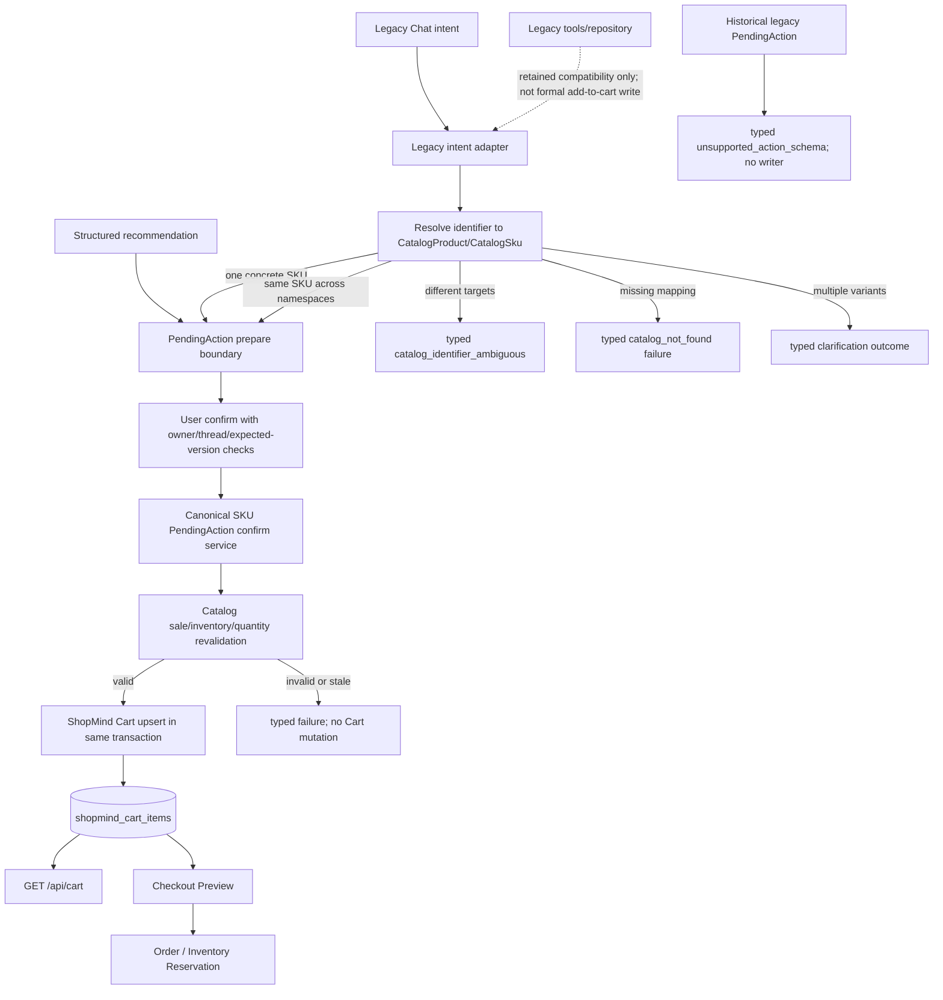

## Context

See `proposal.md` for the motivation. The repository currently has two concrete Cart models:

- `app/db/models.py:80-99,176-197` defines legacy `Product` and `CartItem` backed by `products` and `cart_items`.
- `app/cart/models.py:26-54` defines `ShopMindCartItem` backed by `shopmind_cart_items`, keyed by `(user_id, sku_id)` with quantity/version constraints.

The split is reachable in production code:

1. The legacy Chat/V1 path exposes `tools.cart.prepare_add_to_cart` (`agents/shopmind_agent.py:23-75`). V3 Write Handoff imports the same tool (`agents/shopmind_multi_agent/write_handoff.py:19-21`) and invokes it at `:586-597`.
2. `tools/cart.py:179-205` calls `app.repositories.cart.prepare_add_to_cart`, which stores a legacy payload containing only `product_id`.
3. `/api/chat/confirm` (`app/api/routes/chat_confirm.py:12-64`) dispatches through `app/dependencies/agent.py:268-548`; the registered `confirm_add_to_cart` handler is imported from `tools.cart` (`app/dependencies/agent.py:39-44`) and calls the legacy repository at `tools/cart.py:231-243`.
4. `app/repositories/cart.py:321-342` creates `CartItem`, hence writes `cart_items`.
5. Structured PendingAction creation and confirmation use `app/services/pending_actions.py:85-147,157-212` and call `upsert_cart_item`, which writes `shopmind_cart_items`.
6. `app/api/routes/cart.py:36-44`, `app/services/checkout.py:36-47`, and `app/services/orders.py:220-225` read or lock only the new SKU Cart.

The version boundary is currently asymmetric: structured confirmation requires `expected_version` (`app/api/routes/pending_actions.py:123-131` and `app/services/pending_actions.py:157-173`), while `ConfirmChatRequest` has no such field (`app/schemas/chat.py:169-199`), `app/api/routes/chat_confirm.py:29-39` does not forward one, and `ChatPage.tsx:80-83` only sends it for the structured mode. The current legacy path also uses formatted tool text as control input: Write Handoff extracts `pending_action_id` from text (`write_handoff.py:370-372,456-476`), and the confirmation boundary classifies failures by inspecting the answer string (`app/dependencies/agent.py:137-139,455-460`).

Historical legacy add-to-cart actions have `legacy.pending_action.v1`-style payloads. The canonical service already has a typed `unsupported_action_schema` error (`app/services/pending_actions.py:171-178` and `app/schemas/pending_actions.py:19-36`), but the formal Chat confirm path must be routed through that boundary before any legacy writer can run.

The current tests encode both behaviors: `tests/tools/test_cart.py:115-130` asserts legacy `CartItem` creation, while `tests/api/test_phase2a_pending_actions.py:31-71` asserts a structured confirmation is visible through `/api/cart`.

## Goals / Non-Goals

**Goals:**

- Make `shopmind_cart_items` the only Cart truth for all supported ShopMind commerce confirmations.
- Preserve the public intent/confirmation boundary while normalizing legacy identifiers into a concrete Catalog SKU before the canonical PendingAction is created.
- Reuse the existing typed PendingAction and Cart service semantics instead of bypassing validation.
- Make missing mappings, ambiguous variants, inactive/unavailable SKUs, ownership failures, stale versions, expiry, duplicate confirmation, and transaction failure observable as typed non-success outcomes.
- Keep Checkout and Order behavior on their current SKU-based read path and preserve the archived `backend-regression-stability` contract.

**Non-Goals:**

- No deletion of legacy tables/models, no destructive migration, and no bulk backfill of old `cart_items`.
- No Order expiration, reservation reaper, payment, authentication redesign, Redis/RocketMQ work, recommendation/RAG work, frontend redesign, or unrelated cleanup.
- No dual write, even as a temporary compatibility tactic.

## Current-state flow

```mermaid
flowchart TD
    A[Structured recommendation] --> B1[POST /api/pending-actions/add-to-cart]
    B1 --> C1[app.services.pending_actions.create_add_to_cart_pending_action]
    C1 --> D1[PendingAction schema shopmind.pending_action.add_to_cart.v1]
    D1 --> E1[POST /pending-actions/id/confirm]
    E1 --> F1[app.services.pending_actions.confirm_add_to_cart]
    F1 --> G1[upsert_cart_item]
    G1 --> H1[(shopmind_cart_items)]

    I[Legacy Chat intent / V1 Agent] --> J[write_handoff or prepare_add_to_cart]
    J --> K[tools.cart]
    K --> L[app.repositories.cart.prepare_add_to_cart]
    L --> M[PendingAction legacy payload: product_id]
    M --> N[/api/chat/confirm]
    N --> O[tools.cart.confirm_add_to_cart]
    O --> P[app.repositories.cart.confirm_add_to_cart]
    P --> Q[CartItem]
    Q --> R[(cart_items)]

    H1 --> S[Cart API / Checkout / Order]
    R -. not read by formal Cart/Checkout .-> S
```

## Target-state flow



## Decisions

### 1. Canonical write boundary is the existing SKU PendingAction service

The final mutation remains in the service that already validates CatalogProduct/CatalogSku, sale status, inventory, quantity, owner/thread scope, expiry, expected version, replay hash, and `upsert_cart_item` (`app/services/pending_actions.py:157-212`). A small shared factory/adapter may be extracted so both structured and legacy preparation produce the same canonical `shopmind.pending_action.add_to_cart.v1` payload. This avoids a second Cart mutation implementation and keeps transaction ownership with the caller: API routes commit/rollback their injected Session, while the legacy tool owns and commits its own per-invocation Session.

The legacy public tool names may remain for compatibility, but `prepare_add_to_cart` must stop inserting a legacy-only PendingAction for a formal ShopMind request, and `confirm_add_to_cart` must delegate to the canonical service. The old repository confirm function is not a fallback and must not be called by the supported Chat confirmation path.

### 2. Collision-safe identifier normalization

The adapter accepts an untyped legacy identifier and queries all three canonical identity namespaces in one resolution operation:

1. exact `CatalogSku.sku_code`;
2. exact `CatalogProduct.legacy_product_id`;
3. exact `CatalogProduct.product_code`.

The database guarantees uniqueness within each field (`app/catalog/models.py:65-105`) but not across fields, so this is not a priority fallback chain. Each hit is expanded to its concrete target set: a SKU hit is one `(product_id, sku_id)`; a Product hit is its one or more related SKUs. The resolver then applies these rules:

- one namespace hit with one concrete target → resolve normally;
- multiple namespace hits that all converge to exactly one concrete SKU → resolve that SKU;
- multiple hits that identify different Products/SKUs, or a Product-level hit that remains variant-ambiguous → return typed `catalog_identifier_ambiguous` or `sku_ambiguous`, with bounded non-sensitive diagnostics;
- a Product-level hit with zero related SKUs → return typed `catalog_not_found`; this is a missing concrete canonical SKU, not a variant clarification;
- no hit → typed `catalog_not_found`.

The resolver must never silently use `sku_code → legacy_product_id → product_code` precedence after a collision. A future explicitly typed `identifier_kind` may restrict the lookup to its named namespace, but the current legacy `product_id` input is untyped and therefore collision-safe. A legacy `Product.product_id` is never the commerce fact; its price and `in_stock` flag cannot authorize a Cart write. No fuzzy name/price/category matching or `TECH-*` shape inference is allowed.

If a Product has exactly one CatalogSku, that SKU may be selected automatically, subject to active product/SKU, inventory presence, available quantity, and requested quantity validation. If a Product has more than one SKU and no concrete variant is supplied, the resolver returns a typed clarification outcome rather than choosing by price, database order, first row, random choice, or stock level.

### 3. Machine-readable outcomes and presentation boundary

Resolver and adapter control flow uses a typed domain outcome/error code, such as a Pydantic result model or existing `PendingActionServiceError` contract. The outcome carries a bounded status (`prepared`, `clarification_required`, `failed`, or `confirmed`), a stable code when applicable, the canonical identity when resolved, and the pending action/version when created. The tool boundary and Write Handoff branch on this structured status/code; they do not search Chinese text for “不存在”, “多个规格”, “失败”, or a pending-action ID. Chinese/user-facing text is formatted only after the outcome has been classified.

For multi-SKU clarification, the public Chat contract remains compatible by using the existing `ChatStatus` value `completed` to mean “the request was handled and clarification is required”, while debug/internal metadata carries `outcome=clarification_required`; there is no `pending_action_id`, no confirmable Cart mutation, and no Cart write. A true mapping or persistence failure remains `failed`. This avoids a broad Agent contract change and avoids treating “no pending_action_id” as an automatic failure.

### 4. Prepare-time resolution, confirm-time revalidation and version contract

The legacy adapter resolves the identifier and snapshots canonical SKU/product/price/availability data when preparing the PendingAction. Confirmation repeats the existing locked Catalog and inventory checks. This preserves the existing price-change signal and prevents a stale preview from bypassing current sale status or inventory.

The shared factory must preserve structured recommendation provenance when present (`source_run_id`, candidate membership, and source schema). A legacy adapter may omit recommendation provenance only when the legacy identifier has been resolved to an unambiguous canonical SKU; it must record bounded origin metadata so the action is auditable without changing the public Chat response shape.

`ConfirmChatRequest.expected_version` is an additive optional field at the generic API schema level so unrelated actions such as legacy preference confirmation remain compatible. For a canonical SKU add-to-cart action it is semantically required: the client must send the exact `PendingActionView.version` it loaded. Missing `expected_version`, a fixed default, or a server lookup of the current version in place of the client token is a typed non-success and performs no Cart mutation. A stale value reaches `app/services/pending_actions.py:165-166` and returns `version_conflict`; it is never replaced with the latest database version.

The first-party legacy Chat UI sends `/api/chat/confirm` with `expected_version=action.version` only after loading a real `PendingActionView`. If it cannot load a real version, it keeps the action in a reload/reprepare state and must not confirm using the synthetic compatibility preview's default version. The structured endpoint remains unchanged and continues to send its existing required version.

### 5. One transaction, no dual write, and historical action safety

The canonical confirm operation locks the scoped PendingAction, loads the Catalog/SKU/inventory, validates the current state, upserts one `(user_id, sku_id)` row, persists the terminal resolution, and returns success only if the caller commits. The legacy tool's Session is created and closed within that tool invocation; the API/session boundary remains unchanged. On any exception, the caller rolls back and the public response is `failed`; it must not create `cart_items` as recovery.

There is no write to `CartItem`/`cart_items` in the formal path. Existing legacy rows remain untouched by this change. A historical add-to-cart PendingAction whose payload is not `shopmind.pending_action.add_to_cart.v1` may be read, previewed, or cancelled through an existing safe path, but confirm must return the existing typed `unsupported_action_schema` failure (or equivalent safe code) and must not invoke either Cart writer. It is not silently migrated or SKU-guessed. A future data migration/backfill must be separately specified because mapping old rows to SKUs can be ambiguous.

### 6. Compatibility and minimal frontend behavior

`/api/chat/confirm`, the action type `add_to_cart`, tool names, and ChatResponse status vocabulary remain compatible. The legacy tool can format the canonical transition result into its existing Chinese confirmation text, but the result must reference canonical SKU/product data and only say success after canonical commit. The dedicated structured endpoints remain available and continue to use their current service boundary.

The frontend change is intentionally small. `ChatPage.tsx:80-83` sends the loaded real version for legacy Chat confirmation; the synthetic compatibility preview is display-only if a real action view cannot be loaded. After a confirmation attempt, it invalidates/refetches `cartQueryKey`, clears the checkout attempt, and removes the stale `checkoutPreviewQueryKey` only when the typed response proves a successful canonical add-to-cart (`PendingActionView.status == confirmed` for structured results or `ChatResponse.status == completed` for legacy results). A clicked Confirm button or HTTP 200 alone is not success. The existing CartPanel continues to use `shopMindApi.getCart` (`frontend/src/features/cart/CartPanel.tsx:37-40`), so it becomes consistent once the backend writes the canonical row. No frontend state-management or UI redesign is included.

## Alternatives

### A. Dual write legacy and ShopMind Carts

Rejected. It creates two facts, can partially commit, makes quantity/ownership/inventory semantics diverge, and still leaves Checkout truth ambiguous.

### B. Keep two Carts and change Checkout to merge them

Rejected. It spreads reconciliation into every read and order path, cannot safely infer SKU variants from old rows, and preserves the user-visible inconsistency.

### C. Legacy intent adapter to canonical ShopMind Cart

Recommended. It preserves old intent parsing and public action names while making one validated SKU Cart mutation the only formal fact. It is incremental, testable, and does not require destructive schema changes.

### D. Delete all legacy schema immediately

Rejected for this change. Workshop/V1 compatibility tests and historical rows still exist, and deletion would mix data migration and commerce behavior changes. Retain the old models as non-canonical compatibility code and remove them only under a separately reviewed migration.

## Risks / Trade-offs

- **Risk:** Existing legacy `cart_items` rows will not automatically appear in the new Cart. **Mitigation:** Do not claim migration; add mapping/reconciliation diagnostics and document a separate future backfill decision.
- **Risk:** A legacy product with multiple variants may interrupt a formerly one-click confirmation. **Mitigation:** Treat ambiguity as a safe typed clarification rather than selecting an arbitrary SKU.
- **Risk:** Old tests/workshop callers expect legacy `CartItem`. **Mitigation:** Reclassify formal commerce tests to canonical behavior, retain compatibility helpers for explicitly legacy/test paths, and add direct assertions that formal confirmation never calls the old repository write.
- **Risk:** Legacy Chat and structured PendingAction payloads currently differ. **Mitigation:** Keep the public action type and response shape, use a versioned canonical payload, and preserve a read-only legacy preview only for already-existing historical actions during the transition.
- **Risk:** A value can collide across the three Catalog namespaces. **Mitigation:** Query all namespaces, compare concrete targets, and return bounded `catalog_identifier_ambiguous` instead of applying field precedence.
- **Risk:** Making `expected_version` mandatory for canonical Chat add-to-cart can break old callers. **Mitigation:** Keep the request field optional for schema compatibility, but fail closed with a typed non-success when a canonical add-to-cart request omits it; preference actions retain their current contract.
- **Risk:** A formatted tool string may be mistaken for a domain result. **Mitigation:** Introduce a typed adapter outcome and make Write Handoff/confirmation branch on status/code; presentation text is generated only after classification.

## Migration Plan

1. Add collision-safe resolver behavior and typed ambiguity/mapping outcomes; add unit tests before changing the write path.
2. Add the shared canonical PendingAction factory/adapter and preserve structured recommendation behavior.
3. Add the additive Chat expected-version field and route canonical legacy prepare/confirm through the typed service; leave historical non-canonical actions safe-failing and old tables intact.
4. Add Chat→versioned Confirm→GET `/api/cart`→Checkout Preview tests and frontend mocked Cart/Checkout invalidation tests.
5. Run focused tests and the full non-integration backend suite with external tracing/services disabled. PostgreSQL concurrency/transaction tests are designed as follow-up validation but are not run in this proposal.

Rollback is code-level: revert the adapter routing while retaining the old tables. No destructive migration or irreversible data operation is part of this change.

## Open Questions

None that change the selected behavior. Implementation may choose exact internal helper names or whether the typed outcome is carried as a Pydantic object or structured tool metadata, but it must preserve collision-safe resolution, machine-readable control flow, expected-version semantics, historical-action safe failure, canonical transaction boundaries, and public compatibility described here.
