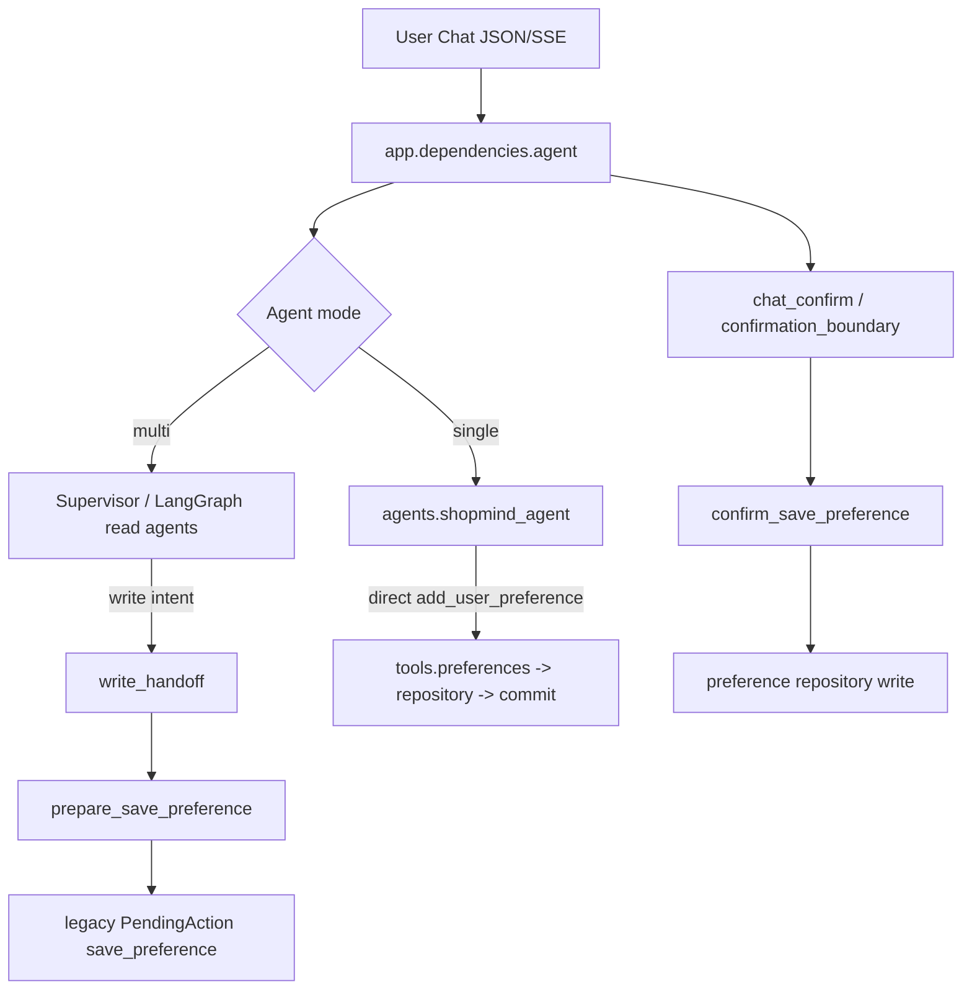

## Context

The proposal and delta spec define the behavioral contract. This design records the implementation boundary confirmed from the current repository.

### Current-state flow



The confirmed bypass is the Single Agent path: `agents/shopmind_agent.py:25,65-72` exposes `add_user_preference`, and `tools/preferences.py:101-121` opens a session, calls `app.repositories.preferences.add_user_preference`, and commits. `clear_user_preferences` at `tools/preferences.py:137-150` is another direct writer, but is not in the current `SHOPMIND_TOOLS` list; it remains a legacy/exported risk that must not be enabled for an Agent.

The Multi-Agent Preference Agent is read-only (`agents/shopmind_multi_agent/preference_agent.py:6,13,43-72`). Multi-Agent write intent is already routed through `agents/shopmind_multi_agent/write_handoff.py:421-486`, which calls `prepare_save_preference`. That preparation writes only a PendingAction through `app/repositories/cart.py:216-255`; the actual preference write occurs later in `app/repositories/cart.py:355-430` through the confirmation boundary.

The existing canonical Cart path is separate and already protected: `app/services/pending_actions.py:87-243,245-496` prepares/confirms SKU Cart actions, while `app/dependencies/agent.py:279-587` resolves and dispatches registered confirmation transitions. The change must preserve that path.

## Goals / Non-Goals

**Goals:**

- Remove active Agent access to direct user/business domain writers.
- Make Single and Multi preference writes converge on one confirmation-first action lifecycle.
- Reuse the current PendingAction owner/thread/version/expiry/replay model and existing Action Registry.
- Make new preference actions versioned and deterministic without a broad PendingAction rewrite.
- Safely reject historical non-canonical preference actions without a data migration.
- Preserve canonical Cart, Chat retry, RAG, backend thread/session, and Order/payment behavior.

**Non-Goals:**

- No payment, Order, inventory reservation, recommendation, RAG, localization, multi-category, auth, Redis, RocketMQ, or Chat retry redesign.
- No replacement of the whole Agent architecture or generic distributed policy platform.
- No migration/backfill of historical PendingAction rows.
- No new frontend confirmation redesign; existing ActionDrawer behavior is the compatibility target.

## Write-boundary inventory

| Agent/tool/action | Current state write? | Current path | Bypasses HITL? | Final design |
|---|---:|---|---:|---|
| `get_user_preferences` | No | V1 `tools/preferences.py:74-98`; V3 Preference Agent allowlist | No | Direct read-only tool |
| Product/document/search/detail/compare tools | No | `tools/products.py`, `tools/documents.py`; Product/RAG agents | No | Direct read-only tools |
| `get_cart_items` | No | `tools/cart.py:393-424` | No | Direct read-only Cart view |
| `prepare_add_to_cart` | PendingAction write only | Single Agent or V3 `write_handoff` → `app.services.pending_actions` | No; this is approved write-intent preparation | Keep existing canonical Cart HITL flow |
| `confirm_add_to_cart` | Yes, canonical Cart | `chat_confirm` → confirmation boundary → `tools/cart.py:247-301` → `app.services.pending_actions.confirm_add_to_cart` | No | Keep unchanged; deterministic confirmation only |
| `prepare_save_preference` | PendingAction write only | V3 `write_handoff:421-486` → `tools/cart.py:169-201` → legacy `app.repositories.cart:216-255` | Not final domain write, but legacy schema | Route to canonical versioned preference PendingAction service |
| `confirm_save_preference` | Yes, `UserPreference` | `chat_confirm` → `app.dependencies.agent:418-423` → `tools/cart.py:307-341` → `app.repositories.cart:355-430` | No at confirmation, but legacy schema is unsafe for historical actions | Use canonical deterministic confirmation service and reject non-canonical history |
| `add_user_preference` | Yes | V1 `SHOPMIND_TOOLS` → `tools/preferences.py:101-121` → repository → commit | **Yes** | Remove from active Agent tool set; route intent to shared prepare handoff |
| `clear_user_preferences` | Yes | Exported legacy tool → `tools/preferences.py:137-150` → repository delete → commit | Potentially, if attached to an Agent | Remove from active Agent capabilities; no new Agent clear action in this Change |
| legacy `app.repositories.cart.confirm_add_to_cart` | Yes, legacy `cart_items` | Legacy repository function at `app/repositories/cart.py:266-353`; not current canonical confirmation mapping | Potentially for legacy callers | Keep only as compatibility/test legacy path; never an active Agent fallback |
| `clear_cart_items` | Yes, legacy/cart tables | `tools/cart.py:426-450` and `app.repositories.cart.py:501+` | Not in current ShopMind Agent allowlists | Explicitly block from Agent; preserve only separately authorized user/API behavior |
| candidate context save/clear | Runtime workflow metadata | `write_handoff.py:145-231` → candidate-context repository | Not a domain mutation | Keep as system-owned bounded execution metadata, outside user/business HITL |
| AgentRun/events/idempotency/audit persistence | Runtime facts | Harness, governance, and audit emitters | Not a domain mutation | Keep system-owned; never treat as preference/Cart confirmation |

## Decisions

### 1. One boundary, two Agent modes

The active Single Agent will no longer receive `add_user_preference` or any direct preference writer. Explicit preference-write intent will be routed through the shared deterministic write-handoff path before or instead of invoking the read Agent. The existing Multi-Agent supervisor/write-handoff path remains the same conceptual boundary. This is smaller and safer than teaching two Agent graphs separate confirmation semantics.

The LLM may produce read results and a bounded write intent, but it cannot choose or invoke a final repository writer. The existing `prepare_add_to_cart` and new canonical `prepare_save_preference` are the only Agent-visible domain write capabilities; they create PendingAction intent and do not write the target domain state.

### 2. Minimal canonical preference action schema

Reuse `action_type="save_preference"` and the existing `PendingAction` table/API rather than creating a new action hierarchy. New actions use a versioned payload similar to:

```json
{
  "schema_version": "shopmind.pending_action.save_preference.v1",
  "operation": "add",
  "preference_type": "avoid",
  "preference_value": "青轴和高噪声键盘"
}
```

The persisted row continues to carry `user_id`, `thread_id`, `risk_class=medium`, `version`, `expires_at`, `preview_text`, status, metadata, and resolution data. `preference_type` is normalized against the existing enum; `preference_value` is bounded and non-empty. The existing frontend `ActionDrawer` already renders enum/text fields for `save_preference`, so no redesign is needed.

`operation="add"` explicitly means append one new preference row. This Change does not add preference identity, overwrite behavior, semantic deduplication, or true update/upsert semantics. A future delete/clear capability would need its own reviewed action contract; the currently exported `clear_user_preferences` is disabled for Agent use.

### 3. Canonical preference preparation

Add the smallest service/adapter seam needed to prepare the versioned preference action. `tools/cart.prepare_save_preference` may remain a compatibility tool name, but its active implementation must delegate to the canonical PendingAction service rather than `app.repositories.cart.prepare_save_preference`. Preparation validates owner/thread and typed fields, persists only the PendingAction, and returns `confirmation_required` with a stable action ID.

The existing legacy preparation function and historical rows remain readable where existing APIs require it, but they are not silently converted at confirmation time.

### 4. Deterministic confirmation

The confirmation boundary remains `app.dependencies.agent.confirm_pending_action` and the current `/api/chat/confirm` route. It resolves and locks the scoped action, checks the Action Registry, validates `expected_version` and typed edits, and dispatches a deterministic handler. The handler reads only the persisted canonical payload plus validated edits; it never sends the request back through an Agent or LLM.

The preference transaction is:

```text
lock PendingAction by id + owner + thread
→ verify canonical schema/status/expiry/version
→ normalize/validate persisted payload + explicit edits
→ insert one new UserPreference row
→ mark action confirmed + persist resolution
→ commit once
```

A failure before commit rolls back both the preference and action resolution. A successful replay returns the persisted resolution and performs no second write. Cancel only resolves the action as cancelled.

### 5. Tool Gateway and permission policy

Add explicit capability/inventory tests and the minimum policy changes needed to prevent direct preference writers from active Agent sets. Existing V3 `AGENT_TOOL_ALLOWLIST` already gives `preference_agent` only `get_user_preferences`, `write_handoff` only preparation tools, and `confirmation_boundary` only transition tools (`agents/shopmind_multi_agent/permissions.py:11-34`). Preserve that structure.

The V1 Single Agent currently bypasses the V3 Tool Gateway by constructing `SHOPMIND_TOOLS`; removing the direct writer from that list is mandatory. A broad generic “all functions that call SQLAlchemy are forbidden” rule is rejected because runtime/audit/candidate metadata and user/API-owned services have different boundaries. Static tests should enumerate active Agent tools and explicitly forbid known direct domain writers.

### 6. Legacy actions and writers

No destructive migration or historical backfill is planned. A canonical schema version is required for confirmation. If a legacy `save_preference` row lacks the canonical schema or has malformed payload, confirmation returns `unsupported_action_schema` (or the project's stable equivalent), performs no `UserPreference` write, and tells the user to reprepare. Read/preview/cancel remain available only where current ownership/expiry behavior already supports them.

Legacy direct writers (`add_user_preference`, `clear_user_preferences`, legacy Cart writers) may remain as repository or compatibility functions for tests/workshop code, but they must not be in active Agent tool sets and must not be reachable as a fallback from write-handoff or confirmation failure.

### 7. Chat retry and transport compatibility

The completed `chat-retry-idempotency` contract remains authoritative. A prepared preference PendingAction is part of the authoritative Run result; JSON/SSE retry replays the same action ID/version/preview and does not call preparation again. Confirmation remains a separate user-triggered action. No new idempotency mechanism is added.

### 8. Canonical Cart preservation

The existing `shopmind_cart_items` prepare/confirm path is not redesigned. Its Action Registry, expected-version, owner/thread, price/inventory revalidation, replay, and no-dual-write semantics remain the reference behavior. This Change only removes other Agent-side direct writers and makes preference follow equivalent safety semantics.

## Alternatives considered

### A. Keep direct V1 preference writes and add logging

Rejected. Audit visibility does not prevent a user/business mutation before consent and cannot provide deterministic replay or cancellation semantics.

### B. Give Single Agent the existing confirmation tool

Rejected. Exposing `confirm_save_preference` to the LLM would allow the model to self-confirm, collapse intent and consent, and bypass the user-facing confirmation boundary.

### C. Add a generic write sandbox for every repository call

Rejected for this Change. It would require a broad architecture rewrite and would incorrectly classify runtime metadata/audit persistence. Explicit active-tool inventory plus canonical prepare/confirm boundaries is smaller and auditable.

### D. Migrate every historical PendingAction row

Rejected. It is destructive/risky and unnecessary for safety. Reject non-canonical historical confirmations and require re-preparation.

## Risks / Trade-offs

- **V1 preference UX changes from immediate success to confirmation** → expose the same existing ActionDrawer/PendingAction flow used by Cart and keep the public status `confirmation_required`.
- **Legacy callers expect direct preference tools** → preserve compatibility symbols where needed, but remove them from active Agent capability and return typed unsupported behavior when invoked as an Agent write path.
- **Duplicate preference rows on repeated semantic requests** → retain existing append behavior; exact same confirmation replay is idempotent, while semantic deduplication is explicitly not invented here.
- **Old save_preference rows lack schema version** → fail closed on confirm and require reprepare; no silent conversion.
- **Single and Multi mode drift** → add parity tests that exercise both mode boundaries and static tool-set checks.

## Migration Plan

1. Add static inventory and focused tests that prove the current Single Agent direct writer is removed and Multi-Agent remains read-only until handoff.
2. Introduce canonical preference preparation and deterministic confirmation adapters while keeping action type/API names compatible.
3. Add negative, replay, ownership, version, expiry, and transaction tests; add PostgreSQL tests only for transaction/concurrency behavior not provable by SQLite.
4. Update the minimal frontend contract only if the canonical payload requires a new generated field; existing ActionDrawer should remain compatible.
5. Run focused and full non-integration regression validation with external services disabled.

Rollback is application-level: restore the previous active tool wiring only through a reviewed decision. Do not restore a direct Agent writer as an emergency fallback; legacy actions should continue to fail closed.

## Open Questions

None block implementation. The current Change intentionally treats preference clear/delete as a disabled legacy direct-write capability rather than adding a new public `clear_preference` action; adding that user-facing action should be a separately reviewed extension.
