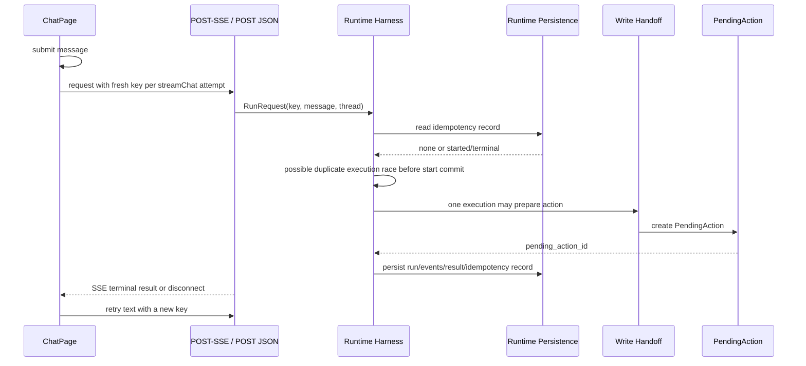

## Context

The current brownfield implementation already has a runtime persistence layer, but the frontend and backend do not yet form one safe retry boundary:

- `frontend/src/api/client.ts` generates a fresh UUID inside `streamChat()` for every invocation. `frontend/src/features/chat/ChatPage.tsx` stores only `lastFailedMessage`, while `ChatMessage` has no request identity. A retry of the same text therefore creates a new key and cannot recover the original run.
- `frontend/src/features/chat/chatStorage.ts` persists only the thread ID in `localStorage`; messages, failed request identity, and pending retry state are React memory. Page refresh cannot currently recover an interrupted logical message.
- `app/api/routes/chat.py` and `app/api/routes/chat_stream.py` already forward an optional `Idempotency-Key` to the same `app.dependencies.agent.call_shopmind_agent` bridge. JSON uses the preserved `run_in_threadpool`; POST-SSE runs the bridge in `asyncio.to_thread`.
- `app/runtime/harness.py` already computes a canonical request hash excluding volatile request ID/time fields, resolves completed idempotency records, replays persisted terminal runs, and returns `runtime.idempotency_in_progress` for a visible `started` record. `app/repositories/runtime_runs.py` and `app/db/models.py` provide `idempotency_records`, `agent_runs`, `agent_run_events`, and unique `(user_id, operation, idempotency_key)` constraints.
- The current start persistence path creates the run/record and catches all persistence exceptions without surfacing them. A concurrent pair can both observe no record before either start transaction commits; the unique constraint then becomes an error path rather than an explicit authoritative claim boundary.
- `app/api/routes/chat_stream.py` sets a cooperative cancellation flag when the client disconnects or the stream buffer fills. The Harness can therefore persist a cancelled run depending on timing. It does not replay event history on reconnect.
- `agents/shopmind_multi_agent/write_handoff.py` and the existing PendingAction services create the write intent during the Agent execution. Existing PendingAction owner/thread/version/confirm semantics are separate and are not redesigned here.

The existing main specifications for backend regression stability, canonical commerce Cart, and Order expiration are independent contracts and remain unchanged.

## Current-State Flow



## Goals / Non-Goals

**Goals:**

- Define one logical Chat message identity and preserve its key through same-page/session retry.
- Make the existing runtime persistence the backend authority for same-key claim, conflict, running state, and terminal replay.
- Ensure concurrent same-key requests produce at most one authoritative Agent execution and one PendingAction preparation path.
- Make idempotency persistence failure fail closed.
- Let a disconnected POST-SSE request recover the authoritative terminal/current state without requiring a second execution.
- Keep JSON and SSE on the same Harness contract and preserve current public Chat status vocabulary.

**Non-Goals:**

- Page-refresh recovery, chat-history UI, cross-device/offline synchronization, WebSocket, or a full resumable SSE cursor protocol.
- PendingAction confirmation/cancellation idempotency redesign; existing owner/thread/expiry/version/replay rules remain authoritative.
- Payment, Cart, Order expiration, RAG, Agent routing, localization, authentication, Redis, RocketMQ, or distributed event-bus changes.

## Decisions

### 1. Logical message identity

The frontend creates a key at logical-message creation, not at transport attempt. The backend identity is:

```text
effective user scope
+ operation = chat
+ client thread_id
+ Idempotency-Key
+ backend canonical request_hash
```

The backend remains the request-hash authority. The canonical hash reuses the existing Harness hash behavior: it includes the logical request fields such as message, user/thread identity, operation, mode/options, and key according to the current `RunRequest` contract, while excluding volatile `request_id` and `requested_at`. The frontend never computes or compares this hash.

An authoritative retry contract requires an effective owner scope. Existing development/trusted identity binding supplies it for first-party Chat requests; anonymous requests without a stable owner remain fail-closed for durable dedupe rather than being merged across users. Thread ID is part of the request hash and must not be reused across switched threads.

### 2. Frontend key lifecycle

`ChatMessage` gains a request identity/state sufficient to distinguish a new logical message from a transport retry. The flow is:

```text
Send click
→ append one user logical message with key
→ first JSON/SSE attempt uses key
→ network failure or terminal event loss keeps key on that message
→ retry/recover uses same key
→ terminal authoritative result clears the pending-retry marker
```

Editing the text, intentionally sending the same text again, creating a new thread, or switching user creates a new logical message and a new key. The key is kept in React message state for this Change; `localStorage` is not expanded into a chat-history store. Page refresh recovery is explicitly Future Work.

The API client accepts an explicit key for `chat` and `streamChat`; it must never generate a new key inside a retry transport call. Existing unrelated request-level idempotency defaults remain unchanged.

### 3. Atomic authoritative backend claim

The Harness/repository boundary becomes an explicit claim operation using the existing unique scope:

1. Normalize effective owner, operation, key, and compute the canonical request hash.
2. In one short database transaction, read the scoped idempotency record with the appropriate row lock.
3. If it exists, compare the hash before any execution.
4. If it does not exist, atomically claim the `started` idempotency record and create/bind the corresponding `AgentRun` identity before invoking the executor. Because the existing `idempotency_records.run_id` foreign key points to `agent_runs`, the initial claim keeps `run_id` nullable inside the same outer transaction; the winner then creates the AgentRun and updates the claimed record before commit. A concurrent insert conflict is caught and resolved by reading the winner, not by executing locally.
5. Only the winner executes the Agent and write handoff.
6. Finish the same authoritative run and update the idempotency record in the existing terminal persistence path.

The claim transaction must not swallow persistence/unique errors. If the system cannot determine whether it owns the claim, it returns a bounded typed persistence failure and does not invoke the Agent. No second global status or new event transport is required.

### 4. Same-key state matrix

| Existing record/run | Same key + same hash | Same key + different hash |
|---|---|---|
| none | atomically claim one `started` run and execute | not applicable |
| running/started | return typed `runtime.idempotency_in_progress`, `retry_state=in_progress`, and authoritative winner run identity; do not execute | `runtime.idempotency_key_conflict`; do not execute |
| completed | replay the persisted result and original run/pending action identity | conflict; do not execute |
| confirmation_required | replay the persisted result and original PendingAction identity/version data | conflict; do not execute |
| failed | replay the same terminal failure; a new attempt requires a new key | conflict; do not execute |
| cancelled | replay the same terminal cancellation; a new attempt requires a new key | conflict; do not execute |

The existing public `ChatResponse` status vocabulary remains compatible. `run_id` remains available through the existing debug/typed runtime projection; the stable key is the primary recovery handle. A running duplicate is not converted into a second stream attachment or a second run.

### 5. Disconnect, cancellation, and retry

For a request carrying a retry identity, an HTTP/SSE disconnect is transport loss, not permission to create a replacement execution. The stream boundary separates two concepts:

```text
delivery_detached
→ stop enqueueing/delivering events to the disconnected response
→ release stream admission and settle the transport task

runtime_cancellation
→ only runtime-owned budget/deadline/safety controls
→ may change the authoritative Run to cancelled
```

The browser Stop button currently calls `AbortController.abort()`, which is indistinguishable from transport loss at the HTTP boundary. In this Change it therefore means “stop receiving”/“断开实时过程”, not authoritative Agent cancellation. The authoritative Run may reach a persisted terminal state under existing runtime budgets. Its logical message retains the same key and can recover the current/terminal state.

The detached producer must not continue filling an abandoned queue until queue pressure indirectly sets the runtime cancellation flag. The implementation must stop delivery at the sink while allowing the authoritative execution task to settle safely, consume exceptions, release admission, and avoid a global background-job framework.

This is a narrow disconnect semantic adjustment, not a resumable streaming protocol: the client does not receive missed intermediate events.

### 5a. Public in-progress projection

The existing public `ChatResponse` status vocabulary remains compatible, but a same-key running duplicate must not look like an ordinary terminal failure. Add the smallest additive typed projection needed by current schema conventions:

- `retry_state`: `none | in_progress | terminal`;
- `runtime_error_code`: the machine-readable runtime code when applicable;
- `authoritative_run_id`: the winner Run ID for `in_progress` recovery.

The frontend branches on `retry_state`/code, never on message text. `retry_state=in_progress` preserves the logical-message key and remains retryable; `retry_state=terminal` ends that retry lifecycle. Existing `run_id` debug behavior remains compatible.

### 6. PendingAction guarantee

The write handoff executes only inside the winning authoritative run. Its `pending_action_id` is persisted into the run's terminal result/idempotency record. A retry after disconnect returns that same result and ID; it never calls prepare again. If a duplicate arrives while the run is still active, it receives the authoritative run identity and must recover by retrying the same key or reading the existing runtime state. It never auto-confirms the action and never changes the existing `/api/chat/confirm` contract.

If the run reaches terminal state after action preparation, the action identity is retained even when the terminal SSE was not delivered. If persistence cannot record the run/action relationship, the claim/finish path fails closed and does not start a second preparation.

### 7. Event replay choice

Choose **terminal/current-state recovery**, not persisted event replay or a full cursor:

- a completed same-key retry returns a synthetic replay/terminal result through the existing JSON/SSE projection;
- a running retry returns typed in-progress state and the authoritative run ID;
- no attempt is made to reproduce the exact intermediate event sequence or resume from a client sequence cursor;
- existing `agent_run_events` remain available for owner-scoped inspection and future work.

This is sufficient for no duplicate execution, no duplicate PendingAction, and authoritative user-visible recovery while avoiding a new cursor protocol.

### 8. Admission and persistence failure

SSE admission still counts each HTTP request at the transport boundary. Same-key duplicates must claim/reject before entering Agent execution; they may consume a short admission slot but cannot consume a second execution slot or Agent budget. The rate limiter is not redesigned.

Runtime idempotency persistence failures are typed and fail closed. The existing broad exception swallowing in start persistence must be narrowed so a failed claim cannot fall through into executor invocation.

### 9. Compatibility and migration

Prefer the existing unique `idempotency_records` and `agent_runs` constraints and current request hash. No schema migration is planned initially. If PostgreSQL integration proves the nullable owner scope or current unique expression cannot arbitrate the required identity, stop and propose the smallest migration; do not silently weaken the contract or add a frontend-only workaround.

## Alternatives

### A. Frontend-only key reuse

Rejected as insufficient. It prevents accidental new keys but cannot stop backend concurrent execution or protect against replay from another client.

### B. Backend authoritative idempotent Run plus frontend stable key

Recommended. It reuses existing runtime persistence, unique constraints, request hash, and result projection while addressing both halves of the failure: the frontend preserves identity and the backend owns correctness.

### C. Full resumable SSE event/cursor replay

Deferred. Persisted events exist, but a complete cursor/resume protocol would expand public event semantics, reconnect state, buffering, and frontend complexity beyond duplicate execution prevention.

### D. Disable retry and ask the user to resend

Rejected. It cannot resolve unknown outcomes and would encourage new keys after a possible PendingAction side effect.

## Risks / Trade-offs

- **Existing running records may have no immediately available terminal result** → return typed in-progress with authoritative run ID; never execute a second run.
- **Disconnect no longer directly cancels the Chat run** → existing runtime budgets still bound execution; an explicit authoritative cancellation API remains Future Work.
- **Persistence failure during claim/finish** → fail closed and surface a bounded typed runtime error; do not fall through to Agent execution.
- **Anonymous owner scope** → require an effective owner scope for durable same-key semantics; do not create cross-user anonymous dedupe.
- **No intermediate event replay** → communicate/recover current state and terminal result only; leave full cursor replay as a separate capability.

## Migration Plan

1. Add/adjust local frontend and runtime unit tests that encode key lifecycle, hash conflict, claim state matrix, and pending-action result reuse.
2. Implement the smallest atomic claim seam using existing runtime tables/unique constraints; preserve public Chat JSON/SSE shapes and thread/session boundaries.
3. Add API/SSE duplicate and disconnect tests, then isolated PostgreSQL concurrent same-key claim tests if the database is the authoritative arbitration layer.
4. Regenerate/check frontend types only if public response metadata changes; avoid unrelated OpenAPI churn.
5. Run focused local tests, full non-integration backend tests, relevant frontend Vitest/lint/typecheck, and isolated PostgreSQL claim tests when required.

Rollback is application-level: disable the new frontend retry reuse and backend claim seam only through a reviewed deployment decision. No database migration is expected; if implementation discovers one is required, it must be proposed explicitly before Apply expands scope.

## Open Questions

None block the selected design. Page-refresh recovery and full event cursor replay are intentionally deferred Future Work, not unresolved decisions.
